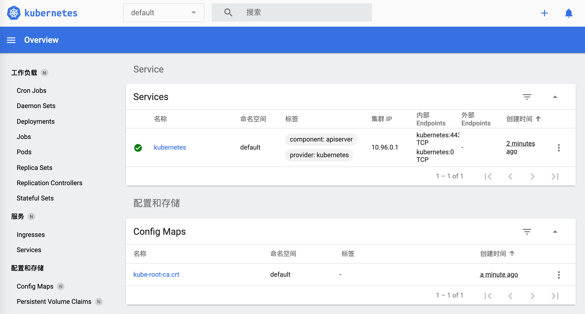
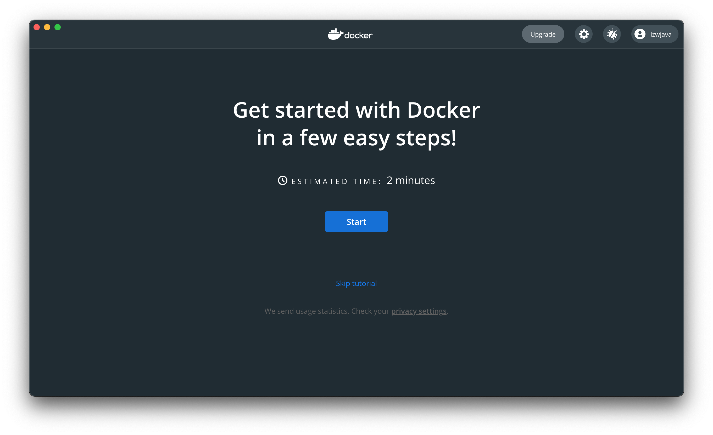
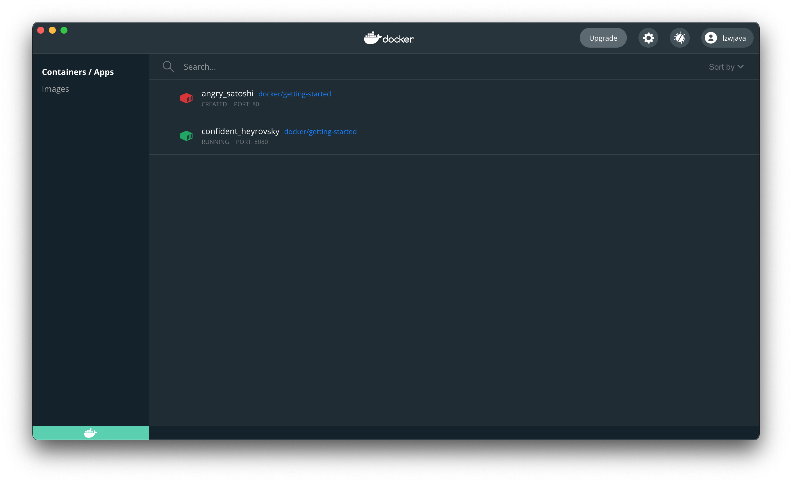
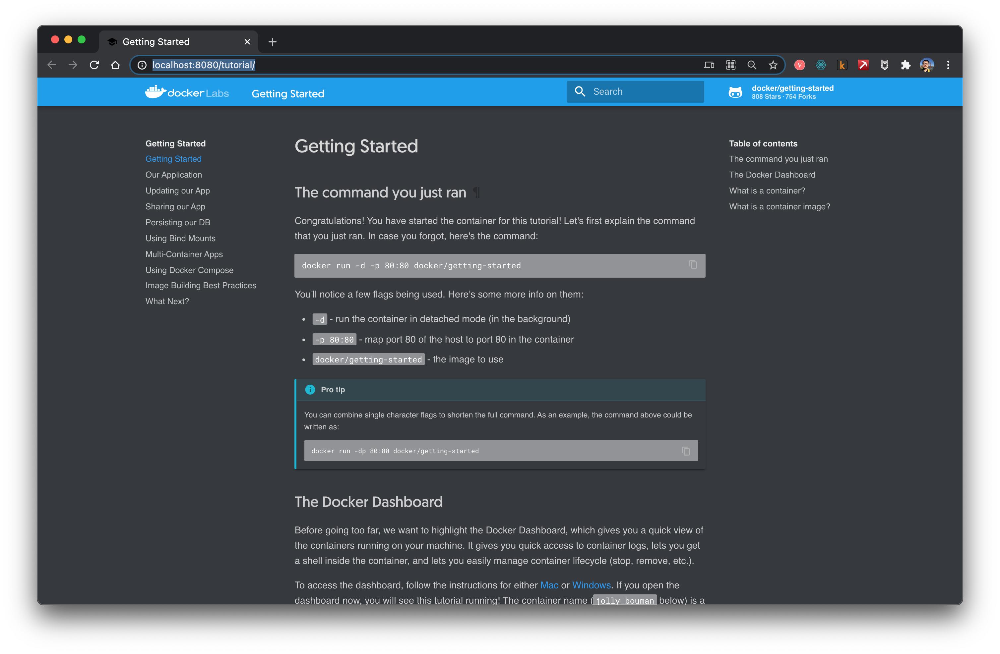

## 云计算和大数据分析

这节课包含以下话题：

* Spark
* Hadoop
* Kubernetes
* Docker
* Flink
* MongoDB

说起云计算，似乎离不开很多的工具，Hadoop、Hive、Hbase、ZooKeeper、Docker、Kubernetes、Spark、Kafka、MongoDB、Flink、Druid、Presto、Kylin、Elastic Search。都有听过吗。这些工具有些我是从`大数据工程师`、`分布式后端工程师`上找到的。这些都是高薪职位。我们试着把他们都安装上，试着把玩两下。


## 初探 Spark


官网说，`Spark`用来处理大规模数据的分析引擎。`spark`就是一套库。它似乎不像`Redis`那样分成服务端和客户端。`spark`就是只在客户端使用的。从官网下载了最新的版本，`spark-3.1.1-bin-hadoop3.2.tar`。

```shell
$ tree . -L 1
.
├── LICENSE
├── NOTICE
├── R
├── README.md
├── RELEASE
├── bin
├── conf
├── data
├── examples
├── jars
├── kubernetes
├── licenses
├── python
├── sbin
└── yarn

11 directories, 4 files
```

似乎就是各语言编写的一些分析库。


同时官网说可以在Python上直接装依赖库。`pip install pyspark`


```shell
$ pip install pyspark
Collecting pyspark
  Downloading pyspark-3.1.1.tar.gz (212.3 MB)
     |████████████████████████████████| 212.3 MB 14 kB/s
Collecting py4j==0.10.9
  Downloading py4j-0.10.9-py2.py3-none-any.whl (198 kB)
     |████████████████████████████████| 198 kB 145 kB/s
Building wheels for collected packages: pyspark
  Building wheel for pyspark (setup.py) ... done
  Created wheel for pyspark: filename=pyspark-3.1.1-py2.py3-none-any.whl size=212767604 sha256=0b8079e82f3a5bcadad99179902d8c8ff9f8eccad928a469c11b97abdc960b72
  Stored in directory: /Users/lzw/Library/Caches/pip/wheels/23/bf/e9/9f3500437422e2ab82246f25a51ee480a44d4efc6c27e50d33
Successfully built pyspark
Installing collected packages: py4j, pyspark
Successfully installed py4j-0.10.9 pyspark-3.1.1
```

装上了。


这会看官网，有些例子

```shell
./bin/run-example SparkPi 10
```

哦，原来可以运行刚刚下载的安装包里的程序。但出错了。

```shell
$ ./bin/run-example SparkPi 10
21/03/11 00:06:15 WARN NativeCodeLoader: Unable to load native-hadoop library for your platform... using builtin-java classes where applicable
21/03/11 00:06:16 INFO ResourceUtils: No custom resources configured for spark.driver.
21/03/11 00:06:16 WARN Utils: Service 'sparkDriver' could not bind on a random free port. You may check whether configuring an appropriate binding address.
```


> Spark is a fast and general processing engine compatible with Hadoop data. It can run in Hadoop clusters through YARN or Spark's standalone mode, and it can process data in HDFS, HBase, Cassandra, Hive, and any Hadoop InputFormat. It is designed to perform both batch processing (similar to MapReduce) and new workloads like streaming, interactive queries, and machine learning.


出现了好几次`hadoop`。谷歌了`spark depends hadoop `之后，找到这样一段话。看来这依赖于`Hadoop`格式的数据。让我们先研究 `Hadoop`。


## Hadoop


简单看了官网后。来安装一下。

```shell
brew install hadoop
```

安装的过程中，来了解一下。


> The Apache Hadoop software library is a framework that allows for the distributed processing of large data sets across clusters of computers using simple programming models. It is designed to scale up from single servers to thousands of machines, each offering local computation and storage. Rather than rely on hardware to deliver high-availability, the library itself is designed to detect and handle failures at the application layer, so delivering a highly-available service on top of a cluster of computers, each of which may be prone to failures.


就是说 Hadoop 是一套框架，来处理分布式的数据集。这些数据集可能分部在很多计算机上。用很简单的编程模型来处理。它是设计来从单一服务器扩展到千台机器的。与其依赖于硬件的高可用，这个库则设计来在应用层就能检查和处理错误。因此能将高可用的服务部署到集群中，虽然集群中的每台电脑都可能导致失败。


```shell
$ brew install hadoop
Error:
  homebrew-core is a shallow clone.
  homebrew-cask is a shallow clone.
To `brew update`, first run:
  git -C /usr/local/Homebrew/Library/Taps/homebrew/homebrew-core fetch --unshallow
  git -C /usr/local/Homebrew/Library/Taps/homebrew/homebrew-cask fetch --unshallow
These commands may take a few minutes to run due to the large size of the repositories.
This restriction has been made on GitHub's request because updating shallow
clones is an extremely expensive operation due to the tree layout and traffic of
Homebrew/homebrew-core and Homebrew/homebrew-cask. We don't do this for you
automatically to avoid repeatedly performing an expensive unshallow operation in
CI systems (which should instead be fixed to not use shallow clones). Sorry for
the inconvenience!
==> Downloading https://homebrew.bintray.com/bottles/openjdk-15.0.1.big_sur.bottle.tar.gz
Already downloaded: /Users/lzw/Library/Caches/Homebrew/downloads/d1e3ece4af1d225bc2607eaa4ce85a873d2c6d43757ae4415d195751bc431962--openjdk-15.0.1.big_sur.bottle.tar.gz
==> Downloading https://www.apache.org/dyn/closer.lua?path=hadoop/common/hadoop-3.3.0/hadoop-3.3.0.tar.gz
Already downloaded: /Users/lzw/Library/Caches/Homebrew/downloads/764c6a0ea7352bb8bb505989feee1b36dc628c2dcd6b93fef1ca829d191b4e1e--hadoop-3.3.0.tar.gz
==> Installing dependencies for hadoop: openjdk
==> Installing hadoop dependency: openjdk
==> Pouring openjdk-15.0.1.big_sur.bottle.tar.gz
==> Caveats
For the system Java wrappers to find this JDK, symlink it with
  sudo ln -sfn /usr/local/opt/openjdk/libexec/openjdk.jdk /Library/Java/JavaVirtualMachines/openjdk.jdk

openjdk is keg-only, which means it was not symlinked into /usr/local,
because it shadows the macOS `java` wrapper.

If you need to have openjdk first in your PATH run:
  echo 'export PATH="/usr/local/opt/openjdk/bin:$PATH"' >> /Users/lzw/.bash_profile

For compilers to find openjdk you may need to set:
  export CPPFLAGS="-I/usr/local/opt/openjdk/include"

==> Summary
🍺  /usr/local/Cellar/openjdk/15.0.1: 614 files, 324.9MB
==> Installing hadoop
🍺  /usr/local/Cellar/hadoop/3.3.0: 21,819 files, 954.7MB, built in 2 minutes 15 seconds
==> Upgrading 1 dependent:
maven 3.3.3 -> 3.6.3_1
==> Upgrading maven 3.3.3 -> 3.6.3_1
==> Downloading https://www.apache.org/dyn/closer.lua?path=maven/maven-3/3.6.3/binaries/apache-maven-3.6.3-bin.tar.gz
==> Downloading from https://mirror.olnevhost.net/pub/apache/maven/maven-3/3.6.3/binaries/apache-maven-3.6.3-bin.tar.gz
######################################################################## 100.0%
Error: The `brew link` step did not complete successfully
The formula built, but is not symlinked into /usr/local
Could not symlink bin/mvn
Target /usr/local/bin/mvn
is a symlink belonging to maven. You can unlink it:
  brew unlink maven

To force the link and overwrite all conflicting files:
  brew link --overwrite maven

To list all files that would be deleted:
  brew link --overwrite --dry-run maven

Possible conflicting files are:
/usr/local/bin/mvn -> /usr/local/Cellar/maven/3.3.3/bin/mvn
/usr/local/bin/mvnDebug -> /usr/local/Cellar/maven/3.3.3/bin/mvnDebug
/usr/local/bin/mvnyjp -> /usr/local/Cellar/maven/3.3.3/bin/mvnyjp
==> Summary
🍺  /usr/local/Cellar/maven/3.6.3_1: 87 files, 10.7MB, built in 7 seconds
Removing: /usr/local/Cellar/maven/3.3.3... (92 files, 9MB)
==> Checking for dependents of upgraded formulae...
==> No broken dependents found!
==> Caveats
==> openjdk
For the system Java wrappers to find this JDK, symlink it with
  sudo ln -sfn /usr/local/opt/openjdk/libexec/openjdk.jdk /Library/Java/JavaVirtualMachines/openjdk.jdk

openjdk is keg-only, which means it was not symlinked into /usr/local,
because it shadows the macOS `java` wrapper.

If you need to have openjdk first in your PATH run:
  echo 'export PATH="/usr/local/opt/openjdk/bin:$PATH"' >> /Users/lzw/.bash_profile

For compilers to find openjdk you may need to set:
  export CPPFLAGS="-I/usr/local/opt/openjdk/include"
```

注意到`brew`的输出日志中`maven`没有很好地被链接。接下来，进行强制链接到`3.6.3_1`版本。

```shell
  brew link --overwrite maven
```

`Hadoop`就安装成功了。


> ## Modules
>
> The project includes these modules:
>
> - **Hadoop Common**: The common utilities that support the other Hadoop modules.
> - **Hadoop Distributed File System (HDFS™)**: A distributed file system that provides high-throughput access to application data.
> - **Hadoop YARN**: A framework for job scheduling and cluster resource management.
> - **Hadoop MapReduce**: A YARN-based system for parallel processing of large data sets.
> - **Hadoop Ozone**: An object store for Hadoop.


说有这些模块。这会敲入`hadoop`出现了：

```shell
$ hadoop
Usage: hadoop [OPTIONS] SUBCOMMAND [SUBCOMMAND OPTIONS]
 or    hadoop [OPTIONS] CLASSNAME [CLASSNAME OPTIONS]
  where CLASSNAME is a user-provided Java class

  OPTIONS is none or any of:

--config dir                     Hadoop config directory
--debug                          turn on shell script debug mode
--help                           usage information
buildpaths                       attempt to add class files from build tree
hostnames list[,of,host,names]   hosts to use in slave mode
hosts filename                   list of hosts to use in slave mode
loglevel level                   set the log4j level for this command
workers                          turn on worker mode

  SUBCOMMAND is one of:


    Admin Commands:

daemonlog     get/set the log level for each daemon

    Client Commands:

archive       create a Hadoop archive
checknative   check native Hadoop and compression libraries availability
classpath     prints the class path needed to get the Hadoop jar and the required libraries
conftest      validate configuration XML files
credential    interact with credential providers
distch        distributed metadata changer
distcp        copy file or directories recursively
dtutil        operations related to delegation tokens
envvars       display computed Hadoop environment variables
fs            run a generic filesystem user client
gridmix       submit a mix of synthetic job, modeling a profiled from production load
jar <jar>     run a jar file. NOTE: please use "yarn jar" to launch YARN applications, not this command.
jnipath       prints the java.library.path
kdiag         Diagnose Kerberos Problems
kerbname      show auth_to_local principal conversion
key           manage keys via the KeyProvider
rumenfolder   scale a rumen input trace
rumentrace    convert logs into a rumen trace
s3guard       manage metadata on S3
trace         view and modify Hadoop tracing settings
version       print the version

    Daemon Commands:

kms           run KMS, the Key Management Server
registrydns   run the registry DNS server

SUBCOMMAND may print help when invoked w/o parameters or with -h.
```

官网给了些例子。


```shell
  $ mkdir input
  $ cp etc/hadoop/*.xml input
  $ bin/hadoop jar share/hadoop/mapreduce/hadoop-mapreduce-examples-3.2.2.jar grep input output 'dfs[a-z.]+'
  $ cat output/*
```


注意到有`share/hadoop/mapreduce/hadoop-mapreduce-examples-3.2.2.jar`。这意味着也许有些样例文件我们没有得到。猜测用`Homebrew`安装会没有这些文件。我们从官网下载了安装文件包。

```shell
$ tree . -L 1
.
├── LICENSE-binary
├── LICENSE.txt
├── NOTICE-binary
├── NOTICE.txt
├── README.txt
├── bin
├── etc
├── include
├── lib
├── libexec
├── licenses-binary
├── sbin
└── share
```

出现了`share`目录。然而`Homebrew`真的没有附加的这些文件吗。找到`Homebrew`安装的目录。

```shell
$ type hadoop
hadoop is /usr/local/bin/hadoop
$ ls -alrt /usr/local/bin/hadoop
lrwxr-xr-x  1 lzw  admin  33 Mar 11 00:48 /usr/local/bin/hadoop -> ../Cellar/hadoop/3.3.0/bin/hadoop
$ cd /usr/local/Cellar/hadoop/3.3.0
```


这是在`/usr/local/Cellar/hadoop/3.3.0/libexec/share/hadoop`下打印的目录树

```shell
$ tree . -L 2
.
├── client
│   ├── hadoop-client-api-3.3.0.jar
│   ├── hadoop-client-minicluster-3.3.0.jar
│   └── hadoop-client-runtime-3.3.0.jar
├── common
│   ├── hadoop-common-3.3.0-tests.jar
│   ├── hadoop-common-3.3.0.jar
│   ├── hadoop-kms-3.3.0.jar
│   ├── hadoop-nfs-3.3.0.jar
│   ├── hadoop-registry-3.3.0.jar
│   ├── jdiff
│   ├── lib
│   ├── sources
│   └── webapps
├── hdfs
│   ├── hadoop-hdfs-3.3.0-tests.jar
│   ├── hadoop-hdfs-3.3.0.jar
│   ├── hadoop-hdfs-client-3.3.0-tests.jar
│   ├── hadoop-hdfs-client-3.3.0.jar
│   ├── hadoop-hdfs-httpfs-3.3.0.jar
│   ├── hadoop-hdfs-native-client-3.3.0-tests.jar
│   ├── hadoop-hdfs-native-client-3.3.0.jar
│   ├── hadoop-hdfs-nfs-3.3.0.jar
│   ├── hadoop-hdfs-rbf-3.3.0-tests.jar
│   ├── hadoop-hdfs-rbf-3.3.0.jar
│   ├── jdiff
│   ├── lib
│   ├── sources
│   └── webapps
├── mapreduce
│   ├── hadoop-mapreduce-client-app-3.3.0.jar
│   ├── hadoop-mapreduce-client-common-3.3.0.jar
│   ├── hadoop-mapreduce-client-core-3.3.0.jar
│   ├── hadoop-mapreduce-client-hs-3.3.0.jar
│   ├── hadoop-mapreduce-client-hs-plugins-3.3.0.jar
│   ├── hadoop-mapreduce-client-jobclient-3.3.0-tests.jar
│   ├── hadoop-mapreduce-client-jobclient-3.3.0.jar
│   ├── hadoop-mapreduce-client-nativetask-3.3.0.jar
│   ├── hadoop-mapreduce-client-shuffle-3.3.0.jar
│   ├── hadoop-mapreduce-client-uploader-3.3.0.jar
│   ├── hadoop-mapreduce-examples-3.3.0.jar
│   ├── jdiff
│   ├── lib-examples
│   └── sources
├── tools
│   ├── dynamometer
│   ├── lib
│   ├── resourceestimator
│   ├── sls
│   └── sources
└── yarn
    ├── csi
    ├── hadoop-yarn-api-3.3.0.jar
    ├── hadoop-yarn-applications-catalog-webapp-3.3.0.war
    ├── hadoop-yarn-applications-distributedshell-3.3.0.jar
    ├── hadoop-yarn-applications-mawo-core-3.3.0.jar
    ├── hadoop-yarn-applications-unmanaged-am-launcher-3.3.0.jar
    ├── hadoop-yarn-client-3.3.0.jar
    ├── hadoop-yarn-common-3.3.0.jar
    ├── hadoop-yarn-registry-3.3.0.jar
    ├── hadoop-yarn-server-applicationhistoryservice-3.3.0.jar
    ├── hadoop-yarn-server-common-3.3.0.jar
    ├── hadoop-yarn-server-nodemanager-3.3.0.jar
    ├── hadoop-yarn-server-resourcemanager-3.3.0.jar
    ├── hadoop-yarn-server-router-3.3.0.jar
    ├── hadoop-yarn-server-sharedcachemanager-3.3.0.jar
    ├── hadoop-yarn-server-tests-3.3.0.jar
    ├── hadoop-yarn-server-timeline-pluginstorage-3.3.0.jar
    ├── hadoop-yarn-server-web-proxy-3.3.0.jar
    ├── hadoop-yarn-services-api-3.3.0.jar
    ├── hadoop-yarn-services-core-3.3.0.jar
    ├── lib
    ├── sources
    ├── test
    ├── timelineservice
    ├── webapps
    └── yarn-service-examples
```

可以看到有很多的`jar`包。

```shell
$ mkdir input
$ ls
bin			hadoop-config.sh	hdfs-config.sh		libexec			sbin			yarn-config.sh
etc			hadoop-functions.sh	input			mapred-config.sh	share
$ cp etc/hadoop/*.xml input
$ cd input/
$ ls
capacity-scheduler.xml	hadoop-policy.xml	hdfs-site.xml		kms-acls.xml		mapred-site.xml
core-site.xml		hdfs-rbf-site.xml	httpfs-site.xml		kms-site.xml		yarn-site.xml
$ cd ..
$ bin/hadoop jar share/hadoop/mapreduce/hadoop-mapreduce-examples-3.2.2.jar grep input output 'dfs[a-z.]+'
JAR does not exist or is not a normal file: /usr/local/Cellar/hadoop/3.3.0/libexec/share/hadoop/mapreduce/hadoop-mapreduce-examples-3.2.2.jar
$
$ bin/hadoop jar share/hadoop/mapreduce/hadoop-mapreduce-examples-3.3.0.jar grep input output 'dfs[a-z.]+'
2021-03-11 01:54:30,791 WARN util.NativeCodeLoader: Unable to load native-hadoop library for your platform... using builtin-java classes where applicable
2021-03-11 01:54:31,115 INFO impl.MetricsConfig: Loaded properties from hadoop-metrics2.properties
2021-03-11 01:54:31,232 INFO impl.MetricsSystemImpl: Scheduled Metric snapshot period at 10 second(s).
...
```

照着官网的例子敲。注意到`bin/hadoop jar share/hadoop/mapreduce/hadoop-mapreduce-examples-3.2.2.jar grep input `，这里是的`jar`包前有版本号。因此要换成我们的`3.3.0`。


日志的最后：

```shell
2021-03-11 01:54:35,374 INFO mapreduce.Job:  map 100% reduce 100%
2021-03-11 01:54:35,374 INFO mapreduce.Job: Job job_local2087514596_0002 completed successfully
2021-03-11 01:54:35,377 INFO mapreduce.Job: Counters: 30
	File System Counters
		FILE: Number of bytes read=1204316
		FILE: Number of bytes written=3565480
		FILE: Number of read operations=0
		FILE: Number of large read operations=0
		FILE: Number of write operations=0
	Map-Reduce Framework
		Map input records=1
		Map output records=1
		Map output bytes=17
		Map output materialized bytes=25
		Input split bytes=141
		Combine input records=0
		Combine output records=0
		Reduce input groups=1
		Reduce shuffle bytes=25
		Reduce input records=1
		Reduce output records=1
		Spilled Records=2
		Shuffled Maps =1
		Failed Shuffles=0
		Merged Map outputs=1
		GC time elapsed (ms)=57
		Total committed heap usage (bytes)=772800512
	Shuffle Errors
		BAD_ID=0
		CONNECTION=0
		IO_ERROR=0
		WRONG_LENGTH=0
		WRONG_MAP=0
		WRONG_REDUCE=0
	File Input Format Counters
		Bytes Read=123
	File Output Format Counters
		Bytes Written=23
```

继续看看。

```shell
$ cat output/*
1	dfsadmin
```


这到底是什么意思呢。不要紧，总之我们把`Hadoop`跑起来了。并且运行了第一个单机版的计算例子。


## Spark

回到 Spark 上。看一个例子。

```python
text_file = sc.textFile("hdfs://...")
counts = text_file.flatMap(lambda line: line.split(" ")) \
             .map(lambda word: (word, 1)) \
             .reduceByKey(lambda a, b: a + b)
counts.saveAsTextFile("hdfs://...")
```

这里出现了`hdfs`文件。查阅后，得知可以这样创建`hdfs`文件：

```shell
hdfs dfs -mkdir /test
```


来看看`hdfs`命令。

```shell
$ hdfs
Usage: hdfs [OPTIONS] SUBCOMMAND [SUBCOMMAND OPTIONS]

  OPTIONS is none or any of:

--buildpaths                       attempt to add class files from build tree
--config dir                       Hadoop config directory
--daemon (start|status|stop)       operate on a daemon
--debug                            turn on shell script debug mode
--help                             usage information
--hostnames list[,of,host,names]   hosts to use in worker mode
--hosts filename                   list of hosts to use in worker mode
--loglevel level                   set the log4j level for this command
--workers                          turn on worker mode

  SUBCOMMAND is one of:


    Admin Commands:

cacheadmin           configure the HDFS cache
crypto               configure HDFS encryption zones
debug                run a Debug Admin to execute HDFS debug commands
dfsadmin             run a DFS admin client
dfsrouteradmin       manage Router-based federation
ec                   run a HDFS ErasureCoding CLI
fsck                 run a DFS filesystem checking utility
haadmin              run a DFS HA admin client
jmxget               get JMX exported values from NameNode or DataNode.
oev                  apply the offline edits viewer to an edits file
oiv                  apply the offline fsimage viewer to an fsimage
oiv_legacy           apply the offline fsimage viewer to a legacy fsimage
storagepolicies      list/get/set/satisfyStoragePolicy block storage policies

    Client Commands:

classpath            prints the class path needed to get the hadoop jar and the required libraries
dfs                  run a filesystem command on the file system
envvars              display computed Hadoop environment variables
fetchdt              fetch a delegation token from the NameNode
getconf              get config values from configuration
groups               get the groups which users belong to
lsSnapshottableDir   list all snapshottable dirs owned by the current user
snapshotDiff         diff two snapshots of a directory or diff the current directory contents with a snapshot
version              print the version

    Daemon Commands:

balancer             run a cluster balancing utility
datanode             run a DFS datanode
dfsrouter            run the DFS router
diskbalancer         Distributes data evenly among disks on a given node
httpfs               run HttpFS server, the HDFS HTTP Gateway
journalnode          run the DFS journalnode
mover                run a utility to move block replicas across storage types
namenode             run the DFS namenode
nfs3                 run an NFS version 3 gateway
portmap              run a portmap service
secondarynamenode    run the DFS secondary namenode
sps                  run external storagepolicysatisfier
zkfc                 run the ZK Failover Controller daemon

SUBCOMMAND may print help when invoked w/o parameters or with -h.
```


继续修改代码。


```python
from pyspark.sql import SparkSession

spark = SparkSession.builder.master("local[*]")\
           .config('spark.driver.bindAddress', '127.0.0.1')\
           .getOrCreate()
sc = spark.sparkContext

text_file = sc.textFile("a.txt")
counts = text_file.flatMap(lambda line: line.split(" ")) \
             .map(lambda word: (word, 1)) \
             .reduceByKey(lambda a, b: a + b)
counts.saveAsTextFile("b.txt")
```


注意到`.config('spark.driver.bindAddress', '127.0.0.1')`很重要。否则会报错误`Service 'sparkDriver' could not bind on a random free port. You may check whether configuring an appropriate binding address`。


然而，这时又出现了错误。

```shell
Caused by: org.apache.spark.api.python.PythonException: Traceback (most recent call last):
  File "/usr/local/lib/python3.9/site-packages/pyspark/python/lib/pyspark.zip/pyspark/worker.py", line 473, in main
    raise Exception(("Python in worker has different version %s than that in " +
Exception: Python in worker has different version 3.8 than that in driver 3.9, PySpark cannot run with different minor versions. Please check environment variables PYSPARK_PYTHON and PYSPARK_DRIVER_PYTHON are correctly set.
```

表示运行了不同版本的`Python`。


修改`.bash_profile`：

```shell
PYSPARK_PYTHON=/usr/local/Cellar/python@3.9/3.9.1_6/bin/python3
PYSPARK_DRIVER_PYTHON=/usr/local/Cellar/python@3.9/3.9.1_6/bin/python3
```

然而还是报同样的错。了解一番后，可能是因为`spark`运行的时候，没有载入这个环境变量，没有使用终端默认的环境变量。


需要在代码里设置：

```python
import os

# Set spark environments
os.environ['PYSPARK_PYTHON'] = '/usr/local/Cellar/python@3.9/3.9.1_6/bin/python3'
os.environ['PYSPARK_DRIVER_PYTHON'] = '/usr/local/Cellar/python@3.9/3.9.1_6/bin/python3'
```

这会运行。


```shell
$ python sc.py
21/03/11 02:54:52 WARN NativeCodeLoader: Unable to load native-hadoop library for your platform... using builtin-java classes where applicable
Using Spark's default log4j profile: org/apache/spark/log4j-defaults.properties
Setting default log level to "WARN".
To adjust logging level use sc.setLogLevel(newLevel). For SparkR, use setLogLevel(newLevel).
PythonRDD[6] at RDD at PythonRDD.scala:53
```

这时生成了`b.txt`。

```shell
├── b.txt
│   ├── _SUCCESS
│   ├── part-00000
│   └── part-00001
```

打开一下。

```shell
$ cat b.txt/part-00000
('college', 1)
('two', 1)
('things', 2)
('worked', 1)
('on,', 1)
('of', 8)
('school,', 2)
('writing', 2)
('programming.', 1)
("didn't", 4)
('then,', 1)
('probably', 1)
('are:', 1)
('short', 1)
('awful.', 1)
('They', 1)
('plot,', 1)
('just', 1)
('characters', 1)
('them', 2)
...
```

成功了！这是不是很熟悉。这就像在`Hadoop`例子里的。

```shell
$ cat output/*
1	dfsadmin
```

这些文件就叫`HDFS`。可见这里用`Spark`来统计单词。短短几句，很方便的样子。


## Kubernetes


接下来捣鼓一下`Kubernetes`，也叫`k8s`，中间的8个字母简写为8。它是一套开源系统，来自动化部署、扩增和管理容器程序的。


`kubectl`命令行工具是用来运行一些命令操作k8s集群。可以用它来部署应用、查看和管理集群资源，来查看日志。


同样可以用Homebrew来安装。

```shell
brew install kubectl 
```


输出日志：

```shell
==> Downloading https://homebrew.bintray.com/bottles/kubernetes-cli-1.20.1.big_sur.bottle.tar.gz
==> Downloading from https://d29vzk4ow07wi7.cloudfront.net/0b4f08bd1d47cb913d7cd4571e3394c6747dfbad7ff114c5589c8396c1085ecf?response-content-disposition=a
######################################################################## 100.0%
==> Pouring kubernetes-cli-1.20.1.big_sur.bottle.tar.gz
==> Caveats
Bash completion has been installed to:
  /usr/local/etc/bash_completion.d
==> Summary
🍺  /usr/local/Cellar/kubernetes-cli/1.20.1: 246 files, 46.1MB
```

装好了。


```shell
$ kubectl version --client
Client Version: version.Info{Major:"1", Minor:"20", GitVersion:"v1.20.1", GitCommit:"c4d752765b3bbac2237bf87cf0b1c2e307844666", GitTreeState:"clean", BuildDate:"2020-12-19T08:38:20Z", GoVersion:"go1.15.5", Compiler:"gc", Platform:"darwin/amd64"}
```


```shell
$ kubectl
kubectl controls the Kubernetes cluster manager.

 Find more information at: https://kubernetes.io/docs/reference/kubectl/overview/

Basic Commands (Beginner):
  create        Create a resource from a file or from stdin.
  expose        Take a replication controller, service, deployment or pod and expose it as a new Kubernetes Service
  run           Run a particular image on the cluster
  set           Set specific features on objects

Basic Commands (Intermediate):
  explain       Documentation of resources
  get           Display one or many resources
  edit          Edit a resource on the server
  delete        Delete resources by filenames, stdin, resources and names, or by resources and label selector

Deploy Commands:
  rollout       Manage the rollout of a resource
  scale         Set a new size for a Deployment, ReplicaSet or Replication Controller
  autoscale     Auto-scale a Deployment, ReplicaSet, or ReplicationController

Cluster Management Commands:
  certificate   Modify certificate resources.
  cluster-info  Display cluster info
  top           Display Resource (CPU/Memory/Storage) usage.
  cordon        Mark node as unschedulable
  uncordon      Mark node as schedulable
  drain         Drain node in preparation for maintenance
  taint         Update the taints on one or more nodes

Troubleshooting and Debugging Commands:
  describe      Show details of a specific resource or group of resources
  logs          Print the logs for a container in a pod
  attach        Attach to a running container
  exec          Execute a command in a container
  port-forward  Forward one or more local ports to a pod
  proxy         Run a proxy to the Kubernetes API server
  cp            Copy files and directories to and from containers.
  auth          Inspect authorization
  debug         Create debugging sessions for troubleshooting workloads and nodes

Advanced Commands:
  diff          Diff live version against would-be applied version
  apply         Apply a configuration to a resource by filename or stdin
  patch         Update field(s) of a resource
  replace       Replace a resource by filename or stdin
  wait          Experimental: Wait for a specific condition on one or many resources.
  kustomize     Build a kustomization target from a directory or a remote url.

Settings Commands:
  label         Update the labels on a resource
  annotate      Update the annotations on a resource
  completion    Output shell completion code for the specified shell (bash or zsh)

Other Commands:
  api-resources Print the supported API resources on the server
  api-versions  Print the supported API versions on the server, in the form of "group/version"
  config        Modify kubeconfig files
  plugin        Provides utilities for interacting with plugins.
  version       Print the client and server version information

Usage:
  kubectl [flags] [options]

Use "kubectl <command> --help" for more information about a given command.
Use "kubectl options" for a list of global command-line options (applies to all commands).
```


来创建一个配置文件。

```yaml
apiVersion: apps/v1
kind: Deployment
metadata:
  name: nginx-deployment
spec:
  selector:
    matchLabels:
      app: nginx
  minReadySeconds: 5
  template:
    metadata:
      labels:
        app: nginx
    spec:
      containers:
      - name: nginx
        image: nginx:1.14.2
        ports:
        - containerPort: 80

```


```shell
$ kubectl apply -f simple_deployment.yaml
The connection to the server localhost:8080 was refused - did you specify the right host or port?
```


```shell
$ kubectl cluster-info

To further debug and diagnose cluster problems, use 'kubectl cluster-info dump'.
The connection to the server localhost:8080 was refused - did you specify the right host or port?
```


当用官网的终端试着运行下。

```shell
$ start.sh
Starting Kubernetes...minikube version: v1.8.1
commit: cbda04cf6bbe65e987ae52bb393c10099ab62014
* minikube v1.8.1 on Ubuntu 18.04
* Using the none driver based on user configuration
* Running on localhost (CPUs=2, Memory=2460MB, Disk=145651MB) ...
* OS release is Ubuntu 18.04.4 LTS

* Preparing Kubernetes v1.17.3 on Docker 19.03.6 ...
  - kubelet.resolv-conf=/run/systemd/resolve/resolv.conf
* Launching Kubernetes ... 
* Enabling addons: default-storageclass, storage-provisioner
* Configuring local host environment ...
* Done! kubectl is now configured to use "minikube"
* The 'dashboard' addon is enabled
Kubernetes Started
```


继续回到我们的终端。

```shell
$ kubectl version --client
Client Version: version.Info{Major:"1", Minor:"20", GitVersion:"v1.20.1", GitCommit:"c4d752765b3bbac2237bf87cf0b1c2e307844666", GitTreeState:"clean", BuildDate:"2020-12-19T08:38:20Z", GoVersion:"go1.15.5", Compiler:"gc", Platform:"darwin/amd64"}
$ kubectl version
Client Version: version.Info{Major:"1", Minor:"20", GitVersion:"v1.20.1", GitCommit:"c4d752765b3bbac2237bf87cf0b1c2e307844666", GitTreeState:"clean", BuildDate:"2020-12-19T08:38:20Z", GoVersion:"go1.15.5", Compiler:"gc", Platform:"darwin/amd64"}
The connection to the server localhost:8080 was refused - did you specify the right host or port?
```

有意思的是加上`--client` 选项并没有报错。


文档说，需要先安装`Minikube`。

```shell
$ brew install minikube
==> Downloading https://homebrew.bintray.com/bottles/minikube-1.16.0.big_sur.bottle.tar.gz
==> Downloading from https://d29vzk4ow07wi7.cloudfront.net/1b6d7d1b97b11b6b07e4fa531c2dc21770da290da9b2816f360fd923e00c85fc?response-content-disposition=a
######################################################################## 100.0%
==> Pouring minikube-1.16.0.big_sur.bottle.tar.gz
==> Caveats
Bash completion has been installed to:
  /usr/local/etc/bash_completion.d
==> Summary
🍺  /usr/local/Cellar/minikube/1.16.0: 8 files, 64.6MB
```


```shell
$ minikube start
😄  minikube v1.16.0 on Darwin 11.2.2
🎉  minikube 1.18.1 is available! Download it: https://github.com/kubernetes/minikube/releases/tag/v1.18.1
💡  To disable this notice, run: 'minikube config set WantUpdateNotification false'

✨  Automatically selected the virtualbox driver
💿  Downloading VM boot image ...
    > minikube-v1.16.0.iso.sha256: 65 B / 65 B [-------------] 100.00% ? p/s 0s
    > minikube-v1.16.0.iso: 212.62 MiB / 212.62 MiB [] 100.00% 5.32 MiB p/s 40s
👍  Starting control plane node minikube in cluster minikube
💾  Downloading Kubernetes v1.20.0 preload ...
    > preloaded-images-k8s-v8-v1....: 491.00 MiB / 491.00 MiB  100.00% 7.52 MiB
🔥  Creating virtualbox VM (CPUs=2, Memory=4000MB, Disk=20000MB) ...
❗  This VM is having trouble accessing https://k8s.gcr.io
💡  To pull new external images, you may need to configure a proxy: https://minikube.sigs.k8s.io/docs/reference/networking/proxy/
🐳  Preparing Kubernetes v1.20.0 on Docker 20.10.0 ...
    ▪ Generating certificates and keys ...
    ▪ Booting up control plane ...
    ▪ Configuring RBAC rules ...
🔎  Verifying Kubernetes components...
🌟  Enabled addons: storage-provisioner, default-storageclass
🏄  Done! kubectl is now configured to use "minikube" cluster and "default" namespace by default
```


接着来访问这个集群。

```shell
$ kubectl get po -A
NAMESPACE     NAME                               READY   STATUS    RESTARTS   AGE
kube-system   coredns-74ff55c5b-ndbcr            1/1     Running   0          60s
kube-system   etcd-minikube                      0/1     Running   0          74s
kube-system   kube-apiserver-minikube            1/1     Running   0          74s
kube-system   kube-controller-manager-minikube   1/1     Running   0          74s
kube-system   kube-proxy-g2296                   1/1     Running   0          60s
kube-system   kube-scheduler-minikube            0/1     Running   0          74s
kube-system   storage-provisioner                1/1     Running   1          74s
```


来打开`minikube`的控制板。

```shell
$ minikube dashboard
🔌  Enabling dashboard ...
🤔  Verifying dashboard health ...
🚀  Launching proxy ...
🤔  Verifying proxy health ...
🎉  Opening http://127.0.0.1:50030/api/v1/namespaces/kubernetes-dashboard/services/http:kubernetes-dashboard:/proxy/ in your default browser...
```





如何关掉呢。


```shell
$ minikube
minikube provisions and manages local Kubernetes clusters optimized for development workflows.

Basic Commands:
  start          Starts a local Kubernetes cluster
  status         Gets the status of a local Kubernetes cluster
  stop           Stops a running local Kubernetes cluster
  delete         Deletes a local Kubernetes cluster
  dashboard      Access the Kubernetes dashboard running within the minikube cluster
  pause          pause Kubernetes
  unpause        unpause Kubernetes

Images Commands:
  docker-env     Configure environment to use minikube's Docker daemon
  podman-env     Configure environment to use minikube's Podman service
  cache          Add, delete, or push a local image into minikube

Configuration and Management Commands:
  addons         Enable or disable a minikube addon
  config         Modify persistent configuration values
  profile        Get or list the current profiles (clusters)
  update-context Update kubeconfig in case of an IP or port change

Networking and Connectivity Commands:
  service        Returns a URL to connect to a service
  tunnel         Connect to LoadBalancer services

Advanced Commands:
  mount          Mounts the specified directory into minikube
  ssh            Log into the minikube environment (for debugging)
  kubectl        Run a kubectl binary matching the cluster version
  node           Add, remove, or list additional nodes

Troubleshooting Commands:
  ssh-key        Retrieve the ssh identity key path of the specified node
  ssh-host       Retrieve the ssh host key of the specified node
  ip             Retrieves the IP address of the specified node
  logs           Returns logs to debug a local Kubernetes cluster
  update-check   Print current and latest version number
  version        Print the version of minikube

Other Commands:
  completion     Generate command completion for a shell

Use "minikube <command> --help" for more information about a given command.
```


可见是`minikube stop`。


回到`kuberntes`，现在工作正常了。


```shell
$ kubectl cluster-info
Kubernetes control plane is running at https://192.168.99.100:8443
KubeDNS is running at https://192.168.99.100:8443/api/v1/namespaces/kube-system/services/kube-dns:dns/proxy

To further debug and diagnose cluster problems, use 'kubectl cluster-info dump'.
```


当我们打开`https://192.168.99.100:8443`时，浏览器显示：


```json
{
  "kind": "Status",
  "apiVersion": "v1",
  "metadata": {
    
  },
  "status": "Failure",
  "message": "forbidden: User \"system:anonymous\" cannot get path \"/\"",
  "reason": "Forbidden",
  "details": {
    
  },
  "code": 403
}
```


访问`https://192.168.99.100:8443/api/v1/namespaces/kube-system/services/kube-dns:dns/proxy`：


```json
{
  "kind": "Status",
  "apiVersion": "v1",
  "metadata": {
    
  },
  "status": "Failure",
  "message": "services \"kube-dns:dns\" is forbidden: User \"system:anonymous\" cannot get resource \"services/proxy\" in API group \"\" in the namespace \"kube-system\"",
  "reason": "Forbidden",
  "details": {
    "name": "kube-dns:dns",
    "kind": "services"
  },
  "code": 403
}
```


来试试刚刚那个配置。

```shell
$ kubectl apply -f simple_deployment.yaml
deployment.apps/nginx-deployment created
```


有点问题。然而到这里，我们已经把`kubernetes`跑起来了。先结束掉。后续再玩。


```shell
$ minikube stop
✋  Stopping node "minikube"  ...
🛑  1 nodes stopped.
```


检查是否结束。

```shell
w$ minikube dashboard
🤷  The control plane node must be running for this command
👉  To start a cluster, run: "minikube start"
```


## Docker


`Docker`也是一种容器平台，来帮助加速创建、分享、运行现代应用。从官网下载应用。



用客户端有点卡。让我们用命令行。

```docker
$ docker

Usage:  docker [OPTIONS] COMMAND

A self-sufficient runtime for containers

Options:
      --config string      Location of client config files (default "/Users/lzw/.docker")
  -c, --context string     Name of the context to use to connect to the daemon (overrides DOCKER_HOST env var and default context set with "docker
                           context use")
  -D, --debug              Enable debug mode
  -H, --host list          Daemon socket(s) to connect to
  -l, --log-level string   Set the logging level ("debug"|"info"|"warn"|"error"|"fatal") (default "info")
      --tls                Use TLS; implied by --tlsverify
      --tlscacert string   Trust certs signed only by this CA (default "/Users/lzw/.docker/ca.pem")
      --tlscert string     Path to TLS certificate file (default "/Users/lzw/.docker/cert.pem")
      --tlskey string      Path to TLS key file (default "/Users/lzw/.docker/key.pem")
      --tlsverify          Use TLS and verify the remote
  -v, --version            Print version information and quit

Management Commands:
  app*        Docker App (Docker Inc., v0.9.1-beta3)
  builder     Manage builds
  buildx*     Build with BuildKit (Docker Inc., v0.5.1-docker)
  config      Manage Docker configs
  container   Manage containers
  context     Manage contexts
  image       Manage images
  manifest    Manage Docker image manifests and manifest lists
  network     Manage networks
  node        Manage Swarm nodes
  plugin      Manage plugins
  scan*       Docker Scan (Docker Inc., v0.5.0)
  secret      Manage Docker secrets
  service     Manage services
  stack       Manage Docker stacks
  swarm       Manage Swarm
  system      Manage Docker
  trust       Manage trust on Docker images
  volume      Manage volumes

Commands:
  attach      Attach local standard input, output, and error streams to a running container
  build       Build an image from a Dockerfile
  commit      Create a new image from a container's changes
  cp          Copy files/folders between a container and the local filesystem
  create      Create a new container
  diff        Inspect changes to files or directories on a container's filesystem
  events      Get real time events from the server
  exec        Run a command in a running container
  export      Export a container's filesystem as a tar archive
  history     Show the history of an image
  images      List images
  import      Import the contents from a tarball to create a filesystem image
  info        Display system-wide information
  inspect     Return low-level information on Docker objects
  kill        Kill one or more running containers
  load        Load an image from a tar archive or STDIN
  login       Log in to a Docker registry
  logout      Log out from a Docker registry
  logs        Fetch the logs of a container
  pause       Pause all processes within one or more containers
  port        List port mappings or a specific mapping for the container
  ps          List containers
  pull        Pull an image or a repository from a registry
  push        Push an image or a repository to a registry
  rename      Rename a container
  restart     Restart one or more containers
  rm          Remove one or more containers
  rmi         Remove one or more images
  run         Run a command in a new container
  save        Save one or more images to a tar archive (streamed to STDOUT by default)
  search      Search the Docker Hub for images
  start       Start one or more stopped containers
  stats       Display a live stream of container(s) resource usage statistics
  stop        Stop one or more running containers
  tag         Create a tag TARGET_IMAGE that refers to SOURCE_IMAGE
  top         Display the running processes of a container
  unpause     Unpause all processes within one or more containers
  update      Update configuration of one or more containers
  version     Show the Docker version information
  wait        Block until one or more containers stop, then print their exit codes

Run 'docker COMMAND --help' for more information on a command.

To get more help with docker, check out our guides at https://docs.docker.com/go/guides/
```


照着教程试试。

```shell
$ docker run -d -p 80:80 docker/getting-started
Unable to find image 'docker/getting-started:latest' locally
latest: Pulling from docker/getting-started
aad63a933944: Pull complete
b14da7a62044: Pull complete
343784d40d66: Pull complete
6f617e610986: Pull complete
Digest: sha256:d2c4fb0641519ea208f20ab03dc40ec2a5a53fdfbccca90bef14f870158ed577
Status: Downloaded newer image for docker/getting-started:latest
815f13fc8f99f6185257980f74c349e182842ca572fe60ff62cbb15641199eaf
docker: Error response from daemon: Ports are not available: listen tcp 0.0.0.0:80: bind: address already in use.
```

改个端口。

```shell
$ docker run -d -p 8080:80 docker/getting-started
45bb95fa1ae80adc05cc498a1f4f339c45c51f7a8ae1be17f5b704853a5513a5
```



打开浏览器，说明我们把`docker`运行起来了。



停掉容器。用上刚刚返回的`ID`。

```shell
$ docker stop 45bb95fa1ae80adc05cc498a1f4f339c45c51f7a8ae1be17f5b704853a5513a5
45bb95fa1ae80adc05cc498a1f4f339c45c51f7a8ae1be17f5b704853a5513a5
```

这时已经打不开网址了。


这说明`docker`像是虚拟机。


## Flink


打开官网。


`Flink`是说数据流的`Stateful`计算。`Stateful`指的是什么？暂时还不明白。上面这个图还是很有趣的。来试试看。


说是需要Java环境。

```shell
$ java -version
java version "1.8.0_151"
Java(TM) SE Runtime Environment (build 1.8.0_151-b12)
Java HotSpot(TM) 64-Bit Server VM (build 25.151-b12, mixed mode)
```

从官网下载最新版本 `flink-1.12.2-bin-scala_2.11.tar`。


```shell
$ ./bin/start-cluster.sh
Starting cluster.
Starting standalonesession daemon on host lzwjava.
Starting taskexecutor daemon on host lzwjava.
```


```shell
$ ./bin/flink run examples/streaming/WordCount.jar
Executing WordCount example with default input data set.
Use --input to specify file input.
Printing result to stdout. Use --output to specify output path.
Job has been submitted with JobID 60f37647c20c2a6654359bd34edab807
Program execution finished
Job with JobID 60f37647c20c2a6654359bd34edab807 has finished.
Job Runtime: 757 ms
```


```shell
$ tail log/flink-*-taskexecutor-*.out
(nymph,1)
(in,3)
(thy,1)
(orisons,1)
(be,4)
(all,2)
(my,1)
(sins,1)
(remember,1)
(d,4)
```


```shell
$ ./bin/stop-cluster.sh
Stopping taskexecutor daemon (pid: 41812) on host lzwjava.
```


嗯，上手成功。可见这跟`Spark`很像。


## Kylin


来打开官网。


> Apache Kylin™ is an open source, distributed Analytical Data Warehouse for Big Data; it was designed to provide OLAP (Online Analytical Processing) capability in the big data era. By renovating the multi-dimensional cube and precalculation technology on Hadoop and Spark, Kylin is able to achieve near constant query speed regardless of the ever-growing data volume. Reducing query latency from minutes to sub-second, Kylin brings online analytics back to big data.


> Apache Kylin™ lets you query billions of rows at sub-second latency in 3 steps.
>
> 1. Identify a Star/Snowflake Schema on Hadoop.
> 2. Build Cube from the identified tables.
> 3. Query using ANSI-SQL and get results in sub-second, via ODBC, JDBC or RESTful API.


大概就是分析大数据的一层。用它可以查得非常快。作为桥梁。


可惜当前只能在`Linux`环境下使用。回头再来折腾。


## MongoDB


这也是一种数据库。试试安装。


```shell
$ brew tap mongodb/brew
==> Tapping mongodb/brew
Cloning into '/usr/local/Homebrew/Library/Taps/mongodb/homebrew-brew'...
remote: Enumerating objects: 63, done.
remote: Counting objects: 100% (63/63), done.
remote: Compressing objects: 100% (62/62), done.
remote: Total 566 (delta 21), reused 6 (delta 1), pack-reused 503
Receiving objects: 100% (566/566), 121.78 KiB | 335.00 KiB/s, done.
Resolving deltas: 100% (259/259), done.
Tapped 11 formulae (39 files, 196.2KB).
```


```shell
$ brew install mongodb-community@4.4
==> Installing mongodb-community from mongodb/brew
==> Downloading https://fastdl.mongodb.org/tools/db/mongodb-database-tools-macos-x86_64-100.3.0.zip
######################################################################## 100.0%
==> Downloading https://fastdl.mongodb.org/osx/mongodb-macos-x86_64-4.4.3.tgz
######################################################################## 100.0%
==> Installing dependencies for mongodb/brew/mongodb-community: mongodb-database-tools
==> Installing mongodb/brew/mongodb-community dependency: mongodb-database-tools
Error: The `brew link` step did not complete successfully
The formula built, but is not symlinked into /usr/local
Could not symlink bin/bsondump
Target /usr/local/bin/bsondump
is a symlink belonging to mongodb. You can unlink it:
  brew unlink mongodb

To force the link and overwrite all conflicting files:
  brew link --overwrite mongodb-database-tools

To list all files that would be deleted:
  brew link --overwrite --dry-run mongodb-database-tools

Possible conflicting files are:
/usr/local/bin/bsondump -> /usr/local/Cellar/mongodb/3.0.7/bin/bsondump
/usr/local/bin/mongodump -> /usr/local/Cellar/mongodb/3.0.7/bin/mongodump
/usr/local/bin/mongoexport -> /usr/local/Cellar/mongodb/3.0.7/bin/mongoexport
/usr/local/bin/mongofiles -> /usr/local/Cellar/mongodb/3.0.7/bin/mongofiles
/usr/local/bin/mongoimport -> /usr/local/Cellar/mongodb/3.0.7/bin/mongoimport
/usr/local/bin/mongorestore -> /usr/local/Cellar/mongodb/3.0.7/bin/mongorestore
/usr/local/bin/mongostat -> /usr/local/Cellar/mongodb/3.0.7/bin/mongostat
/usr/local/bin/mongotop -> /usr/local/Cellar/mongodb/3.0.7/bin/mongotop
==> Summary
🍺  /usr/local/Cellar/mongodb-database-tools/100.3.0: 13 files, 154MB, built in 11 seconds
==> Installing mongodb/brew/mongodb-community
Error: The `brew link` step did not complete successfully
The formula built, but is not symlinked into /usr/local
Could not symlink bin/mongo
Target /usr/local/bin/mongo
is a symlink belonging to mongodb. You can unlink it:
  brew unlink mongodb

To force the link and overwrite all conflicting files:
  brew link --overwrite mongodb-community

To list all files that would be deleted:
  brew link --overwrite --dry-run mongodb-community

Possible conflicting files are:
/usr/local/bin/mongo -> /usr/local/Cellar/mongodb/3.0.7/bin/mongo
/usr/local/bin/mongod -> /usr/local/Cellar/mongodb/3.0.7/bin/mongod
/usr/local/bin/mongos -> /usr/local/Cellar/mongodb/3.0.7/bin/mongos
==> Caveats
To have launchd start mongodb/brew/mongodb-community now and restart at login:
  brew services start mongodb/brew/mongodb-community
Or, if you don't want/need a background service you can just run:
  mongod --config /usr/local/etc/mongod.conf
==> Summary
🍺  /usr/local/Cellar/mongodb-community/4.4.3: 11 files, 156.8MB, built in 10 seconds
==> Caveats
==> mongodb-community
To have launchd start mongodb/brew/mongodb-community now and restart at login:
  brew services start mongodb/brew/mongodb-community
Or, if you don't want/need a background service you can just run:
  mongod --config /usr/local/etc/mongod.conf
```


之前我安装一个旧版本的。解除一下链接。

```shell
$ brew unlink mongodb
Unlinking /usr/local/Cellar/mongodb/3.0.7... 11 symlinks removed
```

```shell
$ mongod --version
db version v4.4.3
Build Info: {
    "version": "4.4.3",
    "gitVersion": "913d6b62acfbb344dde1b116f4161360acd8fd13",
    "modules": [],
    "allocator": "system",
    "environment": {
        "distarch": "x86_64",
        "target_arch": "x86_64"
    }
}
```


接着运行`mongod`启动mongo数据库服务器。然而第一次启动时说`/data/db`不存在。我们创建一个目录，`~/mongodb` ，这里来保存数据库文件。

```shell
$ mongod --dbpath ~/mongodb
```


输出为：

```json
{"t":{"$date":"2021-03-11T18:17:32.838+08:00"},"s":"I",  "c":"CONTROL",  "id":23285,   "ctx":"main","msg":"Automatically disabling TLS 1.0, to force-enable TLS 1.0 specify --sslDisabledProtocols 'none'"}
{"t":{"$date":"2021-03-11T18:17:32.842+08:00"},"s":"W",  "c":"ASIO",     "id":22601,   "ctx":"main","msg":"No TransportLayer configured during NetworkInterface startup"}
{"t":{"$date":"2021-03-11T18:17:32.842+08:00"},"s":"I",  "c":"NETWORK",  "id":4648602, "ctx":"main","msg":"Implicit TCP FastOpen in use."}
{"t":{"$date":"2021-03-11T18:17:32.842+08:00"},"s":"I",  "c":"STORAGE",  "id":4615611, "ctx":"initandlisten","msg":"MongoDB starting","attr":{"pid":46256,"port":27017,"dbPath":"/Users/lzw/mongodb","architecture":"64-bit","host":"lzwjava"}}
{"t":{"$date":"2021-03-11T18:17:32.842+08:00"},"s":"I",  "c":"CONTROL",  "id":23403,   "ctx":"initandlisten","msg":"Build Info","attr":{"buildInfo":{"version":"4.4.3","gitVersion":"913d6b62acfbb344dde1b116f4161360acd8fd13","modules":[],"allocator":"system","environment":{"distarch":"x86_64","target_arch":"x86_64"}}}}
{"t":{"$date":"2021-03-11T18:17:32.843+08:00"},"s":"I",  "c":"CONTROL",  "id":51765,   "ctx":"initandlisten","msg":"Operating System","attr":{"os":{"name":"Mac OS X","version":"20.3.0"}}}
...
```

可见都是`JSON`格式。MongoDB就是一切数据文件都是用`JSON`格式来保存的。接着，打开另外一个终端标签。

```shell
$ mongo
MongoDB shell version v4.4.3
connecting to: mongodb://127.0.0.1:27017/?compressors=disabled&gssapiServiceName=mongodb
Implicit session: session { "id" : UUID("4f55c561-70d3-4289-938d-4b90a284891f") }
MongoDB server version: 4.4.3
---
The server generated these startup warnings when booting:
        2021-03-11T18:17:33.743+08:00: Access control is not enabled for the database. Read and write access to data and configuration is unrestricted
        2021-03-11T18:17:33.743+08:00: This server is bound to localhost. Remote systems will be unable to connect to this server. Start the server with --bind_ip <address> to specify which IP addresses it should serve responses from, or with --bind_ip_all to bind to all interfaces. If this behavior is desired, start the server with --bind_ip 127.0.0.1 to disable this warning
        2021-03-11T18:17:33.743+08:00: Soft rlimits too low
        2021-03-11T18:17:33.743+08:00:         currentValue: 4864
        2021-03-11T18:17:33.743+08:00:         recommendedMinimum: 64000
---
---
        Enable MongoDB's free cloud-based monitoring service, which will then receive and display
        metrics about your deployment (disk utilization, CPU, operation statistics, etc).

        The monitoring data will be available on a MongoDB website with a unique URL accessible to you
        and anyone you share the URL with. MongoDB may use this information to make product
        improvements and to suggest MongoDB products and deployment options to you.

        To enable free monitoring, run the following command: db.enableFreeMonitoring()
        To permanently disable this reminder, run the following command: db.disableFreeMonitoring()
```


接着可以尝试插入数据、查询数据。

```shell
> db.inventory.insertOne(
...    { item: "canvas", qty: 100, tags: ["cotton"], size: { h: 28, w: 35.5, uom: "cm" } }
... )
{
	"acknowledged" : true,
	"insertedId" : ObjectId("6049ef91b653541cf355facb")
}
>
> db.inventory.find()
{ "_id" : ObjectId("6049ef91b653541cf355facb"), "item" : "canvas", "qty" : 100, "tags" : [ "cotton" ], "size" : { "h" : 28, "w" : 35.5, "uom" : "cm" } }
```


## 最后


先到这儿。后面我们再上手别的工具。我们做这些意义是什么。大概是先有个脉络。万事开头难，而我们一上来就把这些全部折腾一遍。这给了我们信心，接下来，就是更多折腾这些软件了。


## 练习

* 学生像上面一样类似探索一遍。


