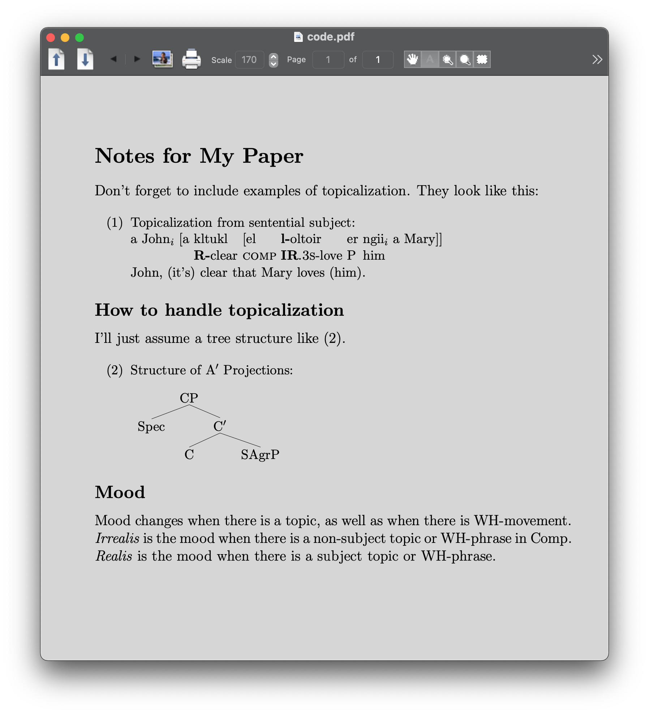
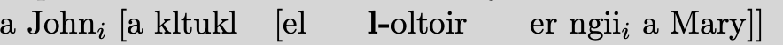
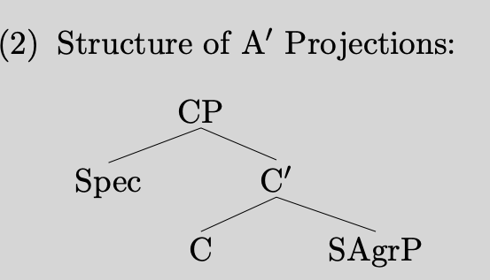
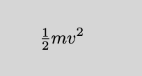

## 项目实战：将费曼物理讲义网页做成电子书


### 项目背景

费曼物理讲义已经在公开在网上可以阅读。我想在`Kindle`上看它。然而因为它有挺多的数学公式。它最初的稿子应该是用`latex`做的。它用`mathjax`这个库来把`latex`格式的内容显示在网页上。

举个例子。

```html
<span class="MathJax_Preview" style="color: inherit; display: none;">
</span>
<div class="MathJax_Display">
    <span class="MathJax MathJax_FullWidth" id="MathJax-Element-10-Frame" tabindex="0" style="">
        <nobr>
            <span class="math" id="MathJax-Span-151" style="width: 100%; display: inline-block; min-width: 11.088em;">
                <span style="display: inline-block; position: relative; width: 100%; height: 0px; font-size: 106%; min-width: 11.088em;"><span style="position: absolute; clip: rect(3.069em, 1005.43em, 4.484em, -999.997em); top: -4.006em; left: 0em; width: 100%;"><span class="mrow" id="MathJax-Span-152"><span class="mtable" id="MathJax-Span-153" style="min-width: 11.088em;"><span style="display: inline-block; position: relative; width: 100%; height: 0px; min-width: 11.088em;"><span style="display: inline-block; position: absolute; width: 5.486em; height: 0px; clip: rect(-0.94em, 1005.43em, 0.475em, -999.997em); top: 0em; left: 50%; margin-left: -2.768em;"><span style="position: absolute; clip: rect(3.128em, 1005.43em, 4.484em, -999.997em); top: -4.006em; left: 0em;"><span style="display: inline-block; position: relative; width: 5.486em; height: 0px;"><span style="position: absolute; clip: rect(3.069em, 1005.43em, 4.425em, -999.997em); top: -4.006em; left: 50%; margin-left: -2.768em;"><span class="mtd" id="MathJax-Span-157"><span class="mrow" id="MathJax-Span-158"><span class="mi" id="MathJax-Span-159" style="font-family: MathJax_Math-italic;">d<span style="display: inline-block; overflow: hidden; height: 1px; width: 0.003em;"></span></span><span class="mi" id="MathJax-Span-160" style="font-family: MathJax_Math-italic;">T<span style="display: inline-block; overflow: hidden; height: 1px; width: 0.121em;"></span></span><span class="texatom" id="MathJax-Span-161"><span class="mrow" id="MathJax-Span-162"><span class="mo" id="MathJax-Span-163" style="font-family: MathJax_Main;">/</span></span></span><span class="mi" id="MathJax-Span-164" style="font-family: MathJax_Math-italic;">d<span style="display: inline-block; overflow: hidden; height: 1px; width: 0.003em;"></span></span><span class="mi" id="MathJax-Span-165" style="font-family: MathJax_Math-italic;">t</span><span class="mo" id="MathJax-Span-166" style="font-family: MathJax_Main; padding-left: 0.298em;">=</span><span class="mi" id="MathJax-Span-167" style="font-family: MathJax_Math-italic; padding-left: 0.298em;">F<span style="display: inline-block; overflow: hidden; height: 1px; width: 0.121em;"></span></span><span class="mi" id="MathJax-Span-168" style="font-family: MathJax_Math-italic;">v</span><span class="mo" id="MathJax-Span-169" style="font-family: MathJax_Main;">.</span></span></span><span style="display: inline-block; width: 0px; height: 4.012em;"></span></span></span><span style="display: inline-block; width: 0px; height: 4.012em;"></span></span></span><span style="display: inline-block; position: absolute; width: 2.538em; height: 0px; clip: rect(-0.881em, 1002.48em, 0.475em, -999.997em); top: 0em; right: 0em; margin-right: 0em;"><span style="position: absolute; clip: rect(3.069em, 1002.48em, 4.425em, -999.997em); top: -4.006em; right: 0em;"><span class="mtd" id="mjx-eqn-EqI133"><span class="mrow" id="MathJax-Span-155"><span class="mtext" id="MathJax-Span-156" style="font-family: MathJax_Main;">(13.3)</span></span></span><span style="display: inline-block; width: 0px; height: 4.012em;"></span></span></span></span></span></span><span style="display: inline-block; width: 0px; height: 4.012em;"></span></span></span><span style="display: inline-block; overflow: hidden; vertical-align: -0.372em; border-left: 0px solid; width: 0px; height: 1.253em;">
                </span>
            </span>
        </nobr>
    </span>
</div>
<script type="math/tex; mode=display" id="MathJax-Element-10">\begin{equation}
\label{Eq:I:13:3}
dT/dt = Fv.
\end{equation}
</script>
```

这一块`html`代码中。`script`标签下是`latex`的原样文本。`mathjax`把它变成很多的`span`。来显示它。

我们现在有个思路。就是把`mathjax`的显示方法改成`svg`图片。

从 GitHub 上找到一个项目`tuxu/latex2svg`。

```python
from latex2svg import latex2svg
out = latex2svg(r'\( e^{i \pi} + 1 = 0 \)')
print(out['depth'])
print(out['svg'])
```

试着运行，但出错了。

```shell
    raise RuntimeError('latex not found')
RuntimeError: latex not found
```

看看代码。

```python
    # Run LaTeX and create DVI file
    try:
        ret = subprocess.run(shlex.split(params['latex_cmd']+' code.tex'),
                             stdout=subprocess.PIPE, stderr=subprocess.PIPE,
                             cwd=working_directory)
        ret.check_returncode()
    except FileNotFoundError:
        raise RuntimeError('latex not found')
```

原来这也依赖于`latex`命令。

安装一下。

```shell
brew install --cask mactex
==> Caveats
You must restart your terminal window for the installation of MacTex CLI tools to take effect.
Alternatively, Bash and Zsh users can run the command:
  eval "$(/usr/libexec/path_helper)"
==> Downloading http://mirror.ctan.org/systems/mac/mactex/mactex-20200407.pkg
==> Downloading from https://mirrors.aliyun.com/CTAN/systems/mac/mactex/mactex-20200407.pkg
######################################################################## 100.0%
All formula dependencies satisfied.
==> Installing Cask mactex
==> Running installer for mactex; your password may be necessary.
installer: Package name is MacTeX
installer: choices changes file '/private/tmp/choices20210315-4643-5884ro.xml' applied
installer: Installing at base path /
installer: The install was successful.
🍺  mactex was successfully installed!
```

安装成功。

```shell
% latex
This is pdfTeX, Version 3.14159265-2.6-1.40.21 (TeX Live 2020) (preloaded format=latex)
 restricted \write18 enabled.
**
```

```python
out = latex2svg(r'\( e^{i \pi} + 1 = 0 \)')
print(out['depth'])
print(out['svg'])

svg = open('1.svg', 'w')
svg.write(out['svg'])
svg.close()
```

可以生成`svg`了。

所以试试把`mathjax`中得到的`latex`文本都生成一下。

```python
from bs4 import BeautifulSoup
from latex2svg import latex2svg

file = open('The Feynman Lectures on Physics Vol. I Ch. 13_ Work and Potential Energy (A).html')
content = file.read()

soup = BeautifulSoup(content)

mathjaxs = soup.findAll('script', {'type': 'math/tex'})
for mathjax in mathjaxs:
    print(mathjax.string)
    out = latex2svg(mathjax.string)
    print(out['svg'])
```

可惜出错了。

```python
    raise CalledProcessError(self.returncode, self.args, self.stdout,
subprocess.CalledProcessError: Command '['latex', '-interaction', 'nonstopmode', '-halt-on-error', 'code.tex']' returned non-zero exit status 1.
```

具体哪个公式错了呢。

```latex
\tfrac{1}{2}mv^2
```


## latex

来学习一下`latex`。

```latex
\documentclass[12pt]{article}
\usepackage{lingmacros}
\usepackage{tree-dvips}
\begin{document}

\section*{Notes for My Paper}

Don't forget to include examples of topicalization.
They look like this:

{\small
\enumsentence{Topicalization from sentential subject:\\ 
\shortex{7}{a John$_i$ [a & kltukl & [el & 
  {\bf l-}oltoir & er & ngii$_i$ & a Mary]]}
{ & {\bf R-}clear & {\sc comp} & 
  {\bf IR}.{\sc 3s}-love   & P & him & }
{John, (it's) clear that Mary loves (him).}}
}

\subsection*{How to handle topicalization}

I'll just assume a tree structure like (\ex{1}).

{\small
\enumsentence{Structure of A$'$ Projections:\\ [2ex]
\begin{tabular}[t]{cccc}
    & \node{i}{CP}\\ [2ex]
    \node{ii}{Spec} &   &\node{iii}{C$'$}\\ [2ex]
        &\node{iv}{C} & & \node{v}{SAgrP}
\end{tabular}
\nodeconnect{i}{ii}
\nodeconnect{i}{iii}
\nodeconnect{iii}{iv}
\nodeconnect{iii}{v}
}
}

\subsection*{Mood}

Mood changes when there is a topic, as well as when
there is WH-movement.  \emph{Irrealis} is the mood when
there is a non-subject topic or WH-phrase in Comp.
\emph{Realis} is the mood when there is a subject topic
or WH-phrase.

\end{document}
```

网上找到一段样例的`latex`源码。

```shell
% latex code.tex
This is pdfTeX, Version 3.14159265-2.6-1.40.21 (TeX Live 2020) (preloaded format=latex)
 restricted \write18 enabled.
entering extended mode
(./code.tex
LaTeX2e <2020-02-02> patch level 5
L3 programming layer <2020-03-06>
(/usr/local/texlive/2020/texmf-dist/tex/latex/base/article.cls
Document Class: article 2019/12/20 v1.4l Standard LaTeX document class
(/usr/local/texlive/2020/texmf-dist/tex/latex/base/size12.clo))
(/usr/local/texlive/2020/texmf-dist/tex/latex/tree-dvips/lingmacros.sty)
(/usr/local/texlive/2020/texmf-dist/tex/latex/tree-dvips/tree-dvips.sty
tree-dvips version .91 of May 16, 1995
) (/usr/local/texlive/2020/texmf-dist/tex/latex/l3backend/l3backend-dvips.def)
(./code.aux) [1] (./code.aux) )
Output written on code.dvi (1 page, 3416 bytes).
Transcript written on code.log.
```



来对着源码和渲染后的效果，看看能学到什么。

```latex
\begin{document}
\end{document}
```

这样来把文档裹起来。

```latex
\section*{Notes for My Paper}
```

这表示`section`标题开头。

```latex
\subsection*{How to handle topicalization}
```

这表示子标题。

```latex
\shortex{7}{a John$_i$ [a & kltukl & [el & 
  {\bf l-}oltoir & er & ngii$_i$ & a Mary]]}
```



可见`$_i$`来表示下标。`{\bf l-}`来表示加粗。

```latex
\enumsentence{Structure of A$'$ Projections:\\ [2ex]
\begin{tabular}[t]{cccc}
    & \node{i}{CP}\\ [2ex]
    \node{ii}{Spec} &   &\node{iii}{C$'$}\\ [2ex]
        &\node{iv}{C} & & \node{v}{SAgrP}
\end{tabular}
\nodeconnect{i}{ii}
\nodeconnect{i}{iii}
\nodeconnect{iii}{iv}
\nodeconnect{iii}{v}
}
```



注意到`nodeconnect`来表示连线。


### 继续项目

```latex
\documentclass[16pt]{article}
\usepackage{amsmath}
\begin{document}

\[\tfrac{1}{2}mv^2\]

\end{document}
```



这样可以正确地被渲染。在代码里无法被渲染，可能是因为没有加上`\usepackage{amsmath}`。

```latex
\documentclass[12pt,preview]{standalone}

\usepackage[utf8x]{inputenc}
\usepackage{amsmath}
\usepackage{amsfonts}
\usepackage{amssymb}
\usepackage{newtxtext}
\usepackage[libertine]{newtxmath}

\begin{document}
\begin{preview}
\tfrac{1}{2}mv^2
\end{preview}
\end{document}
```

```shell
! Missing $ inserted.
<inserted text>
                $
l.12 \tfrac{1}{2}
                 mv^2
```

这样出错了。而改成一下这样就可以。

```latex
\[\tfrac{1}{2}mv^2\]
```

进行各种试探。

```python
from bs4 import BeautifulSoup
from latex2svg import latex2svg

file = open('The Feynman Lectures on Physics Vol. I Ch. 13_ Work and Potential Energy (A).html')
content = file.read()

soup = BeautifulSoup(content, features="lxml")

mathjaxs = soup.findAll('script', {'type': 'math/tex'})
for mathjax in mathjaxs:
    print(mathjax.string)
    wrap = '$' + mathjax.string + '$'
    # if 'frac' in mathjax.string:
    #     wrap = '$' + mathjax.string + '$'
    if 'FLP' in mathjax.string:
        continue
    elif 'Fig' in mathjax.string:
        continue
    elif 'eps' in mathjax.string:
        continue
    out = latex2svg(wrap)
    # print(out)
    node = BeautifulSoup(out['svg'], features="lxml")
    svg = node.find('svg')
    mathjax.insert_after(svg)
    # print(out['svg'])
    # break
    # mathjax.replaceWith(out['svg'])    
    
    # print(dir(mathjax))
    # break
    
    # out = latex2svg(wrap)    
    # print(out['svg'])

# print(len(soup.contents))
    
output_file = open('out.html', 'w')
output_file.write(soup.prettify())
output_file.close()
# print(soup.contents)

# out = latex2svg(r'\( e^{i \pi} + 1 = 0 \)')
# print(out['depth'])
# print(out['svg'])

# svg = open('1.svg', 'w')
# svg.write(out['svg'])
# svg.close()

```

