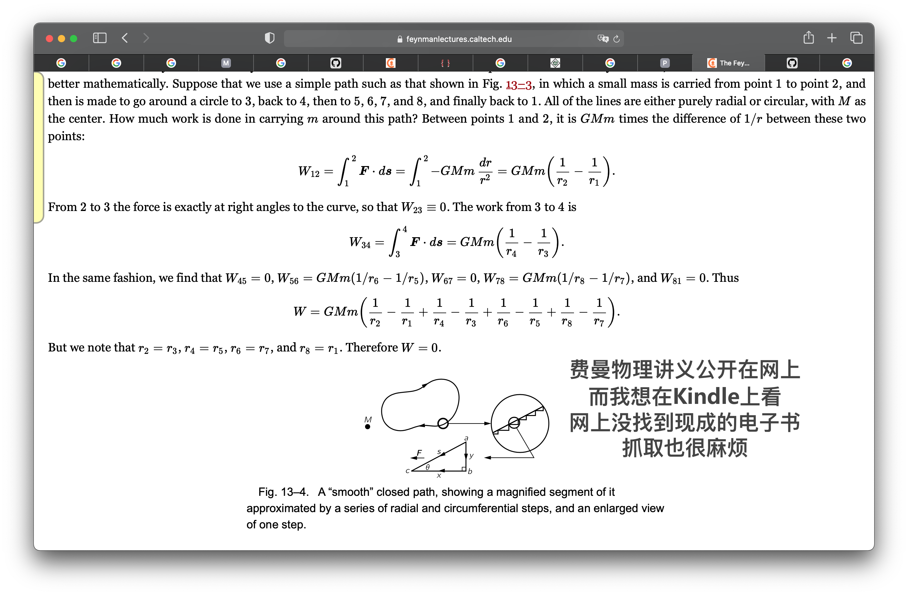
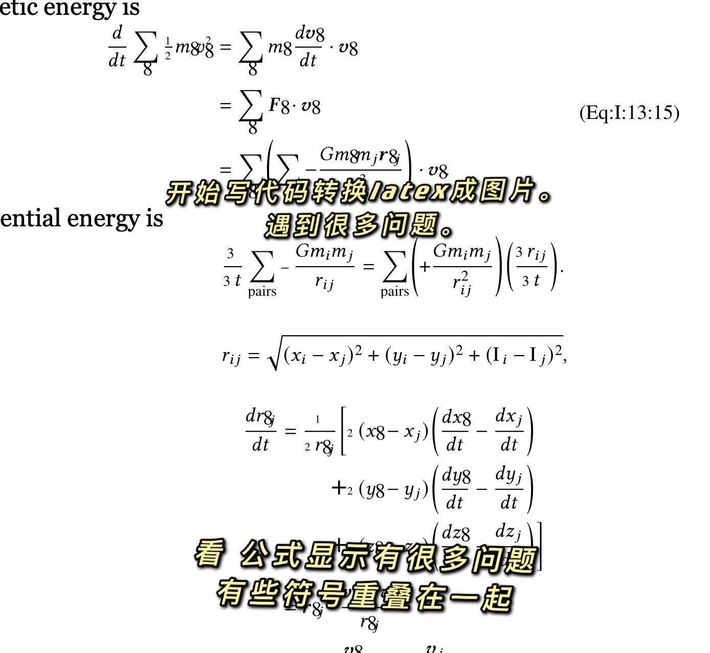
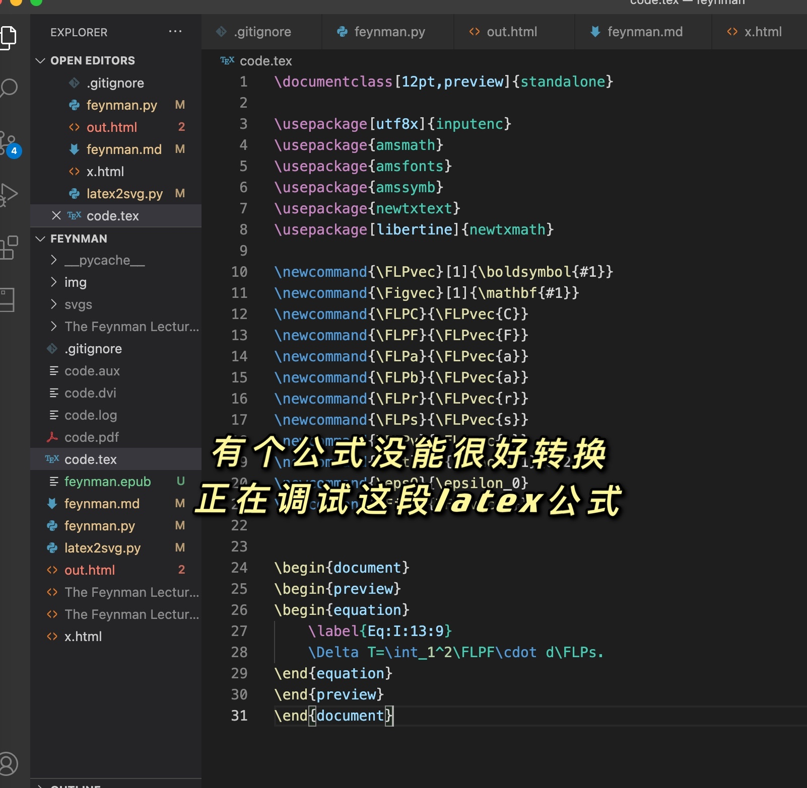
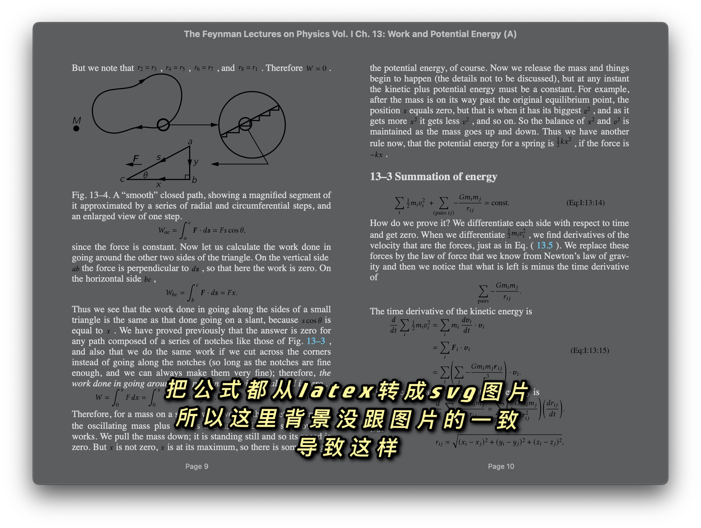
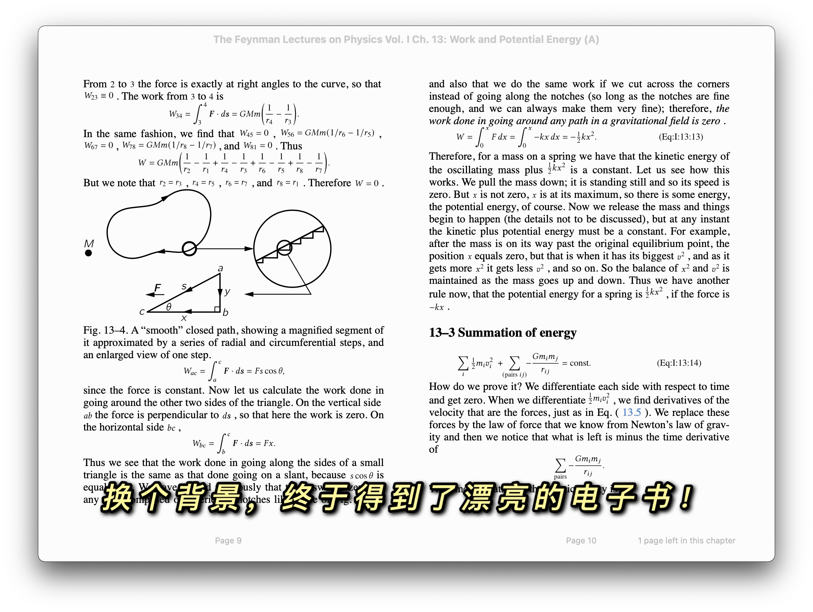
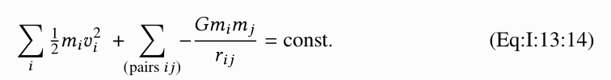
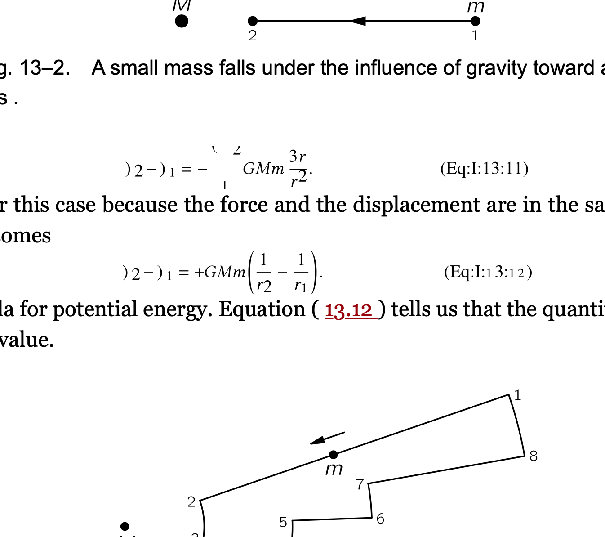

## 项目实战：将费曼物理讲义网页做成电子书


### 项目简介

先大致讲讲项目情况。











做完项目后，有点开心。写下了这样一段话。

写了一天代码，终于得到了漂亮的费曼物理讲义电子书！费曼物理讲义公开在网上，是用`latex`渲染的。人们常用`latex`来写论文，它对数学公式的渲染很棒。而公开在网上，用到了`mathjax`这个库。它把`latex`源码变成了`html`代码，生成了很多的`div`和`span`标签。电子书却不支持这种方式。这时，想法是抓取网页，逆向`mathjax`渲染，接着替换成`svg`图片。出现了挺多问题，一个是源码有很多的`latex`自定义宏，需要加上；第二个是内嵌很多`svg`会有问题。如果是单个`svg`倒没问题，很多的时候会出现问题。大概是浏览器和`svg`的诡异Bug。这时只要把`svg`保存为文件，用`img`标签引入进来即可。公式也分为两种，一种是文本中间的公式，一种是单行的公式。所以，最后就得到了漂亮的电子书！


### 查询的资料

这里记录了解决项目过程中访问的资料。因为这是一个教程，所以向学生展示一下大概做一个项目是怎么样的体验。


### 开始项目

费曼物理讲义已经在公开在网上可以阅读。我想在`Kindle`上看它。然而因为它有挺多的数学公式。它最初的稿子应该是用`latex`做的。它用`mathjax`这个库来把`latex`格式的内容显示在网页上。

举个例子。

```html
<span class="MathJax_Preview" style="color: inherit; display: none;">
</span>
<div class="MathJax_Display">
    <span class="MathJax MathJax_FullWidth" id="MathJax-Element-10-Frame" tabindex="0" style="">
              <span class="mi" id="MathJax-Span-159" style="font-family: MathJax_Math-italic;">d<span style="display: inline-block; overflow: hidden; height: 1px; width: 0.003em;">
                </span>  
    </span>
</div>
<script type="math/tex; mode=display" id="MathJax-Element-10">\begin{equation}
\label{Eq:I:13:3}
dT/dt = Fv.
\end{equation}
</script>
```

上面是截取的一段`html`代码。这一块`html`代码中。`script`标签下是`latex`的原样文本。`mathjax`把它变成很多的`span`。来显示它。

我们现在有个思路。就是把`mathjax`的显示方法改成`svg`图片。

从 GitHub 上找到一个项目`tuxu/latex2svg`。

```python
from latex2svg import latex2svg
out = latex2svg(r'\( e^{i \pi} + 1 = 0 \)')
print(out['depth'])
print(out['svg'])
```

试着运行，但出错了。

```shell
    raise RuntimeError('latex not found')
RuntimeError: latex not found
```

看看代码。

```python
    # Run LaTeX and create DVI file
    try:
        ret = subprocess.run(shlex.split(params['latex_cmd']+' code.tex'),
                             stdout=subprocess.PIPE, stderr=subprocess.PIPE,
                             cwd=working_directory)
        ret.check_returncode()
    except FileNotFoundError:
        raise RuntimeError('latex not found')
```

原来这也依赖于`latex`命令。

安装一下。

```shell
brew install --cask mactex
==> Caveats
You must restart your terminal window for the installation of MacTex CLI tools to take effect.
Alternatively, Bash and Zsh users can run the command:
  eval "$(/usr/libexec/path_helper)"
==> Downloading http://mirror.ctan.org/systems/mac/mactex/mactex-20200407.pkg
==> Downloading from https://mirrors.aliyun.com/CTAN/systems/mac/mactex/mactex-20200407.pkg
######################################################################## 100.0%
All formula dependencies satisfied.
==> Installing Cask mactex
==> Running installer for mactex; your password may be necessary.
installer: Package name is MacTeX
installer: choices changes file '/private/tmp/choices20210315-4643-5884ro.xml' applied
installer: Installing at base path /
installer: The install was successful.
🍺  mactex was successfully installed!
```

安装成功。

```shell
% latex
This is pdfTeX, Version 3.14159265-2.6-1.40.21 (TeX Live 2020) (preloaded format=latex)
 restricted \write18 enabled.
**
```

```python
out = latex2svg(r'\( e^{i \pi} + 1 = 0 \)')
print(out['depth'])
print(out['svg'])

svg = open('1.svg', 'w')
svg.write(out['svg'])
svg.close()
```

可以生成`svg`了。

所以试试把`mathjax`中得到的`latex`文本都生成一下。

```python
from bs4 import BeautifulSoup
from latex2svg import latex2svg

file = open('The Feynman Lectures on Physics Vol. I Ch. 13_ Work and Potential Energy (A).html')
content = file.read()

soup = BeautifulSoup(content)

mathjaxs = soup.findAll('script', {'type': 'math/tex'})
for mathjax in mathjaxs:
    print(mathjax.string)
    out = latex2svg(mathjax.string)
    print(out['svg'])
```

可惜出错了。

```python
    raise CalledProcessError(self.returncode, self.args, self.stdout,
subprocess.CalledProcessError: Command '['latex', '-interaction', 'nonstopmode', '-halt-on-error', 'code.tex']' returned non-zero exit status 1.
```

具体哪个公式错了呢。

```latex
\tfrac{1}{2}mv^2
```


## latex

来学习一下`latex`。

```latex
\documentclass[12pt]{article}
\usepackage{lingmacros}
\usepackage{tree-dvips}
\begin{document}

\section*{Notes for My Paper}

Don't forget to include examples of topicalization.
They look like this:

{\small
\enumsentence{Topicalization from sentential subject:\\ 
\shortex{7}{a John$_i$ [a & kltukl & [el & 
  {\bf l-}oltoir & er & ngii$_i$ & a Mary]]}
{ & {\bf R-}clear & {\sc comp} & 
  {\bf IR}.{\sc 3s}-love   & P & him & }
{John, (it's) clear that Mary loves (him).}}
}

\subsection*{How to handle topicalization}

I'll just assume a tree structure like (\ex{1}).

{\small
\enumsentence{Structure of A$'$ Projections:\\ [2ex]
\begin{tabular}[t]{cccc}
    & \node{i}{CP}\\ [2ex]
    \node{ii}{Spec} &   &\node{iii}{C$'$}\\ [2ex]
        &\node{iv}{C} & & \node{v}{SAgrP}
\end{tabular}
\nodeconnect{i}{ii}
\nodeconnect{i}{iii}
\nodeconnect{iii}{iv}
\nodeconnect{iii}{v}
}
}

\subsection*{Mood}

Mood changes when there is a topic, as well as when
there is WH-movement.  \emph{Irrealis} is the mood when
there is a non-subject topic or WH-phrase in Comp.
\emph{Realis} is the mood when there is a subject topic
or WH-phrase.

\end{document}
```

网上找到一段样例的`latex`源码。

```shell
% latex code.tex
This is pdfTeX, Version 3.14159265-2.6-1.40.21 (TeX Live 2020) (preloaded format=latex)
 restricted \write18 enabled.
entering extended mode
(./code.tex
LaTeX2e <2020-02-02> patch level 5
L3 programming layer <2020-03-06>
(/usr/local/texlive/2020/texmf-dist/tex/latex/base/article.cls
Document Class: article 2019/12/20 v1.4l Standard LaTeX document class
(/usr/local/texlive/2020/texmf-dist/tex/latex/base/size12.clo))
(/usr/local/texlive/2020/texmf-dist/tex/latex/tree-dvips/lingmacros.sty)
(/usr/local/texlive/2020/texmf-dist/tex/latex/tree-dvips/tree-dvips.sty
tree-dvips version .91 of May 16, 1995
) (/usr/local/texlive/2020/texmf-dist/tex/latex/l3backend/l3backend-dvips.def)
(./code.aux) [1] (./code.aux) )
Output written on code.dvi (1 page, 3416 bytes).
Transcript written on code.log.
```


来对着源码和渲染后的效果，看看能学到什么。

```latex
\begin{document}
\end{document}
```

这样来把文档裹起来。

```latex
\section*{Notes for My Paper}
```

这表示`section`标题开头。

```latex
\subsection*{How to handle topicalization}
```

这表示子标题。

```latex
\shortex{7}{a John$_i$ [a & kltukl & [el & 
  {\bf l-}oltoir & er & ngii$_i$ & a Mary]]}
```


可见`$_i$`来表示下标。`{\bf l-}`来表示加粗。

```latex
\enumsentence{Structure of A$'$ Projections:\\ [2ex]
\begin{tabular}[t]{cccc}
    & \node{i}{CP}\\ [2ex]
    \node{ii}{Spec} &   &\node{iii}{C$'$}\\ [2ex]
        &\node{iv}{C} & & \node{v}{SAgrP}
\end{tabular}
\nodeconnect{i}{ii}
\nodeconnect{i}{iii}
\nodeconnect{iii}{iv}
\nodeconnect{iii}{v}
}
```


注意到`nodeconnect`来表示连线。


### latex 转换成 svg

继续项目。

```latex
\documentclass[16pt]{article}
\usepackage{amsmath}
\begin{document}

\[\tfrac{1}{2}mv^2\]

\end{document}
```


这样可以正确地被渲染。在代码里无法被渲染，可能是因为没有加上`\usepackage{amsmath}`。

```latex
\documentclass[12pt,preview]{standalone}

\usepackage[utf8x]{inputenc}
\usepackage{amsmath}
\usepackage{amsfonts}
\usepackage{amssymb}
\usepackage{newtxtext}
\usepackage[libertine]{newtxmath}

\begin{document}
\begin{preview}
\tfrac{1}{2}mv^2
\end{preview}
\end{document}
```

```shell
! Missing $ inserted.
<inserted text>
                $
l.12 \tfrac{1}{2}
                 mv^2
```

这样出错了。而改成一下这样就可以。

```latex
\[\tfrac{1}{2}mv^2\]
```

进行各种试探。

```python
from bs4 import BeautifulSoup
from latex2svg import latex2svg

file = open('The Feynman Lectures on Physics Vol. I Ch. 13_ Work and Potential Energy (A).html')
content = file.read()

soup = BeautifulSoup(content, features="lxml")

mathjaxs = soup.findAll('script', {'type': 'math/tex'})
for mathjax in mathjaxs:
    print(mathjax.string)
    wrap = '$' + mathjax.string + '$'
    # if 'frac' in mathjax.string:
    #     wrap = '$' + mathjax.string + '$'
    if 'FLP' in mathjax.string:
        continue
    elif 'Fig' in mathjax.string:
        continue
    elif 'eps' in mathjax.string:
        continue
    out = latex2svg(wrap)
    # print(out)
    node = BeautifulSoup(out['svg'], features="lxml")
    svg = node.find('svg')
    mathjax.insert_after(svg)
    # print(out['svg'])
    # break
    # mathjax.replaceWith(out['svg'])    
    
    # print(dir(mathjax))
    # break
    
    # out = latex2svg(wrap)    
    # print(out['svg'])

# print(len(soup.contents))
    
output_file = open('out.html', 'w')
output_file.write(soup.prettify())
output_file.close()
# print(soup.contents)

# out = latex2svg(r'\( e^{i \pi} + 1 = 0 \)')
# print(out['depth'])
# print(out['svg'])

# svg = open('1.svg', 'w')
# svg.write(out['svg'])
# svg.close()

```

这些我都在试探什么呢。

```python
    if 'FLP' in mathjax.string:
        continue
    elif 'Fig' in mathjax.string:
        continue
    elif 'eps' in mathjax.string:
        continue
```

这里当解析到有`FLP`、`Fig`、`eps`在`latex`源码的时候，转换的过程出错了。

例如，在`HTML中`，有这样的脚本：

```html
<script type="math/tex" id="MathJax-Element-11">\FLPF\cdot\FLPv</script>
```

解析拿到：

```latex
\FLPF\cdot\FLPv
```

当在代码里转换的时候出错了。也即，`latex2svg.py`出错了。这里就是用`latex`程序来转换。

`code.tex`:

```latex
\documentclass[12pt,preview]{standalone}

\usepackage[utf8x]{inputenc}
\usepackage{amsmath}
\usepackage{amsfonts}
\usepackage{amssymb}
\usepackage{newtxtext}
\usepackage[libertine]{newtxmath}

\begin{document}
\begin{preview}
\begin{equation}
    \FLPF\cdot\FLPv
\end{equation}
\end{preview}
\end{document}
```

```shell
$latex code.tex
! Undefined control sequence.
l.13     \FLPF
              \cdot\FLPv
?
```

这到底是什么问题。我后来才注意到在`html`中的这段代码。

```html
<script type="text/x-mathjax-config;executed=true">
      MathJax.Hub.Config({
        TeX: {
          Macros: {
            FLPvec: ["\\boldsymbol{#1}", 1], Figvec: ["\\mathbf{#1}", 1], FLPC: ["\\FLPvec{C}", 0], FLPF: ["\\FLPvec{F}", 0], FLPa: ["\\FLPvec{a}", 0], FLPb: ["\\FLPvec{b}", 0], FLPr: ["\\FLPvec{r}", 0], FLPs: ["\\FLPvec{s}", 0], FLPv: ["\\FLPvec{v}", 0], ddt: ["\\frac{d#1}{d#2}", 2], epsO: ["\\epsilon_0", 0], FigC: ["\\Figvec{C}", 0]
          }
        }
      });
</script>
```

这表示网页在渲染的时候，给`MathJax`设置上了宏。所以我们的`latex`转换源码里也应该加上。来加上它们。

```latex
\documentclass[12pt,preview]{standalone}

\usepackage[utf8x]{inputenc}
\usepackage{amsmath}
\usepackage{amsfonts}
\usepackage{amssymb}
\usepackage{newtxtext}
\usepackage[libertine]{newtxmath}

\newcommand{\FLPvec}[1]{\boldsymbol{#1}}
\newcommand{\Figvec}[1]{\mathbf{#1}}
\newcommand{\FLPC}{\FLPvec{C}}
\newcommand{\FLPF}{\FLPvec{F}}
\newcommand{\FLPa}{\FLPvec{a}}
\newcommand{\FLPb}{\FLPvec{a}}
\newcommand{\FLPr}{\FLPvec{r}}
\newcommand{\FLPs}{\FLPvec{s}}
\newcommand{\FLPv}{\FLPvec{v}}
\newcommand{\ddt}[2]{\frac{d#1}{d#2}}
\newcommand{\epsO}{\epsilon_0}
\newcommand{\FigC}{\Figvec{C}}


\begin{document}
\begin{preview}
\begin{equation}
    \FLPF\cdot\FLPv
\end{equation}
\end{preview}
\end{document}
```

这样就对了。


### 分析代码

来看看最后的代码。

```python
import subprocess
from bs4 import BeautifulSoup
from latex2svg import latex2svg

def clean_mathjax(soup, name, cls):
    previews = soup.findAll(name, {'class': cls})
    for preview in previews:
        preview.decompose()
        
def clean_script(soup):
    scripts = soup.findAll('script')
    for s in scripts:
        s.decompose()    

def wrap_latex(mathjax, equation = False):
    wrap = ''
    if equation:
        wrap = mathjax.string
    else:
        wrap = '$' + mathjax.string + '$'
    wrap = wrap.replace('label', 'tag')
    return wrap
 
def wrap_svg(svg, equation):
    if equation:
        p = BeautifulSoup(f'<div style="text-align:center;"></div>', features="lxml")
        p.div.append(svg)
        return p.div
    else:
        return svg

def to_svg(mathjaxs, equation=False):
    if equation:
        svg_prefix = 'eq_'
    else:
        svg_prefix = 'in_'
    i = 0
    for mathjax in mathjaxs:     
        print(mathjax.string)
        wrap = wrap_latex(mathjax, equation=equation)   
        out = {}
        try:
            out = latex2svg(wrap)   
        except subprocess.CalledProcessError as err:
            raise err      
            
        f = open(f'svgs/{svg_prefix}{i}.svg', 'w')
        f.write(out['svg'])
        f.close()
        
        node = BeautifulSoup('', features="lxml")
        img = node.find('img')
        img.attrs['src'] = f'./svgs/{svg_prefix}{i}.svg'
        img.attrs['style'] = 'vertical-align: middle; margin: 0.5em 0;'
        
        p = wrap_svg(img, equation)
        mathjax.insert_after(p)
        i +=1

def main():    
    file = open('The Feynman Lectures on Physics Vol. I Ch. 13_ Work and Potential Energy (A).html')
    content = file.read()
    
    soup = BeautifulSoup(content, features="lxml")
    clean_mathjax(soup, 'span', 'MathJax')
    clean_mathjax(soup, 'div', 'MathJax_Display')
    clean_mathjax(soup, 'span', 'MathJax_Preview')
    
    mathjaxs = soup.findAll('script', {'type': 'math/tex'})
    to_svg(mathjaxs, equation=False)
    
    mathjaxs = soup.findAll('script', {'type': 'math/tex; mode=display'})   
    to_svg(mathjaxs, equation=True)
    
    clean_script(soup)
    
    output_file = open('out.html', 'w')
    output_file.write(soup.prettify())
    output_file.close()    

main()
```

当我们想转换整个电子书时，可以先用一个页面来试试。

```python
    file = open('The Feynman Lectures on Physics Vol. I Ch. 13_ Work and Potential Energy (A).html')
    content = file.read()
```

这里便是下载了一个页面。

`MathJax`生成了很多的`div`和`span`。意思是比如 `T+U=const`。MathJax这样来生成。

```html
<span class="MathJax">T</span>
<span class="MathJax">+</span>
<span class="MathJax">U</span>
<span class="MathJax">=</span>
<span class="MathJax">const</span>
```

这些很讨厌，也会影响我们的文本。因为已经有`svg`了，不需要这些了。

```python
def clean_mathjax(soup, name, cls):
    previews = soup.findAll(name, {'class': cls})
    for preview in previews:
        preview.decompose()

    clean_mathjax(soup, 'span', 'MathJax')
    clean_mathjax(soup, 'div', 'MathJax_Display')
    clean_mathjax(soup, 'span', 'MathJax_Preview')
```

把它们都去掉。

```python
    mathjaxs = soup.findAll('script', {'type': 'math/tex'})
    to_svg(mathjaxs, equation=False)
    
    mathjaxs = soup.findAll('script', {'type': 'math/tex; mode=display'})   
    to_svg(mathjaxs, equation=True)
```

注意到这里分成两种的`script`。

```latex
m(dv/dt)=F
```

这是内嵌形式的。

```latex
\begin{equation}
\underset{\text{K.E.}}{\tfrac{1}{2}mv^2}+
\underset{\text{P.E.}}{\vphantom{\tfrac{1}{2}}mgh}=\text{const},\notag
```

这是成段形式的。

当时内嵌形式时，转换要在表达式左右加上`$`或`[]`。否则就有可能出错。

```latex
\begin{document}
\begin{preview}
\tfrac{1}{2}mv^2
\end{preview}
\end{document}
```

```shell
! Missing $ inserted.
<inserted text>
                $
l.26 \tfrac{1}{2}
                 mv^2
```

得改成这样：

```latex
\begin{document}
\begin{preview}
$\tfrac{1}{2}mv^2$
\end{preview}
\end{document}
```

接下来看看如何转换`latex`成`svg`。

```python
    if equation:
        svg_prefix = 'eq_'
    else:
        svg_prefix = 'in_'
```

```shell
% tree svgs
svgs
├── eq_0.svg
├── eq_1.svg
├── in_0.svg
```

这样来保存`svg`。

```python
def wrap_latex(mathjax, equation = False):
    wrap = ''
    if equation:
        wrap = mathjax.string
    else:
        wrap = '$' + mathjax.string + '$'
    wrap = wrap.replace('label', 'tag')
    return wrap
```

这里来对`latex`源码进行一些调整。注意到`label`变成了`tag`。



注意右边的`(Eq:I:13:14)`。如果是`label`的话，则没解析成功。这会显示的是`(1)`。这里将就用`tag`表示一下，暂时没有深究。

接着就进行调用`latex2svg.py`。

```python
        out = {}
        try:
            out = latex2svg(wrap)   
        except subprocess.CalledProcessError as err:
            raise err    
```

看看`latex2svg.py`。

```python
    # Run LaTeX and create DVI file
    try:
        ret = subprocess.run(shlex.split(params['latex_cmd']+' code.tex'),
                             stdout=subprocess.PIPE, stderr=subprocess.PIPE,
                             cwd=working_directory)
        ret.check_returncode()
    except FileNotFoundError:
        raise RuntimeError('latex not found')
```

这里是在调用`latex`命令。

```shell
 % latex --help
Usage: pdftex [OPTION]... [TEXNAME[.tex]] [COMMANDS]
   or: pdftex [OPTION]... \FIRST-LINE
   or: pdftex [OPTION]... &FMT ARGS
  Run pdfTeX on TEXNAME, usually creating TEXNAME.pdf.
```

```python
    try:
        ret = subprocess.run(shlex.split(params['dvisvgm_cmd']+' code.dvi'),
                             stdout=subprocess.PIPE, stderr=subprocess.PIPE,
                             cwd=working_directory, env=env)
        ret.check_returncode()
    except FileNotFoundError:
        raise RuntimeError('dvisvgm not found')
```

这里是在调用`dvisvgm`命令。

```shell
% dvisvgm
dvisvgm 2.9.1

This program converts DVI files, as created by TeX/LaTeX, as well as
EPS and PDF files to the XML-based scalable vector graphics format SVG.

Usage: dvisvgm [options] dvifile
       dvisvgm --eps [options] epsfile
       dvisvgm --pdf [options] pdffile
```

上面说的`latex`自定义宏写在哪儿呢。这里要改一下`latex2svg.py`。改改`default_preamble`。

```python
default_preamble = r"""
\usepackage[utf8x]{inputenc}
\usepackage{amsmath}
\usepackage{amsfonts}
\usepackage{amssymb}
\usepackage{newtxtext}
\usepackage[libertine]{newtxmath}

\newcommand{\FLPvec}[1]{\boldsymbol{#1}}
\newcommand{\Figvec}[1]{\mathbf{#1}}
\newcommand{\FLPC}{\FLPvec{C}}
\newcommand{\FLPF}{\FLPvec{F}}
\newcommand{\FLPa}{\FLPvec{a}}
\newcommand{\FLPb}{\FLPvec{a}}
\newcommand{\FLPr}{\FLPvec{r}}
\newcommand{\FLPs}{\FLPvec{s}}
\newcommand{\FLPv}{\FLPvec{v}}
\newcommand{\ddt}[2]{\frac{d#1}{d#2}}
\newcommand{\epsO}{\epsilon_0}
\newcommand{\FigC}{\Figvec{C}}
"""
```

转换成功后，写入到文件。

```python
        f = open(f'svgs/{svg_prefix}{i}.svg', 'w')
        f.write(out['svg'])
        f.close()
```

继续。

```python
        node = BeautifulSoup('', features="lxml")
        img = node.find('img')
        img.attrs['src'] = f'./svgs/{svg_prefix}{i}.svg'
        img.attrs['style'] = 'vertical-align: middle; margin: 0.5em 0;'
```

这里构造一个`img`标签。

```python
def wrap_svg(svg, equation):
    if equation:
        p = BeautifulSoup(f'<div style="text-align:center;"></div>', features="lxml")
        p.div.append(svg)
        return p.div
    else:
        return svg
      
p = wrap_svg(img, equation)
```

如果是独段的`latex`，那么用`div`包起来，并且居中。

```python
mathjax.insert_after(p)
```

这里把`div`标签或`img`标签加在原来的`script`后面。

```python
def clean_script(soup):
    scripts = soup.findAll('script')
    for s in scripts:
        s.decompose()    
        
clean_script(soup)
```

把所有的`latex`替换完`svg`后，就不需要`script`了。把它们删掉，这样整洁一点。

最后，再写入把修改后的整个`html`写入到一个文件里。

```python
    output_file = open('out.html', 'w')
    output_file.write(soup.prettify())
    output_file.close()    
```

接着用`pandoc`工具，转换成`epub`。

```shell
pandoc -s -r html out.html -o feynman.epub
```

这会打开，就是漂亮的电子书了。

为什么不直接嵌入`svg`标签，而是用`img`来引入呢。即是说这样写：

```html
<p></p>
<svg></svg>
<p></p>
```

有个很奇怪的`bug`。当有很多的`svg`的时候，会出现这样的情况。



后来发现用`img`引入就行。至于为什么这样，没搞明白。当我把这单个的`svg`拿出来的时候，用浏览器看就没有问题。看来是在浏览器渲染非常多个`svg`时，就会出错。


### 最后

至于`epub`如何转成`mobi`，可以用`Kindle`的官方工具`Kindle Previewer 3`。注意这里只是一章。

该项目代码在[feynman-lectures-mobi@lzwjava](https://github.com/lzwjava/feynman-lectures-mobi)。

如何把所有的页面都抓取整理成电子书呢。后续再讲。但这费曼物理讲义一章也够看的了。好了，让我们拿起Kindle开始看吧。

