## 如何用上 Google

这节课有如下内容：

1. 如何登录翻墙网站官网
2. Windows平台如何翻墙
3. Clash 软件介绍
4. 试着打开Google、Twitter、Youtube 和TikTok

开始吧。这里用文字描述了我如何教会小王用上Google的。

我们这里用到的是一个叫召唤师的平台。网址是`https://zhshi.gitlab.io`。

然而可能上不去。因为它被长城防火墙阻拦了。

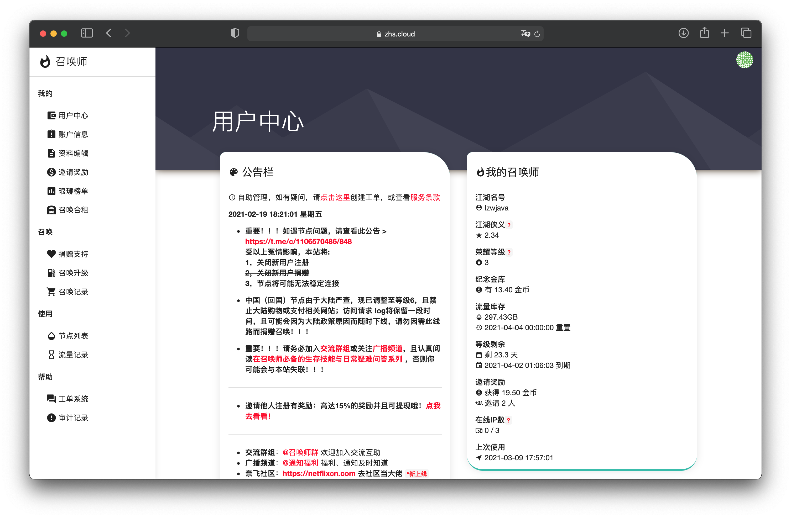

登录上去是这样的。

事实上，有两种翻墙的方式。一是我们自己买海外的服务器。二是使用翻墙平台，而这翻墙平台提供了挺多海外服务器的地址。

翻墙意思是说，先在国内访问到一个海外的服务器，这个海外的服务器可以访问被墙掉的网站。

这样的一个平台叫「召唤师」。那这个官网上不去，我们又如何获取它提供的海外服务器地址呢。小王是第一次翻墙，我远程地教他翻墙。我该如何教呢。

这时，我想到了，让小王的Windows电脑能够翻墙。我给小王提供地址。然后小王就可以打开「召唤师」的网站了，接着小王就可以注册一个账号，可以使用自己账号下的海外服务器地址了。

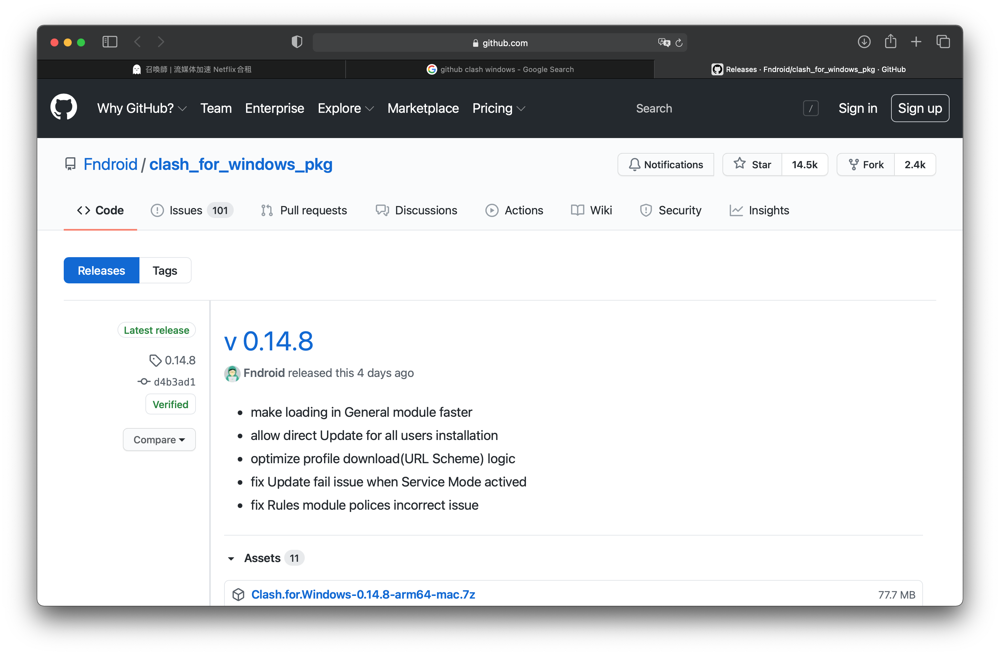

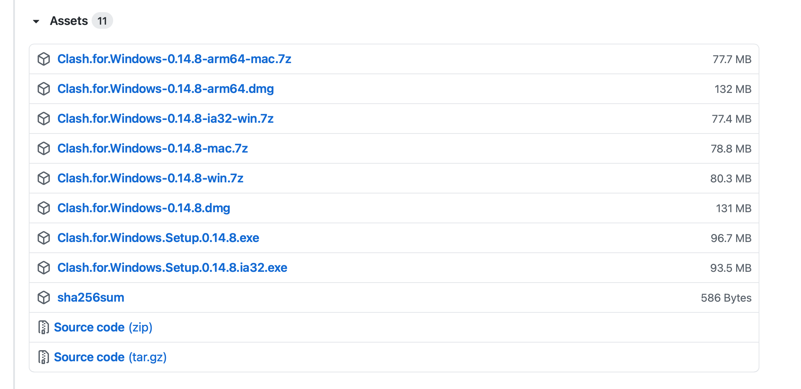

接着看看自己电脑是64位，还是32位。64位的话，下载`Clash.for.Windows.Setup.0.14.8.exe `，32位的话，下载`Clash.for.Windows.Setup.0.14.8.ia32.exe `。

小王的电脑是64位的。可他那里下载很慢。于是我这边电脑下载好了，用QQ邮箱发给他。

他到QQ邮箱上去下载，然后安装打开。

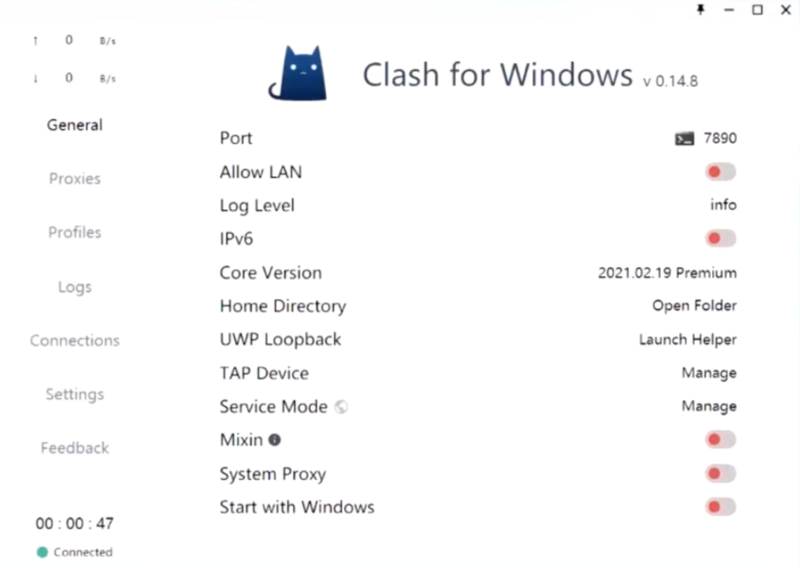

我先给了它我的召唤师配置地址。也就是说，这个配置地址会下载一个文件，这里文件包含着很多翻墙服务器地址。在`Profiles`下面，把地址填上，然后点击`Download`下载。

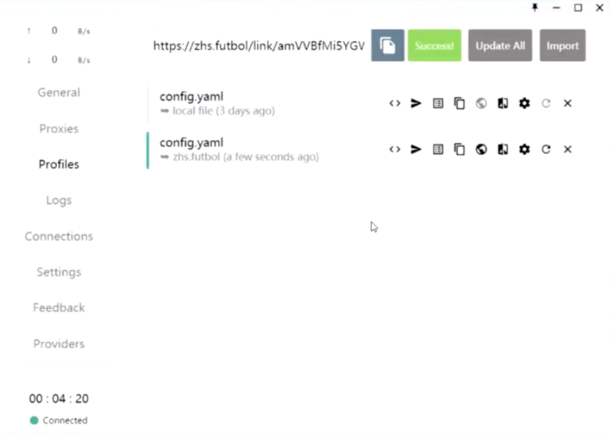

看下载好了。注意看上面第二个配置。注意到配置前面有个绿色的选中标志。表明我们已经在用这个配置了。

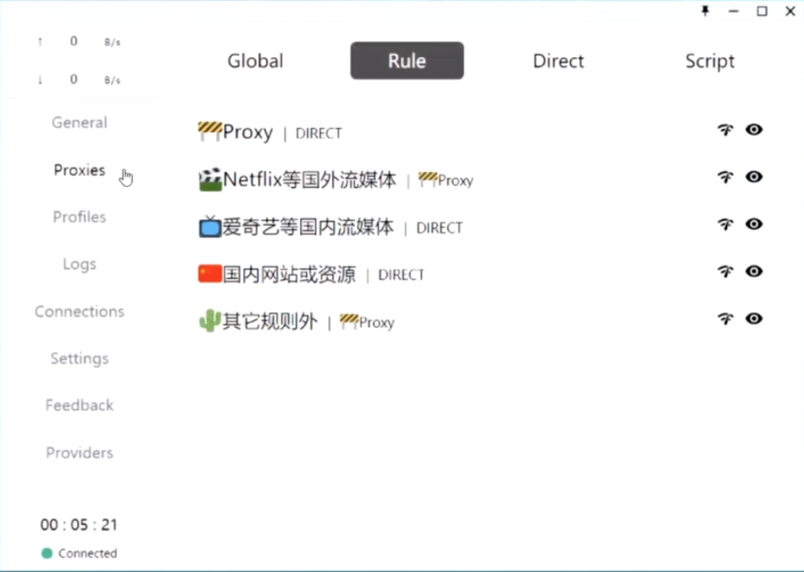

接着打开`Proxies`栏。可以看到这里有一些东西。这里是`Clash`的一些配置。简单说，就是说，国内的网址就不翻墙，国外的网址就翻墙。

注意到`Proxy`目前值是`DIRECT`，表明是直连。我们把它改成一个节点。

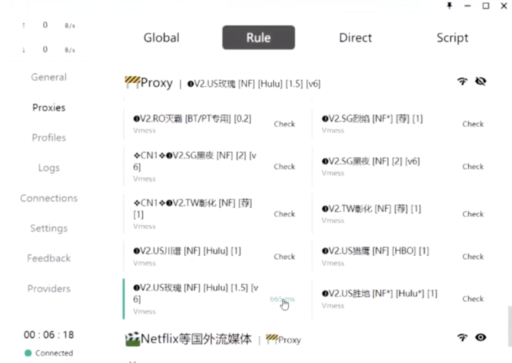

选择了 `US玫瑰`这个节点。

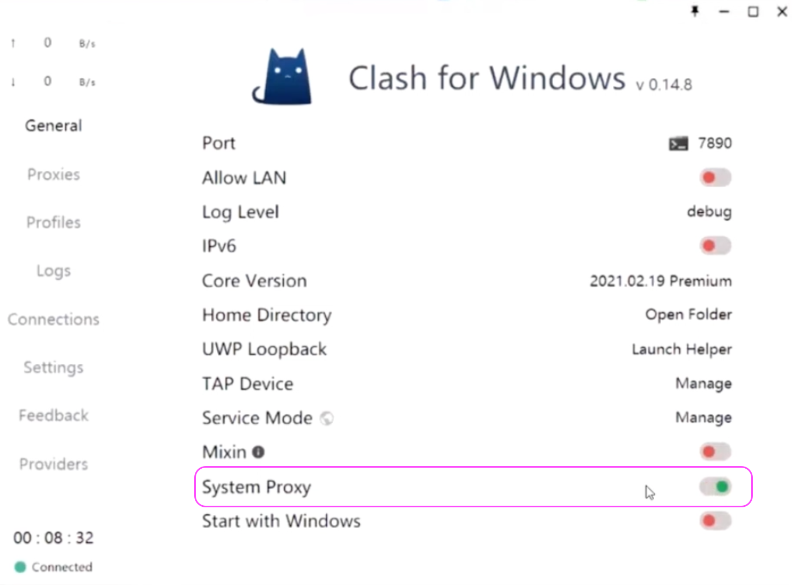

接着，把`System Proxy`这个设置，切换它的状态，来开启它。就是说将`Clash`软件设成系统的代理层。那么系统的流量将先到`Clash`软件，然后再去访问外网。

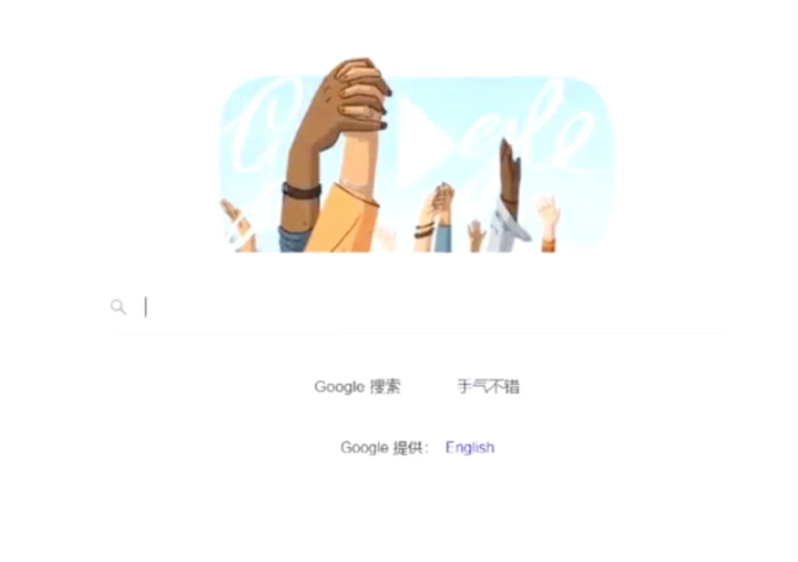

小王打开了谷歌。接下来试试了 TikTok、Youtube和Twitter。

嗯，那小王一直用着我的召唤师账号。他如何注册呢。那就打开召唤师的官网。

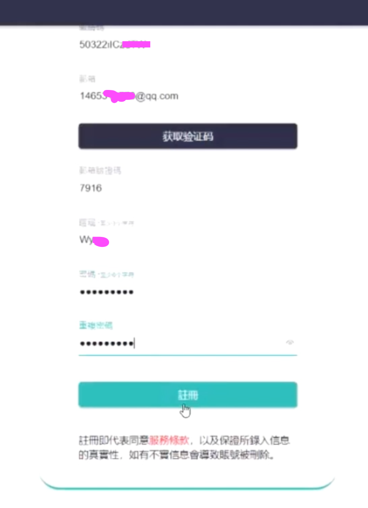

注册好了后。接下来却发现充值购买服务，需要一些步骤。以下是我账号的截图。

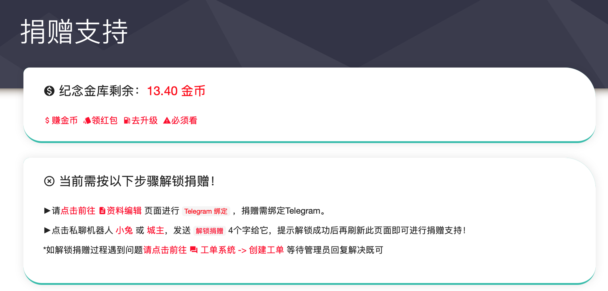

说是要绑定Telegram。

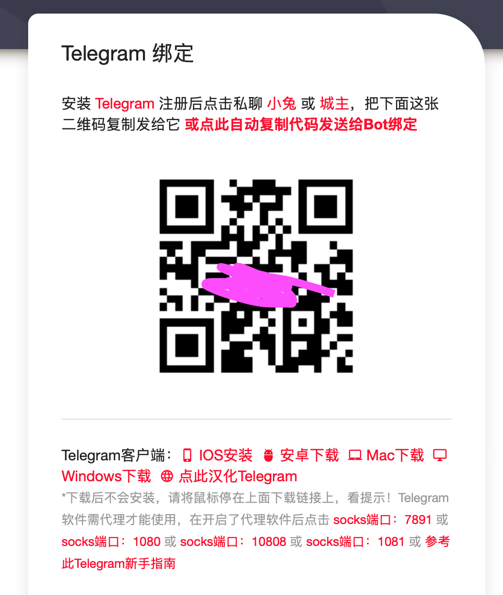

小王到 Telegram网站下载 Telegram Windows桌面版本。

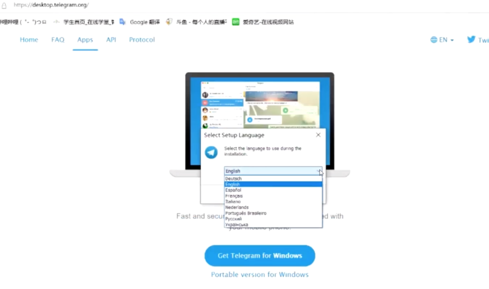

下载安装好后。注意看上面的话。

>  安装 Telegram 注册后点击私聊 `小兔` 或 `城主`，把下面这张二维码复制发给它 或`点此自动复制代码发送给Bot绑定`   

当点击小兔的时候，就能自动跳转到`Telegram`软件，打开和`小兔`的聊天窗口。接着把代码发送给对方就行。

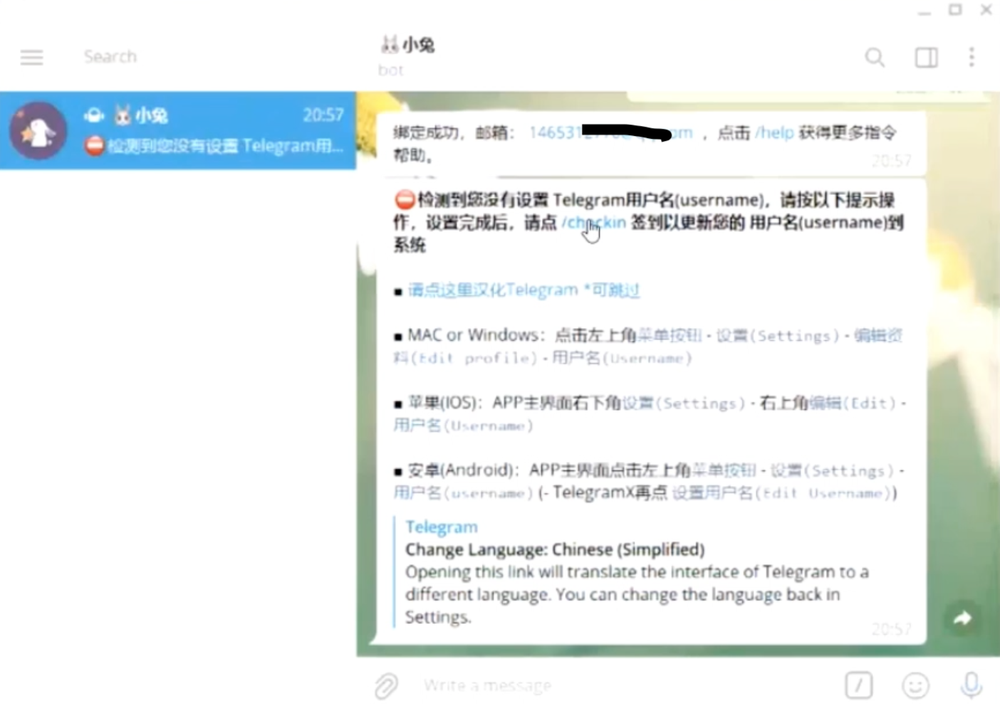

然而小王的`Telegram`的账号是刚刚注册的，没有`username`。就像用微信没有设置微信ID一样。

找到Telegram的菜单，设置就行。接下来再次发送代码，绑定就行。

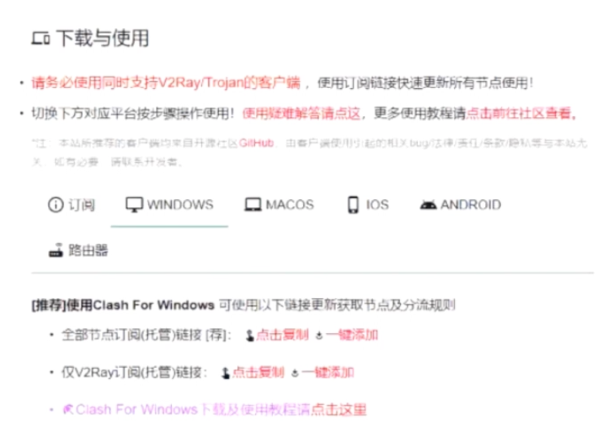

接下来就可以捐赠支持了。可以先充30元用两个月。

回到召唤师首页。在这里，看「点击复制」按钮，得到地址，然后到`Clash`软件下载配置就行。

然后小王就可以删掉我给它的地址了。小王就有了自己的召唤师账号。