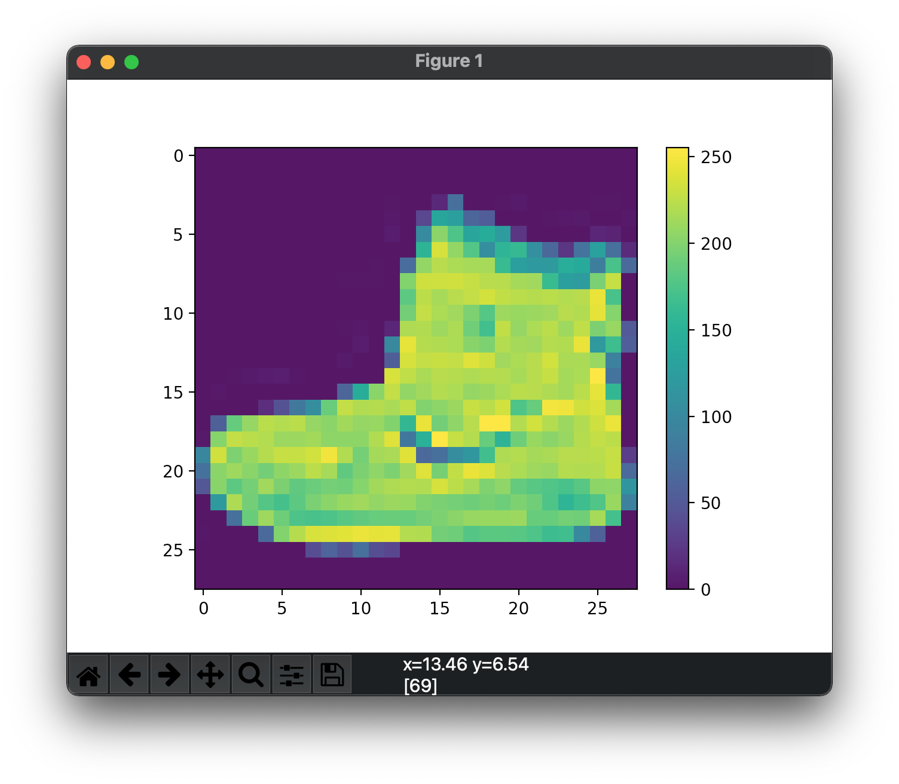
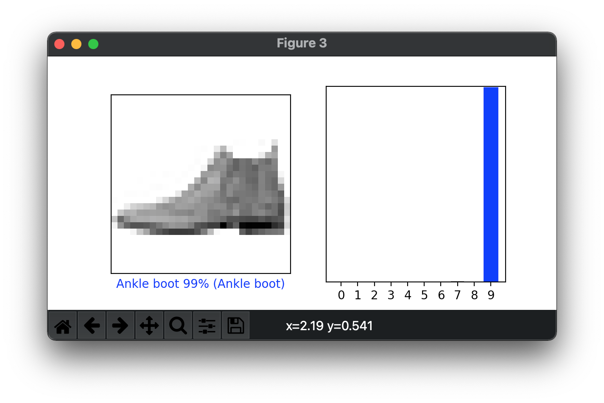

# 机器学习


既然咱们学`Python`，也肯定要讲讲机器学习。因为它的很多库都是用Python写的。开始先装上它们玩一下。


## Tensorflow


安装一下。

```shell
$ pip install tensorflow
ERROR: Could not find a version that satisfies the requirement tensorflow
ERROR: No matching distribution found for tensorflow
```

```shell
$ type python
python is aliased to `/usr/local/Cellar/python@3.9/3.9.1_6/bin/python3'
```

然而 `Tensorflow 2`只支持 `Python 3.5–3.8`。我们用的是`3.9` 。 

```shell
 % type python3
python3 is /usr/bin/python3
% python3 -V
Python 3.8.2
```

注意到我系统里的`python3`是`3.8.2`版本。这个Python版本对应的`pip`安装到哪儿呢。

```shell
% python3 -m pip -V
pip 21.0.1 from /Users/lzw/Library/Python/3.8/lib/python/site-packages/pip (python 3.8)
```

对应的`pip`在这里。那我更改一下`.zprofile`文件里。最近我更改了我的`shell`。`.zprofile`就相当于之前的`.bash_profile`。加入一行。

```shell
alias pip3=/Users/lzw/Library/Python/3.8/bin/pip3
```

这样，我们用`python3`和`pip3`来玩`Tensorflow`。


```shell
% pip3 install tensorflow
...
Successfully installed absl-py-0.12.0 astunparse-1.6.3 cachetools-4.2.1 certifi-2020.12.5 chardet-4.0.0 flatbuffers-1.12 gast-0.3.3 google-auth-1.27.1 google-auth-oauthlib-0.4.3 google-pasta-0.2.0 grpcio-1.32.0 h5py-2.10.0 idna-2.10 keras-preprocessing-1.1.2 markdown-3.3.4 numpy-1.19.5 oauthlib-3.1.0 opt-einsum-3.3.0 protobuf-3.15.6 pyasn1-0.4.8 pyasn1-modules-0.2.8 requests-2.25.1 requests-oauthlib-1.3.0 rsa-4.7.2 tensorboard-2.4.1 tensorboard-plugin-wit-1.8.0 tensorflow-2.4.1 tensorflow-estimator-2.4.0 termcolor-1.1.0 typing-extensions-3.7.4.3 urllib3-1.26.3 werkzeug-1.0.1 wheel-0.36.2 wrapt-1.12.1
```

安装了很多库。用上官网的一个例子。


```python
import tensorflow as tf

mnist = tf.keras.datasets.mnist

(x_train, y_train), (x_test, y_test) = mnist.load_data()
x_train, x_test = x_train / 255.0, x_test / 255.0

model = tf.keras.models.Sequential([
  tf.keras.layers.Flatten(input_shape=(28, 28)),
  tf.keras.layers.Dense(128, activation='relu'),
  tf.keras.layers.Dropout(0.2),
  tf.keras.layers.Dense(10)
])

predictions = model(x_train[:1]).numpy()
print(predictions)

```

运行一下。

```shell
$ /usr/bin/python3 tf.py
Downloading data from https://storage.googleapis.com/tensorflow/tf-keras-datasets/mnist.npz
11493376/11490434 [==============================] - 10s 1us/step
[[ 0.15477428 -0.3877643   0.0994779   0.07474922 -0.26219758 -0.03550266
   0.32226565 -0.37141111  0.10925996 -0.0115255 ]]
```

可见下载了数据集，接着输出了结果。


接下来，看看图片分类的例子。


```python
# TensorFlow and tf.keras
import tensorflow as tf

# Helper libraries
import numpy as np
import matplotlib.pyplot as plt

print(tf.__version__)
```

报错。

```shell
ModuleNotFoundError: No module named 'matplotlib'
```

安装一下。

```shell
% pip3 install matplotlib
```

正确了。

```shell
$ /usr/bin/python3 image.py
2.4.1
```

进行复制粘贴例子代码。

```python
# TensorFlow and tf.keras
import tensorflow as tf

# Helper libraries
import numpy as np
import matplotlib.pyplot as plt

fashion_mnist = tf.keras.datasets.fashion_mnist

(train_images, train_labels), (test_images, test_labels) = fashion_mnist.load_data()

class_names = ['T-shirt/top', 'Trouser', 'Pullover', 'Dress', 'Coat',
               'Sandal', 'Shirt', 'Sneaker', 'Bag', 'Ankle boot']


print(train_images.shape)
print(len(train_labels))
```

输出了结果。

```shell
(60000, 28, 28)
60000
```

继续。

```python
plt.figure()
plt.imshow(train_images[0])
plt.colorbar()
plt.grid(False)
plt.show()
```



```python
plt.figure(figsize=(10,10))
for i in range(25):
    plt.subplot(5,5,i+1)
    plt.xticks([])
    plt.yticks([])
    plt.grid(False)
    plt.imshow(train_images[i], cmap=plt.cm.binary)
    plt.xlabel(class_names[train_labels[i]])
plt.show()
```


```python
model.compile(optimizer='adam',
              loss=tf.keras.losses.SparseCategoricalCrossentropy(from_logits=True),
              metrics=['accuracy'])

model.fit(train_images, train_labels, epochs=10)

test_loss, test_acc = model.evaluate(test_images,  test_labels, verbose=2)

print('\nTest accuracy:', test_acc)
```


```shell
model = tf.keras.Sequential([
    tf.keras.layers.Flatten(input_shape=(28, 28)),
    tf.keras.layers.Dense(128, activation='relu'),
    tf.keras.layers.Dense(10)
])

model.compile(optimizer='adam',
              loss=tf.keras.losses.SparseCategoricalCrossentropy(from_logits=True),
              metrics=['accuracy'])

model.fit(train_images, train_labels, epochs=10)

test_loss, test_acc = model.evaluate(test_images,  test_labels, verbose=2)

print('\nTest accuracy:', test_acc)
```


```shell
Epoch 1/10
1875/1875 [==============================] - 2s 928us/step - loss: 0.6331 - accuracy: 0.7769
Epoch 2/10
1875/1875 [==============================] - 2s 961us/step - loss: 0.3860 - accuracy: 0.8615
Epoch 3/10
1875/1875 [==============================] - 2s 930us/step - loss: 0.3395 - accuracy: 0.8755
Epoch 4/10
1875/1875 [==============================] - 2s 1ms/step - loss: 0.3071 - accuracy: 0.8890
Epoch 5/10
1875/1875 [==============================] - 2s 1ms/step - loss: 0.2964 - accuracy: 0.8927
Epoch 6/10
1875/1875 [==============================] - 2s 985us/step - loss: 0.2764 - accuracy: 0.8955
Epoch 7/10
1875/1875 [==============================] - 2s 961us/step - loss: 0.2653 - accuracy: 0.8996
Epoch 8/10
1875/1875 [==============================] - 2s 1ms/step - loss: 0.2549 - accuracy: 0.9052
Epoch 9/10
1875/1875 [==============================] - 2s 1ms/step - loss: 0.2416 - accuracy: 0.9090
Epoch 10/10
1875/1875 [==============================] - 2s 1ms/step - loss: 0.2372 - accuracy: 0.9086
313/313 - 0s - loss: 0.3422 - accuracy: 0.8798

Test accuracy: 0.879800021648407
```

模型已经训练出来了。

```python
probability_model = tf.keras.Sequential([model, 
                                         tf.keras.layers.Softmax()])
```

接下来预测一下。

```python
probability_model = tf.keras.Sequential([model, 
                                         tf.keras.layers.Softmax()])
predictions = probability_model.predict(test_images)

def plot_image(i, predictions_array, true_label, img):
  true_label, img = true_label[i], img[i]
  plt.grid(False)
  plt.xticks([])
  plt.yticks([])

  plt.imshow(img, cmap=plt.cm.binary)

  predicted_label = np.argmax(predictions_array)
  if predicted_label == true_label:
    color = 'blue'
  else:
    color = 'red'

  plt.xlabel("{} {:2.0f}% ({})".format(class_names[predicted_label],
                                100*np.max(predictions_array),
                                class_names[true_label]),
                                color=color)

def plot_value_array(i, predictions_array, true_label):
  true_label = true_label[i]
  plt.grid(False)
  plt.xticks(range(10))
  plt.yticks([])
  thisplot = plt.bar(range(10), predictions_array, color="#777777")
  plt.ylim([0, 1])
  predicted_label = np.argmax(predictions_array)

  thisplot[predicted_label].set_color('red')
  thisplot[true_label].set_color('blue')

i = 0
plt.figure(figsize=(6,3))
plt.subplot(1,2,1)
plot_image(i, predictions[i], test_labels, test_images)
plt.subplot(1,2,2)
plot_value_array(i, predictions[i],  test_labels)
plt.show()  
```



这说明这个图片99%的可能是`Ankle boot`。我们已经跑起来了。上面代码都是什么意思。我们慢慢来探索。


## PyTorch


安装一下。这个支持`3.9`版本的Python。

```shell
$ pip install torch torchvision
Collecting torch
  Downloading torch-1.8.0-cp39-none-macosx_10_9_x86_64.whl (120.6 MB)
     |████████████████████████████████| 120.6 MB 224 kB/s
Collecting torchvision
  Downloading torchvision-0.9.0-cp39-cp39-macosx_10_9_x86_64.whl (13.1 MB)
     |████████████████████████████████| 13.1 MB 549 kB/s
Requirement already satisfied: numpy in /usr/local/lib/python3.9/site-packages (from torch) (1.20.1)
Collecting typing-extensions
  Downloading typing_extensions-3.7.4.3-py3-none-any.whl (22 kB)
Requirement already satisfied: pillow>=4.1.1 in /usr/local/lib/python3.9/site-packages (from torchvision) (8.0.1)
Installing collected packages: typing-extensions, torch, torchvision
Successfully installed torch-1.8.0 torchvision-0.9.0 typing-extensions-3.7.4.3
```


检验一下。

```python
import torch
x = torch.rand(5, 3)
print(x)
```

出错了。

```shell
Traceback (most recent call last):
  File "torch.py", line 1, in <module>
    import torch
  File "torch.py", line 2, in <module>
    x = torch.rand(5, 3)
AttributeError: partially initialized module 'torch' has no attribute 'rand' (most likely due to a circular import)
```

谷歌一下这个错误信息。原来是因为我们的文件也叫`torch`。重名了。改一下然后就正确了。

```shell
tensor([[0.5520, 0.9446, 0.5543],
        [0.6192, 0.0908, 0.8726],
        [0.0223, 0.7685, 0.9814],
        [0.4019, 0.5406, 0.3861],
        [0.5485, 0.6040, 0.2387]])
```

找到一个例子。


```python
# -*- coding: utf-8 -*-

import torch
import math


dtype = torch.float
device = torch.device("cpu")
# device = torch.device("cuda:0") # Uncomment this to run on GPU

# Create random input and output data
x = torch.linspace(-math.pi, math.pi, 2000, device=device, dtype=dtype)
y = torch.sin(x)

# Randomly initialize weights
a = torch.randn((), device=device, dtype=dtype)
b = torch.randn((), device=device, dtype=dtype)
c = torch.randn((), device=device, dtype=dtype)
d = torch.randn((), device=device, dtype=dtype)

learning_rate = 1e-6
for t in range(2000):
    # Forward pass: compute predicted y
    y_pred = a + b * x + c * x ** 2 + d * x ** 3

    # Compute and print loss
    loss = (y_pred - y).pow(2).sum().item()
    if t % 100 == 99:
        print(t, loss)

    # Backprop to compute gradients of a, b, c, d with respect to loss
    grad_y_pred = 2.0 * (y_pred - y)
    grad_a = grad_y_pred.sum()
    grad_b = (grad_y_pred * x).sum()
    grad_c = (grad_y_pred * x ** 2).sum()
    grad_d = (grad_y_pred * x ** 3).sum()

    # Update weights using gradient descent
    a -= learning_rate * grad_a
    b -= learning_rate * grad_b
    c -= learning_rate * grad_c
    d -= learning_rate * grad_d


print(f'Result: y = {a.item()} + {b.item()} x + {c.item()} x^2 + {d.item()} x^3')
```

运行一下。

```shell
99 1273.537353515625
199 849.24853515625
299 567.4786987304688
399 380.30291748046875
499 255.92752075195312
599 173.2559814453125
699 118.2861328125
799 81.72274780273438
899 57.39331817626953
999 41.198158264160156
1099 30.41307830810547
1199 23.227672576904297
1299 18.438262939453125
1399 15.244369506835938
1499 13.113286972045898
1599 11.690631866455078
1699 10.740333557128906
1799 10.105220794677734
1899 9.6804780960083
1999 9.39621353149414
Result: y = -0.011828352697193623 + 0.8360244631767273 x + 0.002040589228272438 x^2 + -0.09038365632295609 x^3
```


看看只用`numpy`库的代码。


```python
# -*- coding: utf-8 -*-
import numpy as np
import math

# Create random input and output data
x = np.linspace(-math.pi, math.pi, 2000)
y = np.sin(x)

# Randomly initialize weights
a = np.random.randn()
b = np.random.randn()
c = np.random.randn()
d = np.random.randn()

learning_rate = 1e-6
for t in range(2000):
    # Forward pass: compute predicted y
    # y = a + b x + c x^2 + d x^3
    y_pred = a + b * x + c * x ** 2 + d * x ** 3

    # Compute and print loss
    loss = np.square(y_pred - y).sum()
    if t % 100 == 99:
        print(t, loss)

    # Backprop to compute gradients of a, b, c, d with respect to loss
    grad_y_pred = 2.0 * (y_pred - y)
    grad_a = grad_y_pred.sum()
    grad_b = (grad_y_pred * x).sum()
    grad_c = (grad_y_pred * x ** 2).sum()
    grad_d = (grad_y_pred * x ** 3).sum()

    # Update weights
    a -= learning_rate * grad_a
    b -= learning_rate * grad_b
    c -= learning_rate * grad_c
    d -= learning_rate * grad_d

print(f'Result: y = {a} + {b} x + {c} x^2 + {d} x^3')
```

注意到这是两种方式来计算。


这两个例子，是先生成了一组x和y。接着假设是三次方程。再接着用些方法把系数迭代计算出来。这些算法是怎样的呢。注意到是循环了`2000`次。每次拟合地精确一些。这里先不细究。

