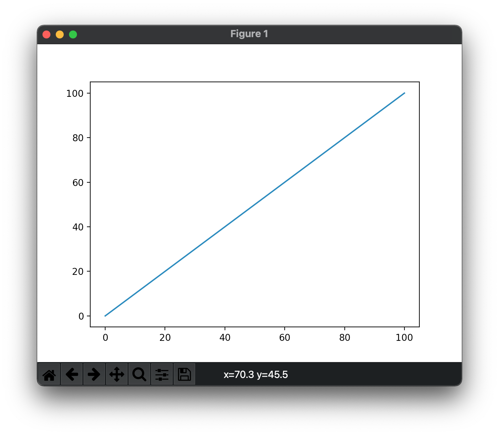
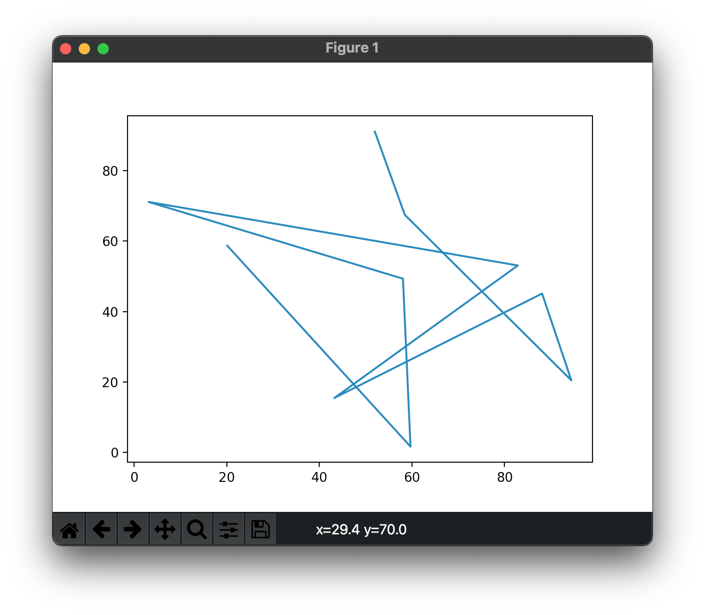
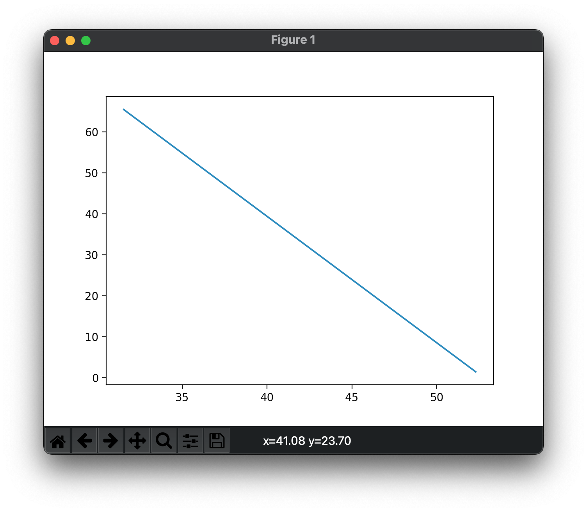
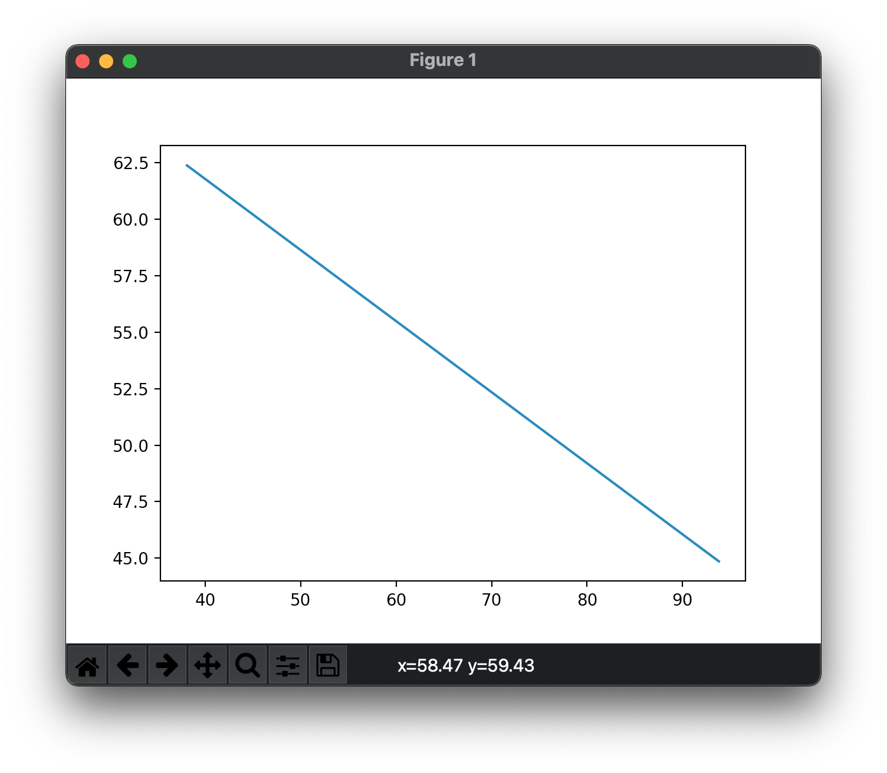

## 拟合练习


接下来试着拟合一下`y(x)=ax+b`。

```python
import numpy as np
import math

x = np.linspace(-math.pi, math.pi, 20)

print(x)
```

```shell
[-3.14159265 -2.81089869 -2.48020473 -2.14951076 -1.8188168  -1.48812284
 -1.15742887 -0.82673491 -0.49604095 -0.16534698  0.16534698  0.49604095
  0.82673491  1.15742887  1.48812284  1.8188168   2.14951076  2.48020473
  2.81089869  3.14159265]
```

注意到是`linspace`，而不是`linespace`。这是在`PyTorch`教程的一个例子的部分代码。这些小数可能不是很直观。

```python
x = np.linspace(0, 100, 20)
```


```python
import numpy as np
import math

x = np.linspace(0, 100, 20)
y = np.linspace(0, 100,20)

print(x)
print(y)
```

这样得到两组数据。如何用图像表示出来呢。



然而竟然`x`和`y`是一样的。

```python
x = np.random.rand(2)
print(x)
```

```shell
[0.06094295 0.89674607]
```

接着改改。

```python
x = np.random.rand(2)*100
print(x)
```

```shell
[39.6136151  66.15534011]
```

继续改。

```python
import numpy as np
import math
import matplotlib.pyplot as plt

x = np.random.rand(10)*100
y = np.random.rand(10)*100

plt.plot(x,y)
plt.show()
```



```shell
[20.1240488  59.69327146 58.05432614  3.14092909 82.86411091 43.23010476
 88.09796699 94.42222486 58.45253048 51.98479507]
[58.7129098   1.6457994  49.34115933 71.13738592 53.09736099 15.4485691
 45.12200319 20.46080549 67.48555147 91.10864978]
```

可见是`(20.1,58.7)`到`(59.7,1.6)`再到`(58,49.3)`。注意到虽然这个图看起来很乱，但仍然是有规律的。它是一笔画。


```python
import numpy as np
import math
import matplotlib.pyplot as plt

x = np.random.rand(2)*100
y = np.random.rand(2)*100

print(x)
print(y)

plt.plot(x,y)
plt.show()
```






注意到`x`和`y`的尺度总在变。所以两条看似一样的直线，其实不一样。那如何求`y(x) = ax+b`的a和b。我们说现在知道这条直线的两个点。注意到我们用草稿纸解出来就行。两个等式相减，消掉`b`，求出`a`。接着代入a到一个等式，求出`b`。


然而可不可以用猜测的方法。用二分法。试试看。

```python
import numpy as np
import math
import matplotlib.pyplot as plt

x = np.random.rand(2)*100
y = np.random.rand(2)*100

a_max=1000
a_min=-1000
b_max=1000
b_min=-1000

def cal_d(da, b):
    y0 = x[0] * da + b
    y1 = x[1] * da + b
    d = abs(y0-y[0]) + abs(y1-y[1])
    return d

def cal_db(a, db):
    y0 = x[0] * a + db
    y1 = x[1] * a + db
    d = abs(y0-y[0]) + abs(y1-y[1])
    return d

def avg_a():
    return (a_max + a_min) / 2

def avg_b():
    return (b_max + b_min) / 2

for i in range(100):
    a = avg_a()
    b = avg_b()
    max_d = cal_d(a_max, b)
    min_d = cal_d(a_min, b)
    if max_d < min_d:
        a_min = a
    else:
        a_max = a
    
    a = avg_a()
    max_db = cal_db(a, b_max)
    min_db = cal_db(a, b_min)
    if max_db < min_db:
        b_min = b        
    else:
        b_max = b

print(x)
print(y)
print('a = ', avg_a())
print('b = ', avg_b())
print(avg_a() * x[0] + avg_b())
print(avg_a() * x[1] + avg_b())
```

运行一下。

```shell
[42.78912791 98.69284173]
[68.95535212 80.89946202]
a =  11.71875
b =  -953.125
-451.68990725289063
203.4317390671779
```

结果却有很大的出入。


让我们把问题简单化。假设`y(x)=ax`。给出一组`x,y`，求a。虽然我们可以直接算出来。让我们猜。


```python
import numpy as np
import math
import matplotlib.pyplot as plt
from numpy.random import rand, randint

x = randint(100)
y = randint(100)

a_max=1000
a_min=-1000

def cal_d(da):
    y0 = x * da
    return abs(y0-y)

def avg_a():
    return (a_max + a_min) / 2

for i in range(1000):
    a = avg_a()
    max_d = cal_d(a_max)
    min_d = cal_d(a_min)
    if max_d < min_d:
        a_min = a
    else:
        a_max = a    

print(x)
print(y)
print(avg_a())
print(avg_a()*x)
```

结果是喜人的。猜得很准。

```shell
96
61
0.6354166666666667
61.00000000000001
```

