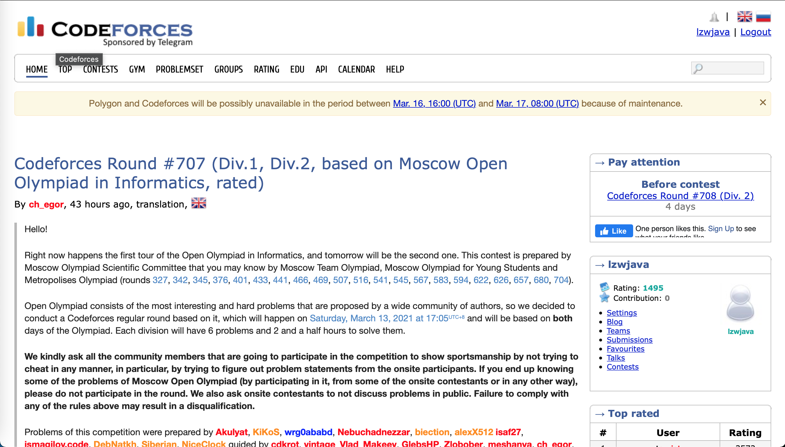
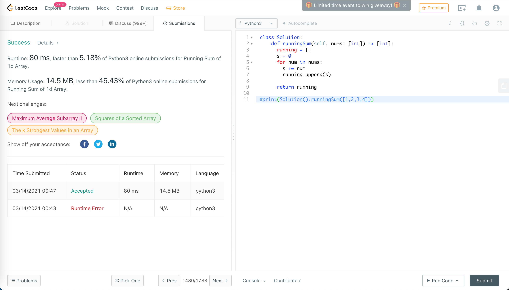

## Python 编程之网上刷题


这里我们用网上评测系统来做做题。英文好的话，可以用`Codeforces`和`LeetCode`。中文可以上计蒜客和力扣。这里用`LeetCode`。




## 1480. Running Sum of 1d Array


> Given an array `nums`. We define a running sum of an array as `runningSum[i] = sum(nums[0]…nums[i])`.
>
> Return the running sum of `nums`.


```python
class Solution:
    def runningSum(self, nums: [int]) -> [int]:         
      running = []
      s = 0
      for num in nums:
        s += num
        running.append(s)
      
      return running

#print(Solution().runningSum([1,2,3,4]))
```




第一题通过。


## 1108. Defanging an IP Address


> Given a valid (IPv4) IP `address`, return a defanged version of that IP address.
>
> A *defanged IP address* replaces every period `"."` with `"[.]"`.

```python
class Solution:
    def defangIPaddr(self, address: str) -> str:
        return address.replace('.', '[.]')

# print(Solution().defangIPaddr('1.1.1.1'))
```


## 1431. Kids With the Greatest Number of Candies

> Given the array `candies` and the integer `extraCandies`, where `candies[i]` represents the number of candies that the ***ith\*** kid has.
>
> For each kid check if there is a way to distribute `extraCandies` among the kids such that he or she can have the **greatest** number of candies among them. Notice that multiple kids can have the **greatest** number of candies.


```python
class Solution:
    def kidsWithCandies(self, candies: [int], extraCandies: int) -> [bool]:
        max = 0
        for candy in candies:
          if candy > max:
            max = candy
        greatests = []
        for candy in candies:
          if candy + extraCandies >= max:
            greatests.append(True)
          else:
            greatests.append(False)
        return greatests

# print(Solution().kidsWithCandies([2,3,5,1,3], 3))
```


## 1672. Richest Customer Wealth


> You are given an `m x n` integer grid `accounts` where `accounts[i][j]` is the amount of money the `ith` customer has in the `jth` bank. Return *the **wealth** that the richest customer has.*
>
> A customer's **wealth** is the amount of money they have in all their bank accounts. The richest customer is the customer that has the maximum **wealth**.


```python
class Solution:
    def maximumWealth(self, accounts: [[int]]) -> int:
        max = 0      
        for account in accounts:
          s = sum(account) 
          if max < s:
            max = s
        return max

#print(Solution().maximumWealth([[1,2,3],[3,2,1]]))          
```


## 1470. Shuffle the Array


> Given the array `nums` consisting of `2n` elements in the form `[x1,x2,...,xn,y1,y2,...,yn]`.
>
> *Return the array in the form* `[x1,y1,x2,y2,...,xn,yn]`.


```python
class Solution:
  def shuffle(self, nums: [int], n: int) -> [int]:
    ns1 = nums[:n]
    ns2 = nums[n:]
    ns = []
    for i in range(n):
      ns.append(ns1[i])
      ns.append(ns2[i])
    return ns

# print(Solution().shuffle([2,5,1,3,4,7], 3))
```


## 1512. Number of Good Pairs


> Given an array of integers `nums`.
>
> A pair `(i,j)` is called *good* if `nums[i]` == `nums[j]` and `i`< `j`.
>
> Return the number of *good* pairs.


```python
class Solution:
    def numIdenticalPairs(self, nums: [int]) -> int:
        j = 1
        n = len(nums)
        p = 0
        while j < n:
          for i in range(j):
            if nums[i] == nums[j]:
              p += 1
          j+=1
        return p

# print(Solution().numIdenticalPairs([1,2,3,1,1,3]))
```


## 771. Jewels and Stones


> You're given strings `jewels` representing the types of stones that are jewels, and `stones` representing the stones you have. Each character in `stones` is a type of stone you have. You want to know how many of the stones you have are also jewels.
>
> Letters are case sensitive, so `"a"` is considered a different type of stone from `"A"`.


```python
class Solution:
    def numJewelsInStones(self, jewels: str, stones: str) -> int:
        n = 0
        for i in range(len(jewels)):
          js = jewels[i:i+1]
          n += stones.count(js)
        return n

# print(Solution().numJewelsInStones("aA", "aAAbbbb"))
```


## 1603. Design Parking System


> Design a parking system for a parking lot. The parking lot has three kinds of parking spaces: big, medium, and small, with a fixed number of slots for each size.
>
> Implement the `ParkingSystem` class:
>
> - `ParkingSystem(int big, int medium, int small)`Initializes object of the `ParkingSystem` class. The number of slots for each parking space are given as part of the constructor.
> - `bool addCar(int carType)` Checks whether there is a parking space of `carType` for the car that wants to get into the parking lot. `carType` can be of three kinds: big, medium, or small, which are represented by `1`, `2`, and `3` respectively. **A car can only park in a parking space of its** `carType`. If there is no space available, return `false`, else park the car in that size space and return `true`.


```python
class ParkingSystem:
    slots = [0, 0, 0]

    def __init__(self, big: int, medium: int, small: int):
      self.slots[0] = big
      self.slots[1] = medium
      self.slots[2] = small        

    def addCar(self, carType: int) -> bool:
      if self.slots[carType - 1] > 0:
        self.slots[carType - 1] -=1
        return True
      else:
        return False

# parkingSystem = ParkingSystem(1, 1, 0)
# print(parkingSystem.addCar(1))
# print(parkingSystem.addCar(2))
# print(parkingSystem.addCar(3))
# print(parkingSystem.addCar(1))
```


## 1773. Count Items Matching a Rule


> You are given an array `items`, where each `items[i] = [typei, colori, namei]` describes the type, color, and name of the `ith` item. You are also given a rule represented by two strings, `ruleKey` and `ruleValue`.
>
> The `ith` item is said to match the rule if **one** of the following is true:
>
> - `ruleKey == "type"` and `ruleValue == typei`.
> - `ruleKey == "color"` and `ruleValue == colori`.
> - `ruleKey == "name"` and `ruleValue == namei`.
>
> Return *the number of items that match the given rule*.


```python
class Solution:
    def countMatches(self, items: [[str]], ruleKey: str, ruleValue: str) -> int:
      i = 0
      if ruleKey == "type":
        i = 0
      elif ruleKey == "color":
        i = 1
      else:
        i = 2
      n = 0
      for item in items:
        if item[i] == ruleValue:
          n +=1
      return n

# print(Solution().countMatches([["phone","blue","pixel"],["computer","silver","lenovo"],["phone","gold","iphone"]], "color", "silver"))
        
```


## 1365. How Many Numbers Are Smaller Than the Current Number


> Given the array `nums`, for each `nums[i]` find out how many numbers in the array are smaller than it. That is, for each `nums[i]` you have to count the number of valid `j's` such that `j != i` **and** `nums[j] < nums[i]`.
>
> Return the answer in an array.


> ```
> Input: nums = [8,1,2,2,3]
> Output: [4,0,1,1,3]
> Explanation: 
> For nums[0]=8 there exist four smaller numbers than it (1, 2, 2 and 3). 
> For nums[1]=1 does not exist any smaller number than it.
> For nums[2]=2 there exist one smaller number than it (1). 
> For nums[3]=2 there exist one smaller number than it (1). 
> For nums[4]=3 there exist three smaller numbers than it (1, 2 and 2).
> ```

```python
class Solution:
    def smallerNumbersThanCurrent(self, nums: [int]) -> [int]:
        ns = []
        l = len(nums)
        for i in range(l):
          n = 0
          for j in range(l):
            if i != j:
              if nums[j] < nums[i]:
                n += 1
          ns.append(n)
        return ns

# print(Solution().smallerNumbersThanCurrent([8,1,2,2,3]))
```


用时528ms，击败了11.81%的程序。优化一下。


```python
class Solution:
    def smallerNumbersThanCurrent(self, nums: [int]) -> [int]:
        l = len(nums)

        sort_nums = nums.copy()

        ins = list(range(l))
        for i in range(l):          
          for j in range(i+1, l):
            if sort_nums[i] > sort_nums[j]:
              a = sort_nums[i]
              sort_nums[i] = sort_nums[j]
              sort_nums[j] = a
              
              a = ins[i]
              ins[i] = ins[j]
              ins[j] = a
        
        smalls = [0]
        for i in range(1, l):
          if sort_nums[i-1] == sort_nums[i]:
            smalls.append(smalls[i-1])
          else:
            smalls.append(i)

        # print(sort_nums)
        # print(smalls)

        r_is = list(range(l))
        for i in ins:
          r_is[ins[i]] = i
    
        ns = []
        for i in range(l):          
          ns.append(smalls[r_is[i]])
        return ns

# print(Solution().smallerNumbersThanCurrent([8,1,2,2,3]))
```


这会测试用时`284ms`，比刚刚用时`528ms`少。


用写系统的函数简写一下。


```python
class Solution:
    def smallerNumbersThanCurrent(self, nums: [int]) -> [int]:
        sort_nums = nums.copy()
        sort_nums.sort()
        
        ns = []
        for num in nums:
          ns.append(sort_nums.index(num))
        return ns

# print(Solution().smallerNumbersThanCurrent([8,1,2,2,3]))
```


这会只需用时`64ms`，击败了`71%`的提交。


```python
class Solution:
    def smallerNumbersThanCurrent(self, nums: [int]) -> [int]:
        l = len(nums)
        ns = [0] * l
        for i in range(l):
          for j in range(i+1, l):
            if nums[i] > nums[j]:
              ns[i] +=1
            elif nums[i] < nums[j]:
              ns[j] +=1
            else:
              pass
        return ns

# print(Solution().smallerNumbersThanCurrent([8,1,2,2,3]))
```

又想出来一种解法。用时`400ms`。


```python
class Solution:
    def smallerNumbersThanCurrent(self, nums: [int]) -> [int]:        
        ss = sorted((e,i) for i,e in enumerate(nums))

        l = len(nums)
        smalls = [0]
        for i in range(1, l):
          (e0, j0) = ss[i-1]
          (e1, j1) = ss[i]
          if e0 == e1:
            smalls.append(smalls[i-1])
          else:
            smalls.append(i)

        ns = [0]*l
        for i in range(l):
          (e,j) = ss[i]
          ns[j] = smalls[i]
        return ns

# print(Solution().smallerNumbersThanCurrent([8,1,2,2,3]))
```


> Runtime: 52 ms, faster than 91.45% of Python3 online submissions forHow Many Numbers Are Smaller Than the Current Number.
>
> Memory Usage: 14.6 MB, less than 15.18% of Python3 online submissions for How Many Numbers Are Smaller Than the Current Number.


终于成功了！这个方法又更快了，打败了`91.45%`的提交。


继续精简一下。

```python
class Solution:
    def smallerNumbersThanCurrent(self, nums: [int]) -> [int]:
        ss = sorted((e,i) for i,e in enumerate(nums))

        l = len(nums)
        smalls = [0]
        ns = [0]*l
        for i in range(1, l):
          (e0, j0) = ss[i-1]
          (e1, j1) = ss[i]
          if e0 == e1:
            smalls.append(smalls[i-1])
          else:
            smalls.append(i)

          ns[j1] = smalls[i]
        return ns

# print(Solution().smallerNumbersThanCurrent([8,1,2,2,3]))
```

继续。

```python
class Solution:
    def smallerNumbersThanCurrent(self, nums: [int]) -> [int]:
        ss = sorted((e,i) for i,e in enumerate(nums))

        l = len(nums)
        last = 0
        ns = [0]*l
        for i in range(1, l):
          (e0, j0) = ss[i-1]
          (e1, j1) = ss[i]
          if e0 == e1:
            pass
          else:
            last = i

          ns[j1] = last
        return ns

# print(Solution().smallerNumbersThanCurrent([8,1,2,2,3]))
```

这时我们跑到了`40ms`，击败了`99.81%`程序。


> Runtime: 40 ms, faster than 99.81% of Python3 online submissions forHow Many Numbers Are Smaller Than the Current Number.
>
> Memory Usage: 14.4 MB, less than 15.18% of Python3 online submissions for How Many Numbers Are Smaller Than the Current Number.


