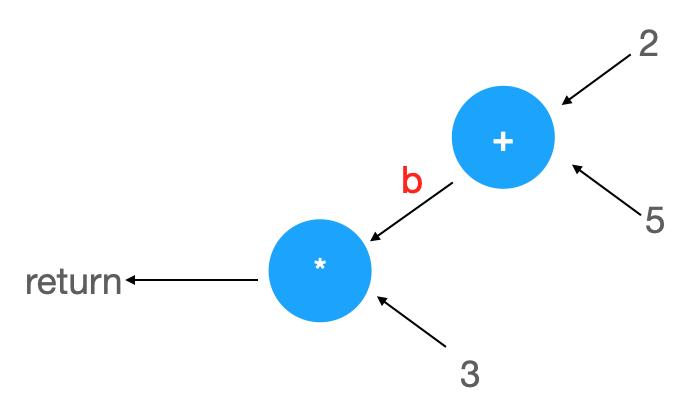

#解谜计算机科学


教人们编程，该教什么。我一开始想以一个语言开始，教人们写出第一个程序，让程序打印出Hello World。然而当我看了王垠的文章《解谜计算机科学》之后，我改变了想法。这才是真正的编程第一课。此篇文章是我看了那篇文章后的复述。来，一起来理解计算机科学的基本概念。


## 手指算术


到底什么是计算。从手指算术开始讲起。小时候，当妈妈问，2+5等于什么的时候。我们紧握手指头，开始数数。拿出左手，伸出2根。接着拿出右手，伸出5跟。接着，看有多少根手指头伸出来了。开始数数，1、2、3、4、5、6、7。嗯，有7根。所以答案是7。


这背后到底发生什么呢。计算机如何来实现这个过程呢。在这过程中，我们其实就是一台计算机。我们在做计算。「2+5」是输入。「7」是输出。我们用头脑和身体完成了计算。


计算机科学就是根植于这类非常简单的过程。


## 符号和模型


当问一个刚出生的幼儿，2+5等于多少的时候。他是不知道的。他完全不知道这什么意思。在这之前，是教小孩子认数字。我们说两根指头就是2，5根指头就是5。两只猫也是2，五只猫是5。这意味着什么。我们在教会孩子数字这个概念。当学习另外一种语言的时候，就体会很深刻了。「あ」是什么？你知道吗。还没学习日语的时候，就不知道。这个字有点像「女」字，是「女」字的弯曲版本。


所以我们会用以往的概念来理解。后来才知道「あ」相当于拼音的音标「a」。所以「2」同样是一个符号，是一条曲线。这个概念叫符号（symbol）。我们把它转化成了大脑里的一个模型(model)。


符号和模型，是编译器里的概念。编译器又是什么。后面说。总之，要区分这是两个不一样的东西。符号是图形化的。模型是富含意义的。一个模型可以用不同的符号来表达。就好像钱，有人民币符号「¥」，有美元符号「$」。钱就是模型，币种的图形表达就是符号。


所以，在回答2+5等于多少的时候。需要先会表达1到10。伸出一根手指就是1。伸出10跟手指就是10。这就是为什么人类通常用10进制来表达算数。


这里还有一点是，手指是非常灵活的。这相当于一个机械装置。当伸出3根指头时，再多伸出1根，就是4根。弯曲伸缩一下，就更改了一种状态。


## 计算图


在计算机领域，通常用一些抽象的图示来表达计算的过程。这样可以直观地看到信息的流动。这样的图示看起来像是箭头和一些形状连接起来的。我们把它叫做「计算图」。


上面的计算可以表达为：


这样的图示可以表达一类的计算。清晰地表达了输入和输出的方向。当我们给这个圆圈两个输入，就会得到一个结果。这里其实把「加法」抽象化了。这个圆圈不妨把它叫做加法器。在手指算术中，这个加法器就是我们自己。还可以用一堆石头，算盘，电子线路来做成这个加法器。具体的方式很多时候我们是不关心的。总之它能做加法就行。所以，这里把加法抽象化了。抽象（abstraction）是计算机科学重要的一种思维方式。我们把事物一层层抽象，从而可以做很复杂的事情。每一层抽象，都把复杂的事情化为更为简单的事情，直到计算机的电子电路可以很容易地表达它，根据需要而更改电子电路的状态。


## 表达式


计算机科学当然不止「2+5」这么简单。然而它确实是由像「2+5」这种简单的计算元素构成的。这种，叫做表达式。表达式是什么。我们先不去定义它。来看一个稍微复杂一点的表达式：


```
3*(2+5)
```

这叫做复合表达式。它的计算图该如何表达。我们把3乘上「2+5」的结果。多了一个运算。所以应该画一个乘法器。一边是3，一边是「2+5」。如下：


由此可以知道计算图的威力。想象一张拥有千百分支的计算图。计算机就是这么工作的。


由此可以知道什么。`3*2+5`的计算图又是如何的。它肯定和`3*(2+5)`不一样。计算顺序是重要的。在`3*(2+5)`中，怎么知道先算2+5。因为有括号。而括号只是一种符号。一种数学上的表示。想象来到另外一个星期，这里人们用`{}`来表达优先级，即是`3*{2+5}`。所以，这里也体现了「符号」和「模型」的差别。符号只是模型的一种表达。符号不是本质的东西。模型才是本质的。


`3*(2+5)`是这个计算图的一种表达，或者叫编码（coding）。这个计算图该怎么计算呢。一起来由结果处推算起。当计算乘法的时候，一边`3`是已知的，而另外一边是加法器，是未知的。故得先计算2+5。由此得到结果是7。接着才能进行乘法计算。于是得到21。


所以，从符号得到模型，接着才能开始计算。这个过程，在计算机科学里，叫做「语法分析」（parsing）。后面会详细讲讲。


来给表达式一个定义。这个定义是不完善的。然而尝试理解它，才更好深入这一切。


定义（表达式）：表达式可以是如下几种东西。


1.数字。如1、2、3、4……。

2.表达式+表达式。两个表达式相加，也是一个表达式。

3.表达式-表达式。两个表达式相减，也是一个表达式。

4.表达式*表达式。两个表达式相乘，也是一个表达式。

5.表达式/表达式。两个表达式相除，也是一个表达式。


为了能一直本质地理解这些，当在说上面的定义的时候，在脑子里也应该出现的是计算图。也就是说，「表达式+表达式」，更本质的存在是：


是不是觉得这个表达式有点奇怪。一个表达式竟然是两个表达式相加。在表达式的定义中，用到了自己。这种叫做递归定义。所谓递归（recursion），就是一个东西的定义中用到了它本身自己。这是重要的一个思想。在于它能把事情变得很简洁清晰。同时它表达的东西又是强大的。


所以可以来验证一下，`3*(2+5)`是不是一个表达式。严格来说，它是的。证明如下：


* 3是数字，它是表达式。2和5也都是数字，都是表达式。它们都符合表达式的第1种定义。
* `(2+5)`是一个表达式，它是表达式+表达式，符合表达式的第2种定义。
* 接着`3*(2+5)`，它是表达式*表达式，符合表达式的第4种定义。


那什么不是上面定义的表达式。到目前为止，「a+b」不是定义的表达式。a字符是什么。不知道。所以由此，目前的定义，无法计算「a+b」这样的表达。


## 并行计算


考虑这样一个表达式：


```
(2+3)*(1+5)
```


现实生活中会怎么计算呢。小孩子会怎么计算呢。


假如妈妈只有你一个小孩，大概你有两种方法：


* 先用手指算2+3，得到5。记下来。接着算1+5，得到6。接着乘起来，从纸牌盒里拿出纸牌，一次拿5张，拿6次，最后再数纸牌数。
* 先算1+5，得到6。再算2+3，得到5。接着数纸牌，一次拿6张，拿5次。


考虑这个先后顺序。为什么不能同时计算`2+3`和`1+5`。因为只有两只手。


假如你还有一个妹妹，那么你算`2+3`的时候，她算`1+5`。你俩同时算。然后再由一个人来做乘法。这便是并行计算（parallel computing）。


然而你和妹妹从妈妈耳朵里听到这个题目的时候，你俩需要商量，谁算什么，怎么来配合，最后谁算乘法。这就是「通信开销」。尽管你妹妹和你算得同样快，但你妹妹说话比较慢的话，通信开销还挺大的。假如你妹妹和你计算能力不同的话，又该怎么分配工作。如今，计算机界的科学家们，在并行计算方面讨论的问题便是，如何根据计算单元的能力不同和通信开销的差异，提高计算效率，降低所需的时间。


## 变量和赋值


如果你有一个非常复杂的表达式，如：


```
(8-3)*(3+5*(6*3-5))
```


由于它有很多层的嵌套，人眼很难一下子搞明白它在做什么，它的意义是什么。这时候，则希望用一些「名字」来表达中间结果，这样表达式更好理解。


举个例子，如你爸爸的妈妈的弟弟的女儿，该怎么称呼。你时常记不住。也不想去搞明白风俗是怎么叫的。然而，爸爸告诉你，她叫阿兰姐。你以后就记住了。


按刚刚的表达式来说，


```
3*(2+5)
```

可以写成等价的、含有变量的代码：


```
{
   a=2+5   //定义变量a，并赋值
   3*a     //代码块的值
}
```


上面的「a」，在计算机科学上，这样的名字，叫做变量（variable）。这里用a，也可以用b、c、d……a1……z10等等，都可以。接着，`a=2+5`是一条赋值语句。


这里`//`是表示注释语句，是用来帮助人理解代码意思的。就好像Word软件的批注一样。这些注释语句不会影响代码的逻辑运行，就好像批注内容不会被打印一样。


`3*a`的结果将会被作为这个代码块的值。`{}`来表示代码块的边界符号。它们都只是一种表示方式。这种表示方式在不同的语言有不同的实现。比如有可能是BEGIN和END来表示边界。用花括号`{}`把语句括起来，是因为不想把这些语句和括号外的语句混淆。由`{`开始的，到`}`结束的，加上这两行代码，这一整个的，叫做代码块（block）。


通常总是以最后一条语句的结果作为代码块的值。这里`3*a`是最后一条语句。它的结果也就是这个代码块的结果。可能会有别的代码用到这个代码块的结果。


其次值得注意的是，变量是可以重复赋值的。如：


```
{
   a=2+5
   b=a
   a=3
   c=a*4
}
```

这里，运行完毕后，a、b、c的值等于多少呢。a一开始是7，后来变成3。b是7，c则是12。注意到a后来的值变了。注意到a尽管后来变为3，b还是原来a的值。因为当a变更值时，b已经赋值完毕了。计算是有顺序的。


总是可以对同一变量赋值，但值得注意的是，只有当它们前后表示同一意义的时候，去赋值，才是比较好的做法。比如当用阿兰姐来称呼喜爱的一只猫的时候，那就可能出现混淆了。


## 编译


一旦引入变量，就不需要复合表达式了。可以把任意复杂的复合表达式，拆开为「单操作算术表达式」（像2+5这样）。


上面的例子：


```
(8-3)*(3+5*(6*3-5))
```


可以表达为：


```
{
   a=8-3
   b=6*3
   c=b-5
   d=5*c
   e=3+d
   f=a*e
}
```


这时一步步去计算每一个简单的表达式，便可以得到上面复杂表达式的结果。这其实就是编译「compile」。我们手工做了编译。我们自己做了编译器（compiler）。根据运算的优先级，把一个复杂的表达式写成了等价的简单表达式。


实际上这代码已经非常接近现代处理器（CPU）的汇编码（assembly）了。只需要多加一些转换，就能变成机器指令。


编译当然是涉及更多复杂的细节，但本质上就像上面的一样。计算机编译过程中，包含了更多符号到模型的转化，各种表达式优先级的排序，还有更多丰富的基础表达式。


我们一开始就理解了编译器是什么，后续只需加深这种理解。


## 函数


到目前为止，已知的计算都是发生在数字之间的。然而现实生活中，有些计算却依赖于一些未知数。


比如设想一种风扇控制器。它的转速总是当前温度的两倍。这个当前的温度便是一个未知数。它是一个输入（input）。这个风扇控制器必须要有一个输入。这个输入是温度控制器的度数。然后它也要有一个输出。这个输出用来当做转速。


这个风扇控制器可以写成：


```
t -> t *2
```


t来表示输入。t * 2则是表达输出。这种表达，不附加在任何具体的编程语言上。这只是我们自己的定义。


用计算图来表达会是怎样。


t 可以理解为电线。可见这样表达便是很清晰。信息的流动一目了然。当在说「风扇控制器」时，其实是不关心「温度传感器」和「风扇」的。也就是说，风扇控制器可以表达为：


可见，这图其实很像`t->t*2`。这幅图就是函数所代表的计算图。t来表达它的一个未知数输入。


所以像 `t->t*2`这样含有未知数的构造，我们称之为函数（function）。其中，`t`这个符号，叫做函数的参数。所以这个参数，也可以叫别的，a、b、c等等。


## 参数、变量和电线


接下来，借助计算图来理解参数、变量这些概念。上面的例子：


```
{
   a=2+5  
   3*a   
}
```


表达为计算图，会是怎么样。`t`来表达参数。变量可不可以也是参数呢。a可不可以画到t的位置上。


如上图所示。为了更像原先的表达式，这里把位置进行了调整。不再是从左到右，而是从右到左。所以可见这个代码块之所以和`3*(2+5)`结果一样，是因为计算图并没有改变什么。只是在某一分支上，用一个字符来表示这个连接。


`a`这里也可以想象是刚刚的电线。所以变量、参数，它们俩在计算图上都是同一个东西。接着改掉`a`的名字，改成`b`，计算图是怎样。




可见这并不会改变计算图的结构。


说明上面的代码块和下面的代码块是等价的：


```
{
   b=2+5  
   3*b   
}
```


同样当面对函数，`t->t*2`、`x->x*2`和 `f->f*2`都是一个东西。


这样看，是否说名字不重要。名字也挺重要的，只是在代码块不要重复就行，否则容易引起混淆。


## 有名字的函数


既然变量可以代表值，那是否可以变量也可以代表函数。意思是让一个变量变成函数。这个变量表示一个函数。既然可以：

```
b=2+5
```

那么是否可以：

```
f=t->t*2
```

我们用变量f来保存这个函数。稍微调整一下，可以写得像数学上的那样：

```
f(t)=t*2
```

然而当这样写时，却不可以写成：

```
f=t*2
```

函数必须要有一个明确的输入来表示未知数。否则就会混淆。比如说。


代码块A：

```
t=3
f(t)=t*2
```


代码块B：

```
t=3
f=t*2
```


这两个代码块不是一个东西。代码块A里的f是一个函数，代码块B里的f则是一个变量。`f(t)=t*2`表示了一种函数规则。`f=t*2`则表达一种赋值。


用计算图来表示是怎样。


`f(t)=t*2`：


`f=t*2`:


所以需要明确指出t是一个「输入」，才能知道它是一个函数的参数，而不是函数之外的变量。


然而这个道理，有些数学家却不明白，他们写书，经常这么写：


```
有一个函数y=x*2
```


这是不对的。这里没有明确指出x是函数y的参数。


## 函数调用


我们给函数起了名字。那如何使用一个函数。那得告诉函数，它的未知数参数是什么，得告诉风扇控制器当前温度是多少。比如这样：

```
f(2)
```

那就会得到4。


当没有调用函数时，它会做什么。它什么也不会做。它不知道输入是什么。当看到这个定义之后，机器该做什么。机器什么也不会做，它只是记录下了这个函数。


## 分支


到目前为止，我们的代码都是闷声不吭的，不问任何问题的埋头执行。我们缺少「问问题」的一种方法。比如我们想表达「运动选择器」这种东西。如果没下雨，则返回「play basketball」表示出去打球。下雨的话，则返回「jump rope」表示在家「跳绳」。


这里用`t`来表示是否下雨，0表示不下雨，1表示下雨。`t==1`表示来判断是否下雨。中间的判断结构叫做分支（branching），通常用菱形表示。


可以想象它就像一块大石头一样。代码流碰到它就分成了两叉。当满足条件时，就执行一边的语句。当不满足条件时，则执行另外一边的语句。


这是图形化的表示。为了书写方便。我们该怎么表达呢。


```
t -> if (t==1)
     {
       "play basketball"
     }
     else
     {
        "jump rope"
     }
```

注意到上面的`else`其实是不必要的。然而可能会把两个语句块混淆，所以这里多用一个词，来隔开两个语句块。


# 字符串


注意到上一节，我们使用了之前没有见过的元素，用双引号引起来的。这叫字符串（string）。这是一种跟数字同等重要的一种基本数据类型。


字符串对于应用程序很重要，然而它却不是计算机科学里最本质的东西。很多编程书在前面花了很多篇幅讲字符串的内容。初学者在练习打印字符串的东西，几个星期后都还没学到函数，这是非常可惜的。


## 布尔值


上面的`t==1`其实叫布尔表达式。可以把`==`看作是跟加法差不多的东西。类似的布尔运算符还有`<`、`>`，这样的表达式如`t<12`，`t>12`。


布尔值有两个，true 和 false，也就是「真」和「假」。


我们为什么需要布尔值这种东西。它的存在可以简化我们的思维。


## 计算的要素


好了，到这里，我们已经掌握了计算机科学的几乎所有基本要素。每一种编程语言都包括这些构造：


1. 基础的数值。比如整数、字符串、布尔值等。

2. 表达式。包括基本的算术表达式，嵌套的表达式。

3. 变量和赋值语句。

4. 分支语句。
5. 函数和函数调用。


这些基础要素就像语言里的音标、文字、单词、句子和语法一样。也就像开车的方向盘、油门、刹车和挂挡一样。当任何一部车，掌握了这些基础要素之外，理论就可以开车上路了。虽然车还有更多的功能细节，路上有很多的交通规则。我们需要很多的练习，来了解这些细节，熟练这些规则。


## 什么是计算


什么是计算，似乎是很哲学的问题。用手指算术是计算，用算盘是计算，用草稿纸演算是计算，用机械装置是计算。而如这一篇文章所言，表达式、分支、函数也都是表达了一种计算。


如果真要定义，那从广义的来说，计算就是「机械化地信息处理」。所谓机械化，可以用手算，计算机算，算盘算。可以有代码，也可以没有代码。甚至可以是生物活动或化学反应。


为什么你可以相信计算机科学的精华就是这些。因为计算就是处理信息，信息有它的诞生位置（输入设备，固定数值），它传输的方式（赋值，函数调用，返回值），它被查看的地方（分支）。你想象不到对于信息还有别的什么操作，所以你就可以很安心地相信，这就是计算机科学这种「棋类游戏」的全部规则了。

