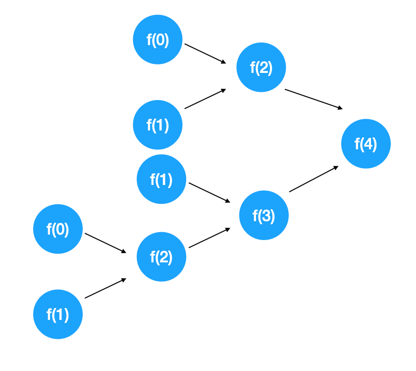
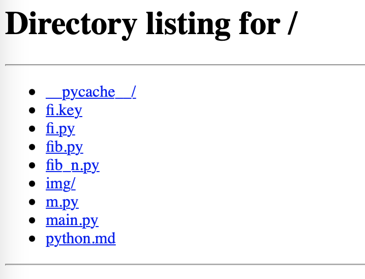

#  试用 Python 编程


可能大家早已听过 Python 这门编程语言。查了下维基百科，发现它是1991年发布的。想不到已经30年。


## 试用起来


让我们把Python编译器安装起来。官网是 https://www.python.org 。找到 `Getting Started`部分。这里说有2.x编译器和3.x编译器。就是说Python编程语言又分为两种主要的版本，Python2和Python3。它们的语法或别的可能不同，它们无法兼容。也就是在「解谜计算机科学」上所说的，对于一些概念，有些模型在两者中的符号表达不一样。至于为什么会这样，我们暂时不去了解。


我们这里用3.x。目前最新的版本是 [Python 3.9.2](https://www.python.org/downloads/release/python-392/)。来把它下载下来。接下来进行安装。我早之前装的是 Python 3.9.0。3.9.0和3.9.2版本应该差别不大。本文以3.9.0来讲述。这里只是演示运行一些基本简单的程序，几乎用所有的版本都应该差不多的。


安装完成后，便可在命令行输入`python`来进入 Python的实时交互编程命令行。


```shell
$ python
Python 3.9.0 (default, Oct  8 2020, 11:54:28)
[Clang 12.0.0 (clang-1200.0.32.2)] on darwin
Type "help", "copyright", "credits" or "license" for more information.
>>>
>>>
```

这里打印了当前Python编译器的一些基本信息和帮助信息。


试试输入一些命令。

```python
>>> 2+3
5
```

```python
>>> 8*(2+3)
40
```

是不是这又很像终端命令行。

```python
>>> 2+
  File "<stdin>", line 1
    2+
      ^
SyntaxError: invalid syntax
```

出错了。告诉我们这是无效的语法。 在文件 stdin 的第一行出错了。这是什么意思。可能这个交互编程环境，Python把每一行命令封装成一个文件，然后提供一些基本的依赖库，接着来运行。stdin是standard input 的意思，即是标准输入的意思。


继续玩。

```python
>>> a=3
>>> a+5
8
```

说明它支持变量。


怎么退出这个交互命令行呢。这样来：

```python
>>> exit()
```


那能不能先写成一个文件，再运行呢。试试看。我们用VSCode来写几行代码。


创建一个`main.py`的文件。随便写点啥吧。

```python
2+3
```

那怎么运行呢。


试试看在终端用`python`运行这个文件，也就是把这个文件名当做参数传递给Python编译器，看看如何。

```shell
$ python main.py
```

什么也没有，什么也看不到。再改一改。


main.py：

```python
println(2+3)
```

```shell
$ python main.py
Traceback (most recent call last):
  File "/Users/lzw/curious-courses/run/python/hello-python/main.py", line 1, in <module>
    println(2+3)
NameError: name 'println' is not defined
```

出错了。println是我在其它语言看到的。这里也可能是我们网上查到的。总之随便试一试。错误信息是说，`println`没有被定义。


再试试改改。


main.py：

```
print(2+3)
```

```
$ python main.py
5
```

成功了！继续玩玩。


main.py：

```python
print("hello")
```

```
$ python main.py
hello
```


嗯。我们用Python语言写了一些代码，接着用Python编译器来执行了这些代码。可以说我们在用Python编程了。


***

### 小练习

* 试着像本文一样，学生在自己电脑上试用Python编程。
* 练习完后，可提交一百字以内的总结或对本文的补充。

***


## 斐波那契数列


接着来实现一些优雅的程序，来熟悉Python编程语言。咱们设计这样一个程序。来打印斐波那契数列的第n位。


斐波那契数列的定义是说，一开始两个数字是0和1。接下来的每个数都是前面两个数之和。那这个数列将会是0、1、1、2、3、5、8、13、21……


用数学上的表示即是说，用n来表示序号。当 n>2时，f(n) = f(n-1) + f(n-2)。f(1)=0，f(2)=1。这里用递归的方式来实现这个程序。


可见要用到函数。Python的函数是怎样的呢。

```shell
# Python 3: Fibonacci series up to n
>>> def fib(n):
>>>     a, b = 0, 1
>>>     while a < n:
>>>         print(a, end=' ')
>>>         a, b = b, a+b
>>>     print()
>>> fib(1000)
0 1 1 2 3 5 8 13 21 34 55 89 144 233 377 610 987
```

Python官网给的第一个程序就告诉了我们。可见函数是这样的。

```python
def fib(n):
  0
```

嗯，运行一下，没什么问题。如果`0`也不写，会怎样。

```shell
  File "./fi.py", line 4

    ^
IndentationError: expected an indented block
```

出错了，说是`IndentationError`，缩进错误。Python 里缩进很重要。编译也会去检查缩进。因为Python的语言语法很简洁。但这种简洁会有时候导致一些混淆，所以得借助代码里的空格等缩进来告诉编译器该怎么理解程序。


像上面的程序。`while`中有两行代码。`print()`这行代码是在`while`之外的。如果在`print()`前面加上几个空格，这行语句就到`while`里面去了。可见很多时候Python语言里，对于代码块，没有一个结束标志的符号，没有类似`}`的符号。所以只能借助缩进来区分代码块。


`a, b = 0, 1`表明可以在一行连续对两个变量赋值。`print(a, end=' ')`表明每次打印完`a`之后，再打印一个空格。`print()`是什么意思。似乎是说在打印`换行符`。


接着写我们的斐波那契数列程序。

```python
def fib(n):
  fib(n-1) + fib(n-2)
```

先写这部分。接着来打印一个序号的数字吧。

```python
def fib(n):
  fib(n-1) + fib(n-2)
  
print(fib(10))
```

程序会怎么运行。似乎程序会一直运行下去。当求`fib(0)`时，就去求`fib(-1)`和`fib(-2)`。当运行到负无穷或者Python中最小的负整数时，会发生什么。会告诉我们越界了吗。试试看。

```python
$ python fi.py
Traceback (most recent call last):
  File "fi.py", line 4, in <module>
    print(fib(10))
  File "fi.py", line 2, in fib
    fib(n-1) + fib(n-2)
  File "fi.py", line 2, in fib
    fib(n-1) + fib(n-2)
  File "fi.py", line 2, in fib
    fib(n-1) + fib(n-2)
  [Previous line repeated 996 more times]
RecursionError: maximum recursion depth exceeded
```

这是说`递归错误：超过了最大的递归深度`。这不禁让人好奇，这最大递归深度到底是多少。怎么办。把函数里的`n`打印出来。

```python
def fib(n):
  print(n)
  fib(n-1) + fib(n-2)
  
print(fib(10))
```

```shell
...
-982
-983
-984
-985
Traceback (most recent call last):
  ...
  File "fi.py", line 3, in fib
    fib(n-1) + fib(n-2)
  [Previous line repeated 992 more times]
  File "fi.py", line 2, in fib
    print(n)
RecursionError: maximum recursion depth exceeded while calling a Python object
```

我把输出简写了一下。这很有意思。可以注意到 `996 more times`和`992 more tims`。第一个打印的应该是`10`。那么10到-985，这大概是打印了996次数。即是`10-(-985)+1`次数。可能最大递归次数真的是`996`次。也许是因为函数里的逻辑比较少，所以能递归那么多次。

 

这也意味着，尽管写出了正确的斐波那契数列程序，我们这递归版本的程序也只能算到`1000`左右。但何妨呢，我们只是来学习的，又不是来干别的。


接下来，很自然要加上`if`判断。

```python
def fib(n):
  if n == 1:
     0
  else:
    if n == 2:
       1
    else: 
      fib(n-1) + fib(n-2)
  
print(fib(10))
```

写成了这样。这样似乎有点不够优雅。`n == 1` 或 `n==2`时应该是一种情况。而我们这里显得 `n==2` 和`fib(n-1) + fib(n-2)` 是一种情况一样。也意味着假如当 `n`为2以上时，总是要判断两下，才能到达最后的递归语句。能不能先处理递归语句。

```python
def fib(n):
  if n > 2:
     fib(n-1) + fib(n-2)
  else:
    if n == 2:
       1
    else:
       0
      
  
print(fib(10))
```

先写成这样吧。运行看看。


出错了。

```shell
$ python fi.py
Traceback (most recent call last):
  ...
  File "fi.py", line 3, in fib
    fib(n-1) + fib(n-2)
  [Previous line repeated 5 more times]
TypeError: unsupported operand type(s) for +: 'NoneType' and 'NoneType'
```

这是什么意思？意思是说，无法将两个类型是 NoneType 的东西加起来。哪里用到了加法。可见是` fib(n-1) + fib(n-2)`出错了。一直运行下去，我们希望的是 `n == 3`时，是希望 1 和 0 加起来。


这是为什么。也许是因为`1`和`0`这两个值并没有返回给函数。难道前面要加一个`return`吗。

```python
def fib(n):
  if n > 2:
     return fib(n-1) + fib(n-2)
  else:
    if n == 2:
       return 1
    else:
       return 0
      
  
print(fib(10))
```

```shell
$ python fi.py
34
```

似乎对了。没法一下子判断 `fib(10)`是不是34。让我们试试求`fib(3)`和`fib(4)`，分别得到了`1`和`2`。可见是对了。


来试试看，求n为1000时的值。果然出错了。

```powershell
$ python fi.py
Traceback (most recent call last):
  ...
  File "fi.py", line 3, in fib
    return fib(n-1) + fib(n-2)
  [Previous line repeated 995 more times]
  File "fi.py", line 2, in fib
    if n > 2:
RecursionError: maximum recursion depth exceeded in comparison
```

来把程序改得更优雅一点。

```python
def f(n):
  if n > 2:
     return f(n-1) + f(n-2)
  else:
    if n == 2:
       return 1
    else:
       return 0
      
  
print(f(10))
```

简单查阅之后，发现 `else if`这种形式可以简写为 `elif`。n 的含义我们想是说平时说的第n位。也就是写成一列数列，第1个是0，第2个是1。也许我们要打印数列，则这个第几位没那么重要。这样来改写：

```python
def f(n):
  if n < 2:
     return n
  else:
     return f(n-1) + f(n-2)

print(f(10))
```

运行一下，发现是：

```python
$ python fi.py
55
```

而不是34了。也就是当前的`f(10)`是表示之前的`f(11)`。


这样其实不影响我们打印它们。序号在这个程序里来说，不是重要的。


来把100位打印一下。


```python
def f(n):
  if n < 2:
     return n
  else:
     return f(n-1) + f(n-2)
      
i = 0
while i < 100:   
  print(f(i))
```

```shell
...
0
0
0
```

结果输出了一大堆`0`。为什么。原来是在`while`里`i`没有加1。加上后。运行一下。

```python
def f(n):
  if n < 2:
     return n
  else:
     return f(n-1) + f(n-2)
      
i = 0
while i < 100:   
  print(f(i))
  i = i + 1
```

```python
$ python fi.py
0
1
1
2
3
5
8
13
21
34
55
89
144
233
377
610
987
1597
2584
4181
6765
10946
17711
28657
46368
75025
121393
196418
317811
514229
832040
1346269
2178309
3524578
5702887
9227465
```

程序还在打印，逐渐变得越来越慢，电脑的风扇也开始发出响声。我们把程序停掉。可按`Ctrl+C`来停止它的运行。


能想象它的计算图吗。




看要求`f(4)`的时候已经需要计算这么多次函数了。然而打印20位是没啥问题的。接着我们试图从终端输入我们想要打印的位数。然后程序就能打印相应位数的数列吧。同时把程序打印结果改得好看一点。

```python
  print(f(i), end=" ")
```

先改打印结果。接着发现，好看了不少。

```python
$ python fi.py
0 1 1 2 3 5 8 13 21 34 55 89 144 233 377 610 987 1597 2584 4181
```

继续改。简单查阅后，发现是这样来得到。

```python
n = input("n:")
while i < n:   
  print(f(i))
  i = i + 1
```

很遗憾报错了。

```shell
$ python fi.py
n:10
Traceback (most recent call last):
  File "fi.py", line 16, in <module>
    while i < n:
TypeError: '<' not supported between instances of 'int' and 'str'
```

这说明 `n`这里被当成了字符串。字符串无法和数字进行比较。

```python
n = input("n:")
n = int(n)
```

改成这样，试试看。好了。

```python
$ python fi.py
n:10
0 1 1 2 3 5 8 13 21 34$
```

然而当这样的时候，输出完结果后，总是立马跟着`$`。我们需要最后再打印一个空行。

```python
n = input("n:")
n = int(n)
i = 0
while i < n:   
  print(f(i), end=" ")
  i = i + 1

print()
```

```python
$ python fi.py
n:10
0 1 1 2 3 5 8 13 21 34
$
```

嗯，这样就美观很多了。


那如何改进程序呢。如何可以打印数列中第100位的数字呢。会发现，上面的计算图中，存在很多的重复计算。在求`f(4)`时，假如先算`f(3)`，算完`f(3)`之后，开始算`f(4)`的另外一个分支的`f(2)`，此时仍然需要去问`f(1)`和`f(0)`。为何不直接告知一下之前在算`f(3)`时得知的`f(2)`值呢。


那怎么办。看来需要有个东西能保存一下这个值。那如何保存一个一个的值呢。总不能声明变量吧。声明一堆变量总是不够用的。即是说声明变量`f0`、`f1`、`f2`、`f3`来保存相应的值。这时要用到数组或列表。

```python
v = []
for x in range(100):
   v.append(-1)
```

这里声明一个列表`v`。`range(100)`大概是说生成一个0到99的列表吧。这里引入`for`循环，和`while`差不多，但有些情况比`while`要好用些。

```python
v = []
for x in range(100):
   v.append(-1)

def f(n):
   if v[n] != -1:
      return v[n]
   else:
      if n < 2:
         return n
      else:
          return f(n-1) + f(n-2)

n = input("n:")
n = int(n)
i = 0
while i < n:   
  print(f(i), end=" ")
  i = i + 1

print()
```

能看明白吗。用列表`v`来保存数列值。然而很快我们发现了错误。`v[n]`的值一直都没有改变。改完后，

```python
v = []
for x in range(100):
   v.append(-1)

def f(n):
   if v[n] != -1:
      return v[n]
   else:
      a = 0
      if n < 2:
         a = n
      else:
         a = f(n-1) + f(n-2)
      v[n] = a
      return v[n]

n = input("n:")
n = int(n)
i = 0
while i < n:   
  print(f(i), end=" ")
  i = i + 1

print()
```

这里引入一个变量 a。来在返回`值`之前，先把值保存起来。

```shell
$ python fi.py
n:100
0 1 1 2 3 5 8 13 21 34 55 89 144 233 377 610 987 1597 2584 4181 6765 10946 17711 28657 46368 75025 121393 196418 317811 514229 832040 1346269 2178309 3524578 5702887 9227465 14930352 24157817 39088169 63245986 102334155 165580141 267914296 433494437 701408733 1134903170 1836311903 2971215073 4807526976 7778742049 12586269025 20365011074 32951280099 53316291173 86267571272 139583862445 225851433717 365435296162 591286729879 956722026041 1548008755920 2504730781961 4052739537881 6557470319842 10610209857723 17167680177565 27777890035288 44945570212853 72723460248141 117669030460994 190392490709135 308061521170129 498454011879264 806515533049393 1304969544928657 2111485077978050 3416454622906707 5527939700884757 8944394323791464 14472334024676221 23416728348467685 37889062373143906 61305790721611591 99194853094755497 160500643816367088 259695496911122585 420196140727489673 679891637638612258 1100087778366101931 1779979416004714189 2880067194370816120 4660046610375530309 7540113804746346429 12200160415121876738 19740274219868223167 31940434634990099905 51680708854858323072 83621143489848422977 135301852344706746049 218922995834555169026
```

成功了！


如果打印1000位会怎么样。

```python
$ python fi.py
n:1000
0 1 1 2 3 5 8 13 21
...
  File "fi.py", line 6, in f
    if v[n] != -1:
IndexError: list index out of range
```

出现了错误。原来是`v`列表不够大。


太厉害了，竟然打印出来了，最后一位是：

```python
26863810024485359386146727202142923967616609318986952340123175997617981700247881689338369654483356564191827856161443356312976673642210350324634850410377680367334151172899169723197082763985615764450078474174626
```

10000呢。竟然也可以。Python 的数值运算太厉害了。


## 模块


这是打印斐波那契数列的前n位。改了一下程序，很容易只打印数列的第n个数。


将

```python
n = input("n:")
n = int(n)
i = 0
while i < n:   
  print(f(i), end=" ")
  i = i + 1

print()
```

改成

```python
n = input("n:")
n = int(n)
print(f(n))
```

即可。


注意到我们写了很有用的关于斐波那契数列的代码，可以被灵活使用。如何把这段代码共享给任何人呢。其他人复制粘贴可能不是那么方便。另外他们的代码里也可能有叫`f`的函数和叫`v`的列表。Python中，可以用文件来办到。


创建一个文件，叫`fib.py`。来把这段有用的代码复制粘贴到这里。接着创建一个文件，叫`fib_n.py`。这里来`import`刚刚那个文件。接着用`fib.f`来调用`fib.py`里的`f`函数。

fib.py：

```python
v = []
for x in range(1000):
   v.append(-1)

def f(n):
   if v[n] != -1:
      return v[n]
   else:
      a = 0
      if n < 2:
         a = n
      else:
         a = f(n-1) + f(n-2)
      v[n] = a
      return v[n]
```

fib_n.py：

```python
import fib

n = input("n:")
n = int(n)
print(fib.f(n))
```

`fib`这样的在Python也叫做模块。刚好这个文件名我起的比较简洁一些，叫`fib`。如果是`fibonacci`，那得要写成：

```python
print(fibonacci.f(n))
```

这样就挺冗长的。怎么办呢。可以这样：

```python
from fib import f

n = input("n:")
n = int(n)
print(f(n))
```


既然这里用到了我们自己写的模块，有没有一些系统的模块，可以很方便地引入呢。


在官网的标准库文档里挑一个，`string`模块吧。它有个函数 `ascii_lowercase` 试试用用它。

```python
import string

print(string.ascii_lowercase('abc'))
```

```shell
$ python m.py
Traceback (most recent call last):
  File "m.py", line 3, in <module>
    print(string.ascii_lowercase('abc'))
TypeError: 'str' object is not callable
```

稍稍读下文档，才知道。`ascii_lowercase` 其实不是一个函数，而是一个字符串。

```python
import string

print(string.ascii_lowercase)
```

```shell
$ python m.py
abcdefghijklmnopqrstuvwxyz
```


## 面向对象


如何把我们的斐波那契数列功能做成 `Web`应用呢。也就是说希望用网页访问的方式来访问它。平时我们用电脑或手机访问网页时，数据在我们电脑手机和网页背后的服务器发生了通信交互。通常这个通信的协议叫 `HTTP协议`。 `HTTP协议`就是一套数据通信规范。就如上面输入参数n的情况，`n:`，接着我们输入数字，就打印了斐波那契数列前`n`位一样。这可以说就是我们定义的`参数输入协议`，可以给它起名叫`FIB_N`协议。


接着我们想想网页它有什么特点。服务器没有出错的话，它随时都在。谁都可以访问。也就是程序一直在运行 。我们的斐波那契数列程序如何一直可以运行呢。如何一直可以输入`n`呢。

```python
from fib import f

while True:
  n = input("n:")
  n = int(n)
  print(f(n))
```

```shell
$ python fib_cls.py
n:5
5
n:9
34
n:
```

看，加个`while`循环就行了。`while True`则表明会一直运行循环里的代码块。


嗯，我们做到了。可以说，这意味着在终端咱们构建了一个服务器。这个服务器用`FIB_N`协议来进行通信。


通常`服务器`有很多的代码要处理，有很多的函数，很多的变量。会混淆怎么办。都分成不同的模块，放在不同的文件是可以。然而这样意味着代码很分散。如何把一类的函数放在一起呢。这时候出现了`面向对象`这种编程方法。同时引入`class`类的概念。来改写一下我们的代码。

```python
from fib import f

class Server:
  def run():
    while True:
      n = input("n:")
      n = int(n)
      print(f(n))
```

这意味着声明了一个类，名字叫`Server`。它有run方法。来运行一下。

```python
from fib import f

class Server:
  def run():
    while True:
      n = input("n:")
      n = int(n)
      print(f(n))

server = Server()
server.run()
```

这就是说用这个类，创建一个实例。`class`下的代码块仅仅表明定义了一个类，没有执行什么。这里声明服务器是这样的。接着创建一个服务器对象。接着调用这个对象的`run`方法。


```shell
$ python fib_cls.py
Traceback (most recent call last):
  File "fib_cls.py", line 11, in <module>
    server.run()
TypeError: run() takes 0 positional arguments but 1 was given
```

然而出现了错误。简单查阅了之后，得知。`run`这里是函数，而非实例的方法。意味着应该直接运行这个函数。改一下。

```python
from fib import f

class Server:
  def run():
    while True:
      n = input("n:")
      n = int(n)
      print(f(n))

Server.run()
```

```shell
$ python fib_cls.py
n:5
5
n:
```

很好。然而如果写成对象的方法，改如何进行呢。应该写成函数还是实例的方法呢。这应该写成实例的方法。因为假如有两个服务器，我们希望是各自处理各自的。

```python
from fib import f

class Server:
  def run(self):
    while True:
      n = input("n:")
      n = int(n)
      print(f(n))

server = Server()
server.run()
```

```python
$ python fib_cls.py
n:7
13
```

很好，运行起来了。注意到此时`run`函数定义处得加上`self`参数，`self`即表明是对象自身。


接着思考如何做一个通用的终端`服务器`。意思是不仅可以处理斐波那契数列的问题，也能处理`1+2+..+n`的求和问题等。来定义一个`处理器`。它可以处理终端的输入。

```python
class Handler:
  def handle(self, request):
    pass
```

这里`pass`就是占一个位置。它什么也不做。类似上面的`return 0`。因为Python中，缩进很重要。如果什么也不写，可能编译器就没法知道哪里是结尾。


那这个处理器是指`求斐波那契数列第n位`的处理器还是说`1到n求和`的处理器呢。我们如何提供一个`终端服务器模块`呢。也就是其他人可以用我们的`Server`和`Handler`。那么其他人也必须遵守一定的规则。这个`Handler`是有规则的。它有一个`handle`函数，是实例方法，需要传递一个参数给它。


可见所谓遵守规则，就是要和我们的`Handler`一样。那就是说我们只接受像`Handler`这样的东西来使用我们的`Server`。于是我们引入一个类`BaseHandler`来表示这样的规则。

```python
class BaseHandler:
  def handle(self, request):
    pass

class FibHandler(BaseHandler):
  def handle(self, request):
    pass
```

注意到声明`BaseHandler`的同时，我们把之前的`Handler`改了名字。同时注意到 `FibHandler`继承了`BaseHandler`，表示在这里`class FibHandler(BaseHandler):`。继承的意思是说，我有了它的方法和变量等，我还可以定义额外的一些方法，但需要遵守一些规则。


再改一下。

```python
class BaseHandler:
  def handle(self, request:str):
    pass
```

这表明`request`必须是个字符串。


接下来我们的`Server`代码如何改动。

```python
class Server:
  def run(self):
    while True:
      n = input("n:")
      n = int(n)
      print(f(n))
```

这个终端服务器应该能一直运行，来处理请求。我们将像`FibHandler`这样的请求处理器告知这个终端服务器，接着它就能用这个请求处理器来处理请求。

```python
from fib import f

class BaseHandler:
  def handle(self, request:str):
    pass

class FibHandler(BaseHandler):
  def handle(self, request:str):
    n = int(request)
    print('f(n)=', f(n))
    pass

class Server:
  def __init__(self, handlerClass):
    self.handlerClass = handlerClass

  def run(self):    
    while True:
      request = input()
      self.handlerClass().handle(request)

      
server = Server(FibHandler)
server.run()
```

`__init__`这里意思是说，初始化的时候，得告诉`Server`请求处理器的名字。注意我们传递的是名字。因为每一个请求，我们都要生成一个请求处理器对象，来处理它。注意到下面的`Server(FibHandler)`，这里我们在生成`Server`的对象的时候，也传入了`请求处理器`的名字。同时也稍稍改变了输出方式。`print('f(n)=', f(n))`增强了前置说明。可注意到了也去掉了`n:`。这些是一些小细节，来方便阅读。

```python
$ python fib_cls.py
3
f(n)= 2
5
f(n)= 5
```

成功了。


## Web 开发


我们把上面的代码改成一个 Web 服务。


Python 的标准库中提供了一个网页服务器。

```
python -m http.server
```

在终端中运行它。

```shell
$ python -m http.server
Serving HTTP on :: port 8000 (http://[::]:8000/) ...
```

在浏览器中打开便可以看到效果。



这把当前目录列举出来了。接着当浏览这个网页时，再回去看终端。这会，很有意思。

```shell
$ python -m http.server
Serving HTTP on :: port 8000 (http://[::]:8000/) ...
::1 - - [07/Mar/2021 15:30:35] "GET / HTTP/1.1" 200 -
::1 - - [07/Mar/2021 15:30:35] code 404, message File not found
::1 - - [07/Mar/2021 15:30:35] "GET /favicon.ico HTTP/1.1" 404 -
::1 - - [07/Mar/2021 15:30:35] code 404, message File not found
::1 - - [07/Mar/2021 15:30:35] "GET /apple-touch-icon-precomposed.png HTTP/1.1" 404 -
::1 - - [07/Mar/2021 15:30:35] code 404, message File not found
::1 - - [07/Mar/2021 15:30:35] "GET /apple-touch-icon.png HTTP/1.1" 404 -
::1 - - [07/Mar/2021 15:30:38] "GET / HTTP/1.1" 200 -
```

这是网页访问日志。其中`GET`表示网页服务的一种数据访问操作。`HTTP/1.1`表示使用了 `HTTP`的`1.1`版本的协议。`HTTP`协议就是一套数据通信规范。就如上面输入参数n的情况，`n:`，接着我们输入数字，就打印了斐波那契数列前`n`位一样。这可以说就是我们定义的`参数输入协议`，可以给它起名叫`FIB_N`协议。


平时我们用电脑或手机访问网页时，数据在我们电脑手机和网页背后的服务器发生了通信交互。很多时候，用的协议就是`HTTP`。


如何用它来打造我们的斐波那契数列服务。先写一个最简单的Web服务器

```python
from http.server import SimpleHTTPRequestHandler, HTTPServer

class Handler(SimpleHTTPRequestHandler):
    def do_GET(self):
      self.send_response(200)
      self.send_header('Content-type', 'text')
      self.end_headers()
      self.wfile.write(bytes("hi", "utf-8"))

server = HTTPServer(("127.0.0.1", 8000), Handler)

server.serve_forever()
```

出现了很多的新东西。


第一行，我们从`http.server`模块中，引入了两个类。`SimpleHTTPRequestHandler`是叫`简单HTTP请求处理器`。`HTTPServer`叫`HTTP服务器`。这是什么意思。还记得上面的例子吗。

```python
n = input("n:")
n = int(n)
```

这两行代码，我们可以用类封装起来。

