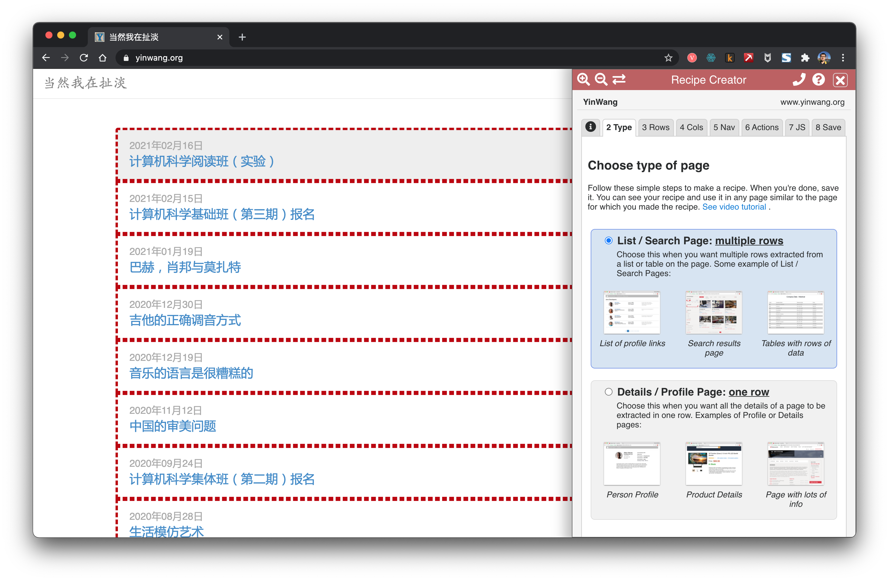
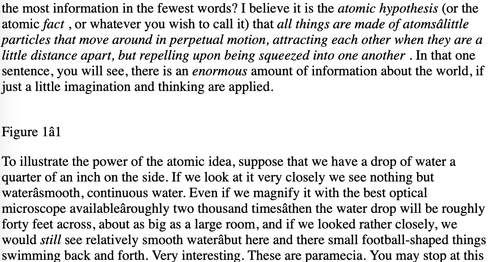

# 实战：抓取网站内容

已经有很多现成的工具可以抓取网站的内容。然而如果使用它们，我们没法更好地理解背后的过程。如果在工作中遇到复杂或特别一些的网站，使用它们可能并不能得到想要的结果。我们需要造轮子，为了更好地学习它们和更好地运用它们。

也来看看现成的一些工具。

## Data Miner



`Data Miner`是Chrome上的很方便的一个插件。可以来很方便地抓取链接和内容。


## getbook

`getbook`是一个很方便的制作电子书工具。

```powershell
pip install getbook
```

`book.json`:

```json
{
  "uid": "book",
  "title": "Hello World",
  "author": "Armin",
  "chapters": [
    "http://lucumr.pocoo.org/2018/7/13/python/",
    "http://lucumr.pocoo.org/2017/6/5/diversity-in-technology",
  ]
}
```

```shell
getbook -f ./book.json --mobi
```

这样就方便地把一些链接做成了电子书。通过使用 `Data Miner`和`getbook`，一个爬取链接，一个把链接变成电子书，就能很方便制作电子书。


## 费曼物理讲义


在「项目实战：将费曼物理讲义网页做成电子书」章节中，我们学会如何把一个用`mathjax`渲染的`html`网页做成电子书。这里继续这个项目，来看看如何获取到所有的网页。费曼物理讲义有三卷。上图是第一卷的的目录。

> http.client — HTTP protocol client
>
> Source code: Lib/http/client.py
>
> This module defines classes which implement the client side of the HTTP and HTTPS protocols. It is normally not used directly — the module urllib.request uses it to handle URLs that use HTTP and HTTPS.
>
> See also: The Requests package is recommended for a higher-level HTTP client interface.

可见`rquests`是更高阶的接口。

```python
import requests

def main():
    r = requests.get('https://api.github.com/user', auth=('user', 'pass'))
    print(r.status_code)    

main()
```

```shell
401
```

```python
import requests

def main():
    r = requests.get('https://github.com')
    print(r.status_code)
    print(r.text)

main()
```

```html
200
<html>
  ...
</html>
```

试了试，说明`requests`的接口是能用的。

```html
     <div class="toc-chapter" id="C03">
        <span class="triangle">
         ▶
        </span>
        <a class="chapterlink" href="javascript:Goto(1,3)">
         <span class="tag">
          Chapter 3.
         </span>
         The Relation of Physics to Other Sciences
        </a>
        <div class="sections">
         <a href="javascript:Goto(1,3,1)">
          <span class="tag">
           3-1
          </span>
          Introduction
         </a>
         <a href="javascript:Goto(1,3,2)">
          <span class="tag">
           3-2
          </span>
          Chemistry
         </a>
         <a href="javascript:Goto(1,3,3)">
          <span class="tag">
           3-3
          </span>
          Biology
         </a>
         <a href="javascript:Goto(1,3,4)">
          <span class="tag">
           3-4
          </span>
          Astronomy
         </a>
         <a href="javascript:Goto(1,3,5)">
          <span class="tag">
           3-5
          </span>
          Geology
         </a>
         <a href="javascript:Goto(1,3,6)">
          <span class="tag">
           3-6
          </span>
          Psychology
         </a>
         <a href="javascript:Goto(1,3,7)">
          <span class="tag">
           3-7
          </span>
          How did it get that way?
         </a>
        </div>
       </div>
```

这是在目录页面中，第三章节的`html`代码。想从这里抓取每一章节的链接。`<a href="javascript:Goto(1,3,7)">`，可见是一个`javascript`的超链接。

```
https://www.feynmanlectures.caltech.edu/I_03.html
```

接着发现，每章节的路径是很有规律的。`I_03.html`表示第一卷第三章。

```python
import requests
from bs4 import BeautifulSoup
from multiprocessing import Process

def scrape(chapter):
    if chapter < 1 or chapter > 52:
        raise Exception(f'chapter {chapter}')
    chapter_str = '{:02d}'.format(chapter)
    url = f'https://www.feynmanlectures.caltech.edu/I_{chapter_str}.html'
    print(f'scraping {url}')
    r = requests.get(url)
    if r.status_code != 200:
        raise Exception(r.status_code)
    soup = BeautifulSoup(r.text, features='lxml')
    f = open(f'./chapters/I_{chapter_str}.html', 'w')
    f.write(soup.prettify())
    f.close()

def main():
    for i in range(52):
        p = Process(target=scrape, args=(i+1))
        p.start()
        p.join()
        
main()
```

来接着写写抓取代码。这里用到了`Process`。

```shell
    raise RuntimeError('''
RuntimeError: 
        An attempt has been made to start a new process before the
        current process has finished its bootstrapping phase.

        This probably means that you are not using fork to start your
        child processes and you have forgotten to use the proper idiom
        in the main module:

            if __name__ == '__main__':
                freeze_support()
                ...

        The "freeze_support()" line can be omitted if the program
        is not going to be frozen to produce an executable.
```


```python
def main():
    for i in range(52):        
        p = Process(target=scrape, args=(i+1,))
        p.start()
    p.join()

if __name__ == "__main__":
    main()
```


```python
def main():
    start = timeit.default_timer()
    ps = [Process(target=scrape, args=(i+1,)) for i in range(52)]
    for p in ps:
        p.start()
    for p in ps:
        p.join()
    stop = timeit.default_timer()
    print('Time: ', stop - start) 

if __name__ == "__main__":    
    main()
```

```shell
scraping https://www.feynmanlectures.caltech.edu/I_01.html
scraping https://www.feynmanlectures.caltech.edu/I_04.html
...
scraping https://www.feynmanlectures.caltech.edu/I_51.html
scraping https://www.feynmanlectures.caltech.edu/I_52.html
Time:  9.144841699
```




```html
<div class="figure" id="Ch1-F1">
        
        <div class="caption empty">
         <span class="tag">
          Figure 1–1
         </span>
        </div>
</div>
```

```python
import requests
from bs4 import BeautifulSoup
from multiprocessing import Process
import timeit

def scrape(chapter):
    if chapter < 1 or chapter > 52:
        raise Exception(f'chapter {chapter}')
    chapter_str = '{:02d}'.format(chapter)
    url = f'https://www.feynmanlectures.caltech.edu/I_{chapter_str}.html'
    print(f'scraping {url}')
    r = requests.get(url)
    if r.status_code != 200:
        raise Exception(r.status_code)
    soup = BeautifulSoup(r.text, features='lxml')
    f = open(f'./chapters/I_{chapter_str}.html', 'w')
    f.write(soup.prettify())
    f.close()

def main():
    start = timeit.default_timer()
    ps = [Process(target=scrape, args=(i+1,)) for i in range(52)]
    for p in ps:
        p.start()
    for p in ps:
        p.join()
    stop = timeit.default_timer()
    print('Time: ', stop - start) 

if __name__ == "__main__":    
    main()
```


看看链接。

```python
    imgs = soup.find_all('img')
    for img in imgs:
        print(img)
```

```html
scraping https://www.feynmanlectures.caltech.edu/I_01.html


```


https://www.feynmanlectures.caltech.edu/img/FLP_I/f01-01/f01-01_tc_big.svgz

```shell
Forbidden

You don't have permission to access this resource.

Apache/2.4.38 (Debian) Server at www.feynmanlectures.caltech.edu Port 443
```


```shell
% pip install selenium
Collecting selenium
  Using cached selenium-3.141.0-py2.py3-none-any.whl (904 kB)
Requirement already satisfied: urllib3 in /usr/local/lib/python3.9/site-packages (from selenium) (1.24.2)
Installing collected packages: selenium
Successfully installed selenium-3.141.0
```


```shell
export CHROME_DRIVER_HOME=$HOME/dev-env/chromedriver
export PATH="${PATH}:${CHROME_DRIVER_HOME}"
```


```shell
% chromedriver -h
Usage: chromedriver [OPTIONS]

Options
  --port=PORT                     port to listen on
  --adb-port=PORT                 adb server port
  --log-path=FILE                 write server log to file instead of stderr, increases log level to INFO
  --log-level=LEVEL               set log level: ALL, DEBUG, INFO, WARNING, SEVERE, OFF
  --verbose                       log verbosely (equivalent to --log-level=ALL)
  --silent                        log nothing (equivalent to --log-level=OFF)
  --append-log                    append log file instead of rewriting
  --replayable                    (experimental) log verbosely and don't truncate long strings so that the log can be replayed.
  --version                       print the version number and exit
  --url-base                      base URL path prefix for commands, e.g. wd/url
  --readable-timestamp            add readable timestamps to log
  --enable-chrome-logs            show logs from the browser (overrides other logging options)
  --allowed-ips                   comma-separated allowlist of remote IP addresses which are allowed to connect to ChromeDriver
```


```python

from selenium import webdriver
from selenium.webdriver.common.by import By
from selenium.webdriver.common.keys import Keys
from selenium.webdriver.support.ui import WebDriverWait
from selenium.webdriver.support.expected_conditions import presence_of_element_located

with webdriver.Chrome() as driver:
    wait = WebDriverWait(driver, 10)
    driver.get("https://google.com/ncr")
    driver.find_element(By.NAME, "q").send_keys("cheese" + Keys.RETURN)
    first_result = wait.until(presence_of_element_located((By.CSS_SELECTOR, "h3>div")))
    print(first_result.get_attribute("textContent"))
```


```python

from selenium import webdriver
from selenium.webdriver.common.by import By
from selenium.webdriver.common.keys import Keys
from selenium.webdriver.support.ui import WebDriverWait
from selenium.webdriver.support.expected_conditions import presence_of_element_located
import urllib

def main():
    driver = webdriver.Chrome()
    wait = WebDriverWait(driver, 10)
    driver.get("https://www.feynmanlectures.caltech.edu/I_01.html")
    elements = driver.find_elements(By.TAG_NAME, "img")
    # print(dir(elements[0]))
    print(driver.page_source)
    i = 0
    for element in elements:
        # src = element.get_attribute('src')
        element.screenshot(f'images/{i}.png')        
        i +=1                
    driver.close()
main()
```

```python
from bs4 import BeautifulSoup
from multiprocessing import Process
import timeit
from pathlib import Path
from selenium import webdriver
from selenium.webdriver.common.by import By

def img_path(chapter):
    return f'./chapters/{chapter}/img'

def img_name(url):
    splits = url.split('/')
    last = splits[len(splits) - 1]
    parts = last.split('.')
    name = parts[0]
    return name

def download_images(driver: webdriver.Chrome, chapter):        
    path = img_path(chapter)
    Path(path).mkdir(parents=True, exist_ok=True)    
        
    elements = driver.find_elements(By.TAG_NAME, "img")    
    for element in elements:
        src = element.get_attribute('src')
        name = img_name(src)
        element.screenshot(f'{path}/{name}.png')

USER_AGENT = 'Mozilla/5.0 (Macintosh; Intel Mac OS X 10_15_6) AppleWebKit/605.1.15 (KHTML, like Gecko) Version/14.0.3 Safari/605.1.15'

def scrape(chapter):
    if chapter < 1 or chapter > 52:
        raise Exception(f'chapter {chapter}')
    chapter_str = '{:02d}'.format(chapter)
    url = f'https://www.feynmanlectures.caltech.edu/I_{chapter_str}.html'
    driver = webdriver.Chrome()
    driver.get(url)
    page_source = driver.page_source        
    Path(f'./chapters/{chapter_str}').mkdir(parents=True, exist_ok=True)    
    print(f'scraping {url}')
        
    download_images(driver, chapter_str)
        
    soup = BeautifulSoup(page_source, features='lxml')        
    imgs = soup.find_all('img')
    for img in imgs:
        if 'src' in img.attrs or 'data-src' in img.attrs:
            src = ''
            if 'src' in img.attrs:
                src = img.attrs['src']
            elif 'data-src' in img.attrs:
                src = img.attrs['data-src']
                del img.attrs['data-src']
            name = img_name(src)
            img.attrs['src'] = f'img/{name}.png'                
    
    f = open(f'./chapters/{chapter_str}/I_{chapter_str}.html', 'w')
    f.write(soup.prettify())
    f.close()
    
    driver.close()
        

def main():
    start = timeit.default_timer()
    ps = [Process(target=scrape, args=(i+1,)) for i in range(2)]
    for p in ps:
        p.start()
    for p in ps:
        p.join()
    stop = timeit.default_timer()
    print('Time: ', stop - start) 

if __name__ == "__main__":    
    main()
```

```shell
scraping https://www.feynmanlectures.caltech.edu/I_01.html
scraping https://www.feynmanlectures.caltech.edu/I_02.html
Time:  21.478510914999998
```


```shell
 errpipe_read, errpipe_write = os.pipe()
OSError: [Errno 24] Too many open files
```

```shell
 % ulimit a
ulimit: invalid number: a
lzw@lzwjava feynman-lectures-mobi % ulimit -a
-t: cpu time (seconds)              unlimited
-f: file size (blocks)              unlimited
-d: data seg size (kbytes)          unlimited
-s: stack size (kbytes)             8192
-c: core file size (blocks)         0
-v: address space (kbytes)          unlimited
-l: locked-in-memory size (kbytes)  unlimited
-u: processes                       2784
-n: file descriptors                256
```


```shell
12
download_images
12
mathjax2svg
latexs 128
make_svg 0
insert_svg 0
make_svg 1
insert_svg 1
make_svg 2
insert_svg 2
make_svg 3
insert_svg 3
convert
```


```shell
12
download_images
12
mathjax2svg
latexs 0
latexs 0
convert
Time:  11.369145162
```


```shell
% grep --include=\*.html -r '\$' *
43/I_43.html:a long period of time $T$, have a certain number, $N$, of hits. If we
43/I_43.html:number of collisions is proportional to the time $T$. We would like to
43/I_43.html:We have written the constant of proportionality as $1/\tau$, where
43/I_43.html:$\tau$ will have the dimensions of a time. The constant $\tau$ is the
43/I_43.html:there are $60$ collisions; then $\tau$ is one minute. We would say
43/I_43.html:that $\tau$ (one minute) is the
```


```shell
错误	E21018: 解析文件中的内容时，创建改进的 Mobi 域名失败。内容：<In earlier chapters > 文件中： /private/var/folders/_3/n3b7dq8x6652drmx6_d3t3bh0000gr/T/069e0b8a-f12e-4102-aed3-977c0c3c1178/cTemp/mTemp/mobi-GxL1ye/OEBPS/c-49.xhtml 行： 969
提醒	W28001: Kindle 阅读器不支持内容中指定的 CSS 样式。正在删除 CSS 属性： 'max-width' 文件中： /private/var/folders/_3/n3b7dq8x6652drmx6_d3t3bh0000gr/T/069e0b8a-f12e-4102-aed3-977c0c3c1178/cTemp/mTemp/mobi-GxL1ye/OEBPS/stylesheet.css
提醒	W29004: 强制关闭的已打开标签为： <span amzn-src-id="985"> 文件中： /private/var/folders/_3/n3b7dq8x6652drmx6_d3t3bh0000gr/T/069e0b8a-f12e-4102-aed3-977c0c3c1178/cTemp/mTemp/mobi-GxL1ye/OEBPS/c-4.xhtml     行： 0000102
提醒	W29004: 强制关闭的已打开标签为： <p amzn-src-id="975"> 文件中： /private/var/folders/_3/n3b7dq8x6652drmx6_d3t3bh0000gr/T/069e0b8a-f12e-4102-aed3-977c0c3c1178/cTemp/mTemp/mobi-GxL1ye/OEBPS/c-4.xhtml     行： 0000102
```


```shell
提醒	W14001: 超链接出现问题，尚未解决：  /private/var/folders/_3/n3b7dq8x6652drmx6_d3t3bh0000gr/T/97c9cb4d-35f7-4920-81eb-4705325c482f/cTemp/mTemp/mobi-pvawPN/OEBPS/c-1.xhtml#Ch1-F1			
提醒	W14001: 超链接出现问题，尚未解决：  /private/var/folders/_3/n3b7dq8x6652drmx6_d3t3bh0000gr/T/97c9cb4d-35f7-4920-81eb-4705325c482f/cTemp/mTemp/mobi-pvawPN/OEBPS/c-1.xhtml#Ch1-F2			
提醒	W14001: 超链接出现问题，尚未解决：  /private/var/folders/_3/n3b7dq8x6652drmx6_d3t3bh0000gr/T/97c9cb4d-35f7-4920-81eb-4705325c482f/cTemp/mTemp/mobi-pvawPN/OEBPS/c-1.xhtml#Ch1-F3			
```


```html
<span class="disabled" href="#Ch1-F1">
          1–1
</span>
```


```shell
Rasterizing 'OEBPS/84b8b4179175f097be1180a10089107be75d7d85.svg' to 1264x1011
Rasterizing 'OEBPS/23a4df37f269c8ed43f54753eb838b29cff538a1.svg' to 1264x259
Traceback (most recent call last):
  File "runpy.py", line 194, in _run_module_as_main
  File "runpy.py", line 87, in _run_code
  File "site.py", line 39, in <module>
  File "site.py", line 35, in main
  File "calibre/utils/ipc/worker.py", line 216, in main
  File "calibre/gui2/convert/gui_conversion.py", line 41, in gui_convert_override
  File "calibre/gui2/convert/gui_conversion.py", line 28, in gui_convert
  File "calibre/ebooks/conversion/plumber.py", line 1274, in run
  File "calibre/ebooks/conversion/plugins/mobi_output.py", line 214, in convert
  File "calibre/ebooks/conversion/plugins/mobi_output.py", line 237, in write_mobi
  File "calibre/ebooks/oeb/transforms/rasterize.py", line 55, in __call__
  File "calibre/ebooks/oeb/transforms/rasterize.py", line 142, in rasterize_spine
  File "calibre/ebooks/oeb/transforms/rasterize.py", line 152, in rasterize_item
  File "calibre/ebooks/oeb/transforms/rasterize.py", line 185, in rasterize_external
  File "calibre/ebooks/oeb/base.py", line 1092, in bytes_representation
  File "calibre/ebooks/oeb/base.py", line 432, in serialize
TypeError: cannot convert 'NoneType' object to bytes
```


```shell
% kindlepreviewer feynman-lectures-on-physics-volumn-1.epub -convert
Checking specified arguments.
Pre-processing in progress.
Processing 1/1 book(s).
Book converted with warnings! : /Users/lzw/projects/feynman-lectures-mobi/feynman-lectures-on-physics-volumn-1.epub
Post-processing in progress.
Writing output/log files to /Users/lzw/projects/feynman-lectures-mobi/output
```


```shell
Cleaning up manifest...
Trimming unused files from manifest...
Creating AZW3 Output...
Serializing resources...
Splitting markup on page breaks and flow limits, if any...
Creating KF8 output
	Generating KF8 markup...
Tag table has no aid and a too large chunk size. Adding anyway.
Tag table has no aid and a too large chunk size. Adding anyway.
Tag table has no aid and a too large chunk size. Adding anyway.
	Compressing markup...
	Creating indices...
```


