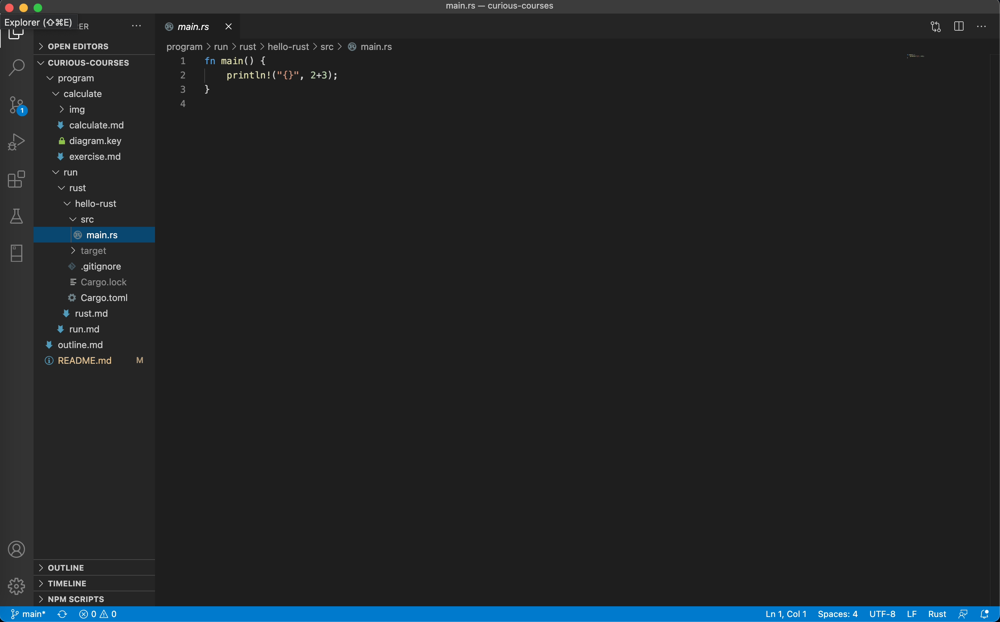

# 熟悉编程环境


如果需要在电脑上编程，那要更多了解一下电脑，了解终端、命令行等。若要开始写程序运行程序，也需要了解更多一些知识，如构建工具和包管理工具。依据不同的编程语言，要了解不同的工具。这里把相对常用的知识集中到一起，学习了这章知识后，便可以愉快地开始写某一具体语言的第一个程序。


这一章内容，很依赖于具体的操作系统。`macOS`上和`Windows`上的情况是很不一样的。这里按`macOS`上的情况来讲述。至于`Windows`的情况，可以先读完本文，再在网上查找资料进行补充理解。


## 终端


在 macOS 上是`Terminal`程序。在 Windows上则是`CMD.exe`。在 macOS 上可以在 LauchPad 上搜索`Terminal`，来打开这个应用。在 Windows 上可以在系统菜单上找到。电脑上有些程序是没有图形化界面的。有些程序只能在终端下运行。当开始编程时，需要更多地折腾计算机，需要更细微地管理计算机。而很多编译程序，离不开终端。


来在终端运行一些命令。

```shell
$ ls  

hello-rust	rust.md
```


ls 表示列举当前目录下的文件。这里用`$`符号来表示这是终端交互运行环境。


```shell
$ pwd
 
/Users/lzw/ideas/curious-courses/program/run/rust
```

```shell
mkdir program
```


猜上面两个语句是什么意思。一个是打印当前目录，一个是创建目录。pwd是 `print working directory` 的意思。mkdir中的mk是make的简写。


如何打开目录呢。来进入下载目录。

```shell
cd ~/Downloads
```

注意`~`是表示用户根目录的意思。运行一下`pwd`。

```shell
$ pwd
/Users/lzw/Downloads
```

可能因为经常用到用户根目录，于是`~`就用来指代这么一个用户根目录。


当输入`ls`命令的时候发生什么呢。用 `which`命令来找到相应的执行程序。


```shell
$ which ls
/bin/ls
```


表示 ls 命令，即是路径为`/bin/ls`的程序。当在运行ls的时候，就是在运行`/bin/ls`这个程序。这个程序执行起来，看看当前目录有哪些文件，然后把它打印输出。


也可以用`type`命令来弄清楚。

```shell
$ type ls
ls is hashed (/bin/ls)
```


这些又跟具体的编程有何关系呢。通常，编程语言提供了在终端上运行命令来安装的方式。如 Rust 语言。接下来讲Rust的两种安装方式。


官网提供了一个脚本：

```shell
curl --proto '=https' --tlsv1.2 -sSf https://sh.rustup.rs | sh
```


这里的`curl`是一个下载程序。上面命令意思是下载一个脚本，并且将脚本给sh运行。


在 Mac 上也可以用 Mac系统的包管理工具Homebrew来安装。

```shell
brew install rust
```


这些脚本只需要复制粘贴到终端，即可执行。为什么有时要用Homebrew来安装。因为官网的脚本通常只包含了安装功能，而没有卸载功能。升级可能也没有Homebrew那么方便。Homebrew也能把这类程序都统一管理起来。通常折腾计算机，需要安装很多的程序，各种各样的程序，时常也用到多种编程语言。如果每种语言都安装到不同的地方，那我们很难记得它们在哪里，也就不方便管理它们。然而刚开始接触编程的话，用官网的脚本是很方便的。


## 环境变量


像上面在终端运行命令的时候，每次输入一些单词，系统怎么知道怎么去执行呢。来随便输入一点什么。

```shell
$ abc
-bash: abc: command not found
```

这意思是说`abc`没有找到。就是说当输入一些单词敲回车的时候，终端就会在一些目录去找有没有叫这个单词的程序。如果都没有找到，那就提示说`command not found`。如果找到，就执行它。


那会在哪些目录去找呢。细心的读者可以发现，上面用`which` 和`type`的时候就已经告诉了一些答案。

```shell
$ which ls
/bin/ls
```

接着继续发现看看。

```shell
$ type curl
curl is /usr/bin/curl
```

```shell
$ type mkdir
mkdir is /bin/mkdir
```

```shell
$ type pwd
pwd is a shell builtin
```

```shell
$ type brew
brew is /usr/local/bin/brew
```

很有意思吧。`pwd`竟然不是跟`ls`在同一个目录，而是命令行自带的。


可见终端会在`/bin`、`/usr/bin`、`/usr/local/bin`目录找。这当然只是一些情况。我们也只是探索了几个命令。


那能不能告诉终端还可以去别的目录找。比如我们刚下载一个编译器程序叫 happy，它用来对 Happy 语言进行编程。我们希望在终端就能调用这个happy程序。


假如这个程序在用户目录的`compiler`目录下，即`~/compiler`中。那该如何做呢。该如何告诉终端，每次在我输入命令名字的时候，也去下载目录里找找有没有叫这个名字的命令。


终端用一个名字来保存这样的信息，叫`PATH`。`PATH`就是环境变量。终端在默认的一些目录找完后，就在`PATH`所表示的目录里找。


当前的`PATH`变量值是多少呢。


```shell
$ echo $PATH
/usr/local/bin:/usr/bin:/bin:/usr/sbin:/opt/local/bin:/opt/local/sbin
```

我的终端上显示一大堆目录。这里我挑选了一部分目录写在上边。可见用`:`来分隔一些目录。


接下来这么改，把`~/compiler`加上去。

```shell
PATH=/usr/local/bin:/usr/bin:/bin:/usr/sbin:/opt/local/bin:/opt/local/sbin:~/compiler
```

那么在终端输入`happpy`，终端就能找到相应的程序来运行来。


然而关闭终端后，重新打开，去打印环境变量时，会发现`PATH`还是老样子。敲入`happy`去执行后，告诉我们`command not found`。


如何每次启动终端，环境变量`PATH`都是所希望的呢。在 macOS 上可以创建或更改 `~/.bash_profile`文件。把PATH更改语句写在上面：


`~/.bash_profile`：

```shell
PATH=/usr/local/bin:/usr/bin:/bin:/usr/sbin:/opt/local/bin:/opt/local/sbin:~/compiler
```


接下来，每次都能在终端上运行`happy`了。


## 构建和包管理


让我们用 Rust 举例子。Rust的构建工具和包管理工具程序叫 Cargo。Cargo可以理解为编译器的一环。通过「解谜计算机科学」一文，我们已经很明白了。Cargo具有构建功能。构建功能这里便是在做编译器的工作。


真实的程序通常是包含很多功能的。比如写个画图的程序。可能需要图形的依赖库。写个数学的程序，可能需要数学的依赖库。依赖库是什么意思。是有很多的函数。比如数学的依赖库，可能有方便的求和、求平均、求n次方等函数。图形的依赖库，则可能有画圆圈、画矩形的函数。于是传递参数给那些函数，便得到了想要的结果。也就是说当引用了某一个依赖库，可以在当前想写的这个Rust程序里，就能很方便地使用这个依赖库所提供的便捷函数。依赖库，也就是所谓的「包」。


Cargo程序则是用来编译Rust程序和管理众多Rust依赖库的。


## 编辑器


在编写一些语言的程序时，我们有时用类似Word这样的大型软件，去编写专门这一种语言。如 Jetbrains公司出了很多这样的程序，如用`Intellij IDEA`来写Java，用`PyCharm` 来写Python。


也有通用的编辑器，如 VSCode。通用编辑器是说，人们常常用它来编写多种语言的程序，也用来编写文档等。这个我相对常用。VSCode全名叫「Visual Studio Code」。VSCode很方便很强大。





## 练习


* 依据我们使用的电脑系统，熟悉相应的终端。搜索常用命令。试图敲打10个左右的命令熟悉一下。
* 学生尝试了解自己电脑上的环境变量。
* 下载和使用VSCode。试试用它来写几行字。熟悉复制、粘贴和查找等功能。
* 练习完成后，可提交一两百字左右的总结。把以上三个任务学习到的知识简要总结一下。

