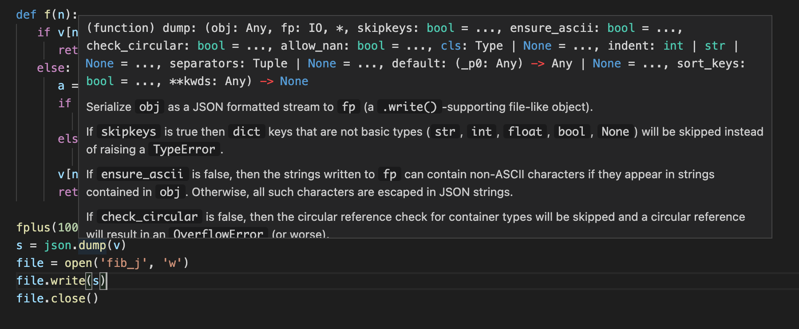

# Web 编程


继续 Web 开发的话题，让我们稍稍重构一下代码。

```python
from http.server import SimpleHTTPRequestHandler, HTTPServer
from fib import f
from urllib.parse import urlparse,parse_qs

class Handler(SimpleHTTPRequestHandler):

    def parse_n(self, s):
      parsed = urlparse(s)
      qs = parse_qs(parsed.query)
      if len(qs) > 0:
        ns = qs['n']
        if len(ns) > 0:
          n = int(ns[0])
          return n
      return None
      
    def do_GET(self):
      self.send_response(200)
      self.send_header('Content-type', 'text')
      self.end_headers()

      result = ""
      n = self.parse_n(self.path)
      if n is not None:
        result = str(f(n))
              
      self.wfile.write(bytes(result, "utf-8"))
      self.wfile.write(bytes(result, "utf-8"))

server = HTTPServer(("127.0.0.1", 8000), Handler)

server.serve_forever()
```


引入 `parse_n`的函数来把从请求路径中解析得到`n`封装在一块。


现在程序有这样的问题。小王请求了斐波那契数列的第10000位，过了一些天，小明又请求了斐波那契数列的第10000位。两次，小王和小明都等待了半天，才得到结果。我们该如何提高这个`Web服务的`效率呢。


注意到如果`n`相同，`f(n)`的值总是一样的。我们进行了一番实验。


```shell
127.0.0.1 - - [10/Mar/2021 00:33:01] "GET /?n=1000 HTTP/1.1" 200 -
----------------------------------------
Exception occurred during processing of request from ('127.0.0.1', 50783)
Traceback (most recent call last):
    ...
    if v[n] != -1:
IndexError: list index out of range
```

原来数组不够大，那就把v数组改成10000吧。

```python
v = []
for x in range(10000):
   v.append(-1)
```

然而当n为`2000`时，出现了递归深度溢出错误：

```shell
127.0.0.1 - - [10/Mar/2021 00:34:00] "GET /?n=2000 HTTP/1.1" 200 -
----------------------------------------
Exception occurred during processing of request from ('127.0.0.1', 50821)
Traceback (most recent call last):
    ...
    if v[n] != -1:
RecursionError: maximum recursion depth exceeded in comparison
```

然而这一切都还挺快的。


为什么。因为`f(1)`到`f(1000)`，都只需要算一次。这意味着当在算`f(1000)`的时候，`+`运算也许只被执行了1000次左右。我们知道`Python`的递归深度大约在1000左右。这意味着我们可以这样优化程序，如果要算`2000`，那我先算`1000`的。不，这样还是可能会出现`递归深度溢出错误`。如果要算2000，先算1200吧。如果要算1200，先算400吧。


这样算完400和1200之后，再算2000，递归深度大概在800左右，就不会出现递归深度溢出错误了。

```python
v = []
for x in range(1000000):
   v.append(-1)

def fplus(n):
   if n > 800:         
      fplus(n-800)
      return f(n)
   else:
      return f(n)

def f(n):
   if v[n] != -1:
      return v[n]
   else:
      a = 0
      if n < 2:
         a = n
      else:
         a = f(n-1) + f(n-2)
      v[n] = a
      return v[n]
```

增加了`fplus`函数。


然而不禁让人想，`fplus`被递归调用`1000`次怎么样。1000 * 800 = 800000。当我把n设为80万之后，又出现递归深度错误了。继续试探了一下，发现事情更复杂。然而这样优化之后，算2000是非常轻松的了。


## 文件缓存


似乎把话题岔开了。回到Web开发的话题上。第一次请求`f(400)`，第二次请求`f(600)`。那么第二次请求时，第一次请求所产生的`v`数组的值，我们是能用上的。然而当我们把程序退出。再启动就用不上了。按我们的方法，斐波那契数列计算是很快的。然而设想，如果很慢怎么办。尤其就如当我们没有引入v数组的时候，有着大量重复的计算。这时我们希望能把好不容易得到的结果保存起来。


这时，就引入`缓存`的概念了。`v`数组这里就是一个缓存。不过它只存在于程序生命周期里。程序关闭后，它就没了。怎么办呢。很自然，我们会想到存到文件里去。


如何把v数组保存到文件呢。

```shell
0 0
1 1
2 1
3 2
4 3
...
```

我们的`v`数组可以这样保存。每一行保存为`n f(n)`。既然`n`是自然增长的。或许我们可以只保存`f(n)`值。

```shell
0
1
1
2
3
...
```

来试试吧。

```python
f = open("demofile2.txt", "a")
f.write("Now the file has more content!")
f.close()

#open and read the file after the appending:
f = open("demofile2.txt", "r")
print(f.read())
```

`open`的第二个参数可以是`a`，表示会加在文件末尾；或者是`w`，表示会覆盖掉文件。

```python
file = open('fib_v', 'a')
file.write('hi')
file.close()
```

运行一下，果然有文件`fib_v`。

`fib_v`:

```shell
hi
```

当我们再运行一次的时候，变成了这样。

```shell
hihi
```

如何换行呢。

```python
file = open('fib_v', 'a')
file.write('hi\n')
file.close()
```

这会打印一次，出现了`hihihi`，没看见换行呢。然而再打印一次，换行了。可见第一次已经打印了换行符，只是在末尾，看不见。

如何读取呢。

```python
file = open('fib_v', 'r')
print(file.read())
```

```shell
$ python fib.py
hihihi
hi
```

接下来，改改我们的斐波那契程序。

```python 
v = []
for x in range(1000000):
   v.append(-1)

def read():
   file = open('fib_v', 'r')
   s = file.read()
   if len(s) > 0:
      lines = s.split('\n')
      if (len(lines) > 0):
        for i in range(len(lines)):
           v[i] = int(lines[i])   

def save():
   file = open('fib_v', 'w')
   s = ''
   start = True
   for vv in v:
      if vv == -1:
         break      
      if start == False:
         s += '\n'
      start = False   
      s += str(vv)
   file.write(s)
   file.close()

def fcache(n):
   x = fplus(n)
   save()
   return x

def fplus(n):
   if n > 800:         
      fplus(n-800)
      return f(n)
   else:
      return f(n)

def f(n):
   if v[n] != -1:
      return v[n]
   else:
      a = 0
      if n < 2:
         a = n
      else:
         a = f(n-1) + f(n-2)
      v[n] = a
      return v[n]

read()
fcache(10)
save()
```

终于我们写好程序了。程序运行后，`fib_v`文件是这样的。

`fib_v`:

```shell
0
1
1
2
3
5
8
13
21
34
55
```

看到上面的解析有点麻烦。`\n`是换行符。有没有更简单统一的解析方式。人们发明了`JSON`这件数据格式。


## JSON


JSON的全名是`JavaScript Object Notation`。以下是`JSON`的例子。

```json
{"name":"John", "age":31, "city":"New York"}
```

以上这样来表示一种映射。


JSON有这样基本元素：


1. 数字或字符串
2. 列表
3. 映射


而这些基本元素又可以任意嵌套。就是列表里可以有列表。映射里也可以有列表。等等

```json
{
  "name":"John",
  "age":30,
  "cars":[ "Ford", "BMW", "Fiat" ]
}
```

写成一行，和这样写得好看点是意义上的差别的。或许我们可以想象它们的计算图。空格不会影响他们的计算图。


接着我们要把v数组变成`json`格式的字符串。

```python
import json

v = []
for x in range(1000000):
   v.append(-1)

def fplus(n):
   if n > 800:         
      fplus(n-800)
      return f(n)
   else:
      return f(n)

def f(n):
   if v[n] != -1:
      return v[n]
   else:
      a = 0
      if n < 2:
         a = n
      else:
         a = f(n-1) + f(n-2)
      v[n] = a
      return v[n]

fplus(100)
s = json.dump(v)
file = open('fib_j', 'w')
file.write(s)
file.close()
```

当我们这么写的时候。报错了。`TypeError: dump() missing 1 required positional argument: 'fp'`。在`vscode`上可以这样来看到函数定义。



可以用鼠标移动到`dump`上就行。很方便吧。

```python
fplus(10)
file = open('fib_j', 'w')
json.dump(v, file)
file.close()
```

计算到100显示的数有点多，这里改为10。原来dump的第二个参数传如`file`对象就行。


这样可以看到文件：

```json
[0, 1, 1, 2, 3, 5, 8, 13, 21, 34, 55, -1, -1, -1]
```

注意后面省略了很多`-1`。

```python
def read():
    file = open('fib_j', 'r')
    s = file.read()
    sv = json.loads(s)
    for i in range(len(sv)):
        if sv[i] != -1:
            v[i] = sv[i]


def save():
    file = open('fib_j', 'w')
    json.dump(v, file)
    file.close()

read()

for vv in v:
    if vv!=-1:
        print(vv)
```

当这样时，可见打印出了：

```shell
0
1
1
2
3
5
8
13
21
34
55
```

这几个函数一起检查一下：

```python
def read():
    file = open('fib_j', 'r')
    s = file.read()
    sv = json.loads(s)
    for i in range(len(sv)):
        v[i] = sv[i]
            

def save():
    sv = []
    for i in range(len(v)):
        if v[i] != -1:
            sv.append(v[i])
        else:
            break        
    file = open('fib_j', 'w')
    json.dump(sv, file)
    file.close()

read()
fplus(100)
save()
```

然后到文件查看，果然保存了正确的值，而且很整齐。

```json
[0, 1, 1, 2, 3, 5, 8, 13, 21, 34, 55, 89, 144, 233, 377, 610, 987, 1597, 2584, 4181, 6765, 10946, 17711, 28657, 46368, 75025, 121393, 196418, 317811, 514229, 832040, 1346269, 2178309, 3524578, 5702887, 9227465, 14930352, 24157817, 39088169, 63245986, 102334155, 165580141, 267914296, 433494437, 701408733, 1134903170, 1836311903, 2971215073, 4807526976, 7778742049, 12586269025, 20365011074, 32951280099, 53316291173, 86267571272, 139583862445, 225851433717, 365435296162, 591286729879, 956722026041, 1548008755920, 2504730781961, 4052739537881, 6557470319842, 10610209857723, 17167680177565, 27777890035288, 44945570212853, 72723460248141, 117669030460994, 190392490709135, 308061521170129, 498454011879264, 806515533049393, 1304969544928657, 2111485077978050, 3416454622906707, 5527939700884757, 8944394323791464, 14472334024676221, 23416728348467685, 37889062373143906, 61305790721611591, 99194853094755497, 160500643816367088, 259695496911122585, 420196140727489673, 679891637638612258, 1100087778366101931, 1779979416004714189, 2880067194370816120, 4660046610375530309, 7540113804746346429, 12200160415121876738, 19740274219868223167, 31940434634990099905, 51680708854858323072, 83621143489848422977, 135301852344706746049, 218922995834555169026, 354224848179261915075]
```


## 数据库


