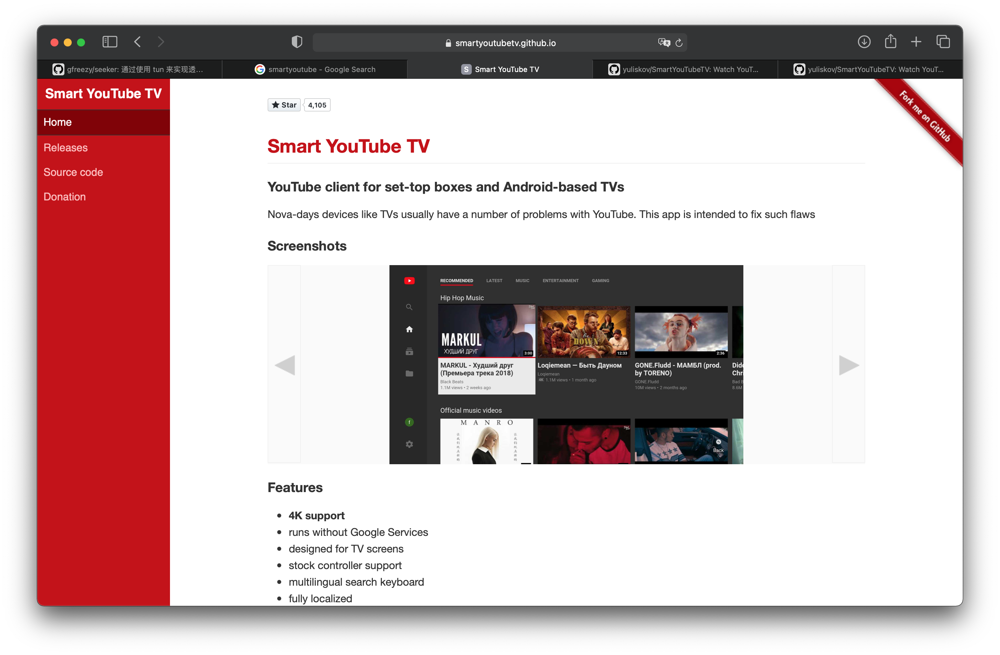
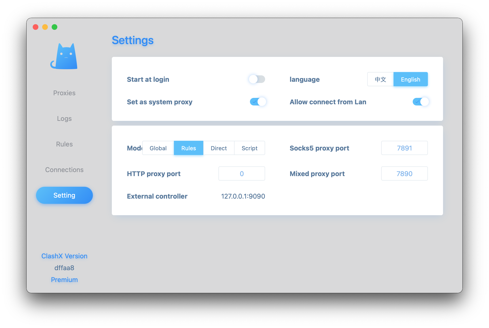
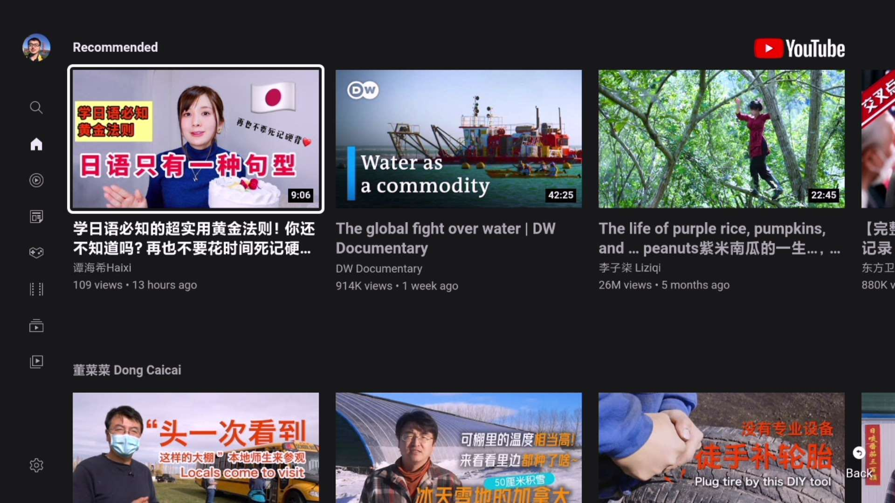
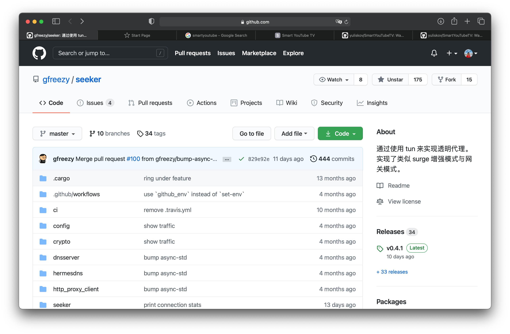

# 如何在电视上看 Youtube

这里假设我们知道如何科学上网，那如何在电视上看Youtube呢。刷路由有点麻烦。这里借助一个应用。

## SmartYoutubeTV

把它下载下来。用U盘安装到电视上。



接下来在科学上网应用客户端上选上，`Allow connnect from Lan`。意思是支持局域网其它设备连接我们这台设备来上网。

接着在`SmartYoutubeTV`的设置选项，设置上端口就行了。


设置完后。点击`测试`按钮试试看。注意到我这里用了`SOCKS`类型的代理。用`HTTP`的试过几次没成功。测试成功后，点击确定，然后测试看看。其次，你那里不一定设置成`192.168.1.3`，得看你电脑局域网地址是什么。

这样就看上了，很方便。




## gfreezy/seeker

这是一个 GitHub 项目。项目主页有使用说明。这里主要补充一些额外的要点。



它通过使用 tun 来实现透明代理。实现了类似 surge 增强模式与网关模式。

一开始我就用`seeker`来把我电脑变成科学上网路由器。这里说说我的配置：

```yml
verbose: true
dns_start_ip: 10.0.0.10
dns_servers:
  - 223.5.5.5:53
  - 114.114.114.114:53  
dns_timeout: 1s
tun_name: utun4
tun_ip: 10.0.0.1
tun_cidr: 10.0.0.0/16
dns_listen: 0.0.0.0:53
gateway_mode: true
ping_timeout: 2s
probe_timeout: 30ms
connect_timeout: 1s
read_timeout: 30s
write_timeout: 5s
max_connect_errors: 2 

servers:
  - name: http proxy server
    addr: 0.0.0.0:7890
    protocol: Http

  - name: https proxy server
    addr: 0.0.0.0:7890
    protocol: Https

rules:
  - 'MATCH,PROXY'
```

一开始我用的是 `socks5`代理。把配置写成这样：

```yml
servers:
  - name: socks5 proxy server
    addr: 0.0.0.0:7891
    protocol: Socks5
```

然而有挺多问题。经常连接不上。文档有这么一段话：

> 使用 socks5 代理的时候，需要将所有直连的域名设置在配置文件里面，如果使用 ss 或者 vmess 之类的，需要将 ss 或 vmess server 的域名也加入配置文件。否则有可能会导致死循环，没法正常使用。

可能是这个原因。

用`seeker`，意味着需要有台电脑运行着它，把它当做路由器来用。而用`proxy`配置的方式，则灵活很多。我可以用iPhone或Android手机来分享代理端口。


## 电视截图

在写这篇文章时，琢磨了如何在电视上截图。我家用的是小米电视。可以在遥控器上连按两下`Home`健，唤出应用管理菜单。


看到截图按钮了吗。接着还可以很方便分享给微信。这里还可以把应用程序都关掉。有些应用卡掉的话，则可以这样处理。

好了。让我们用大屏电视来看世界吧。